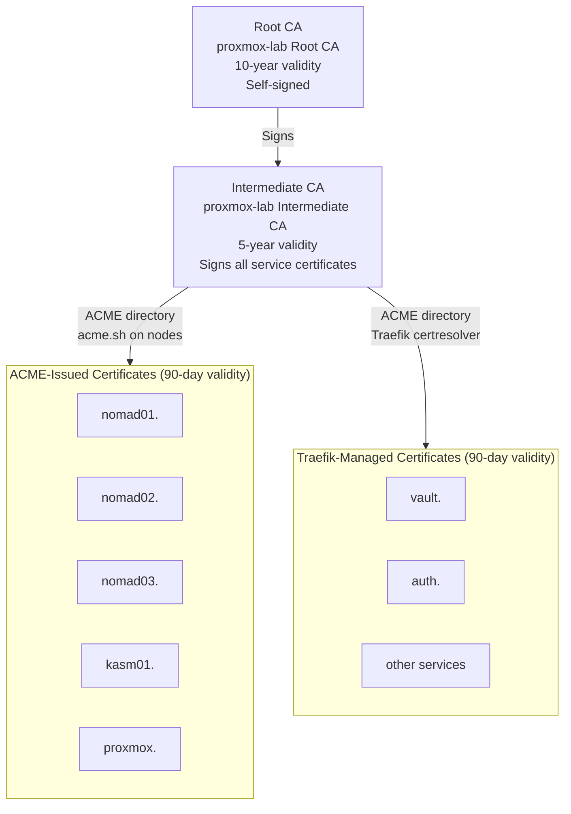
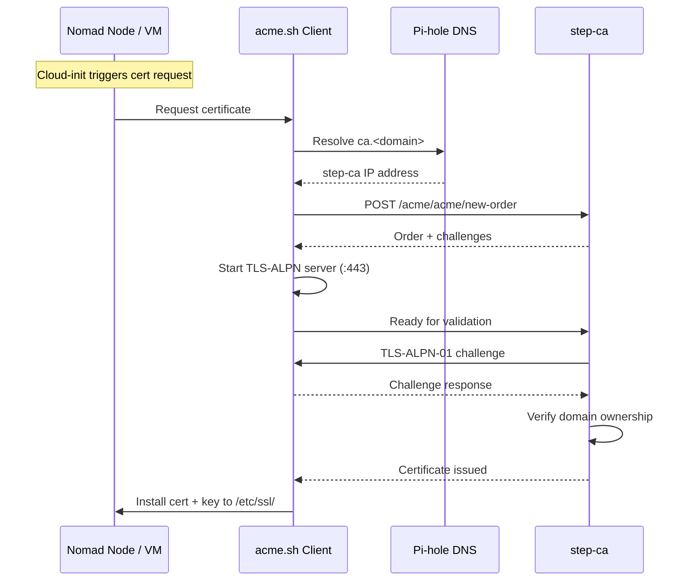
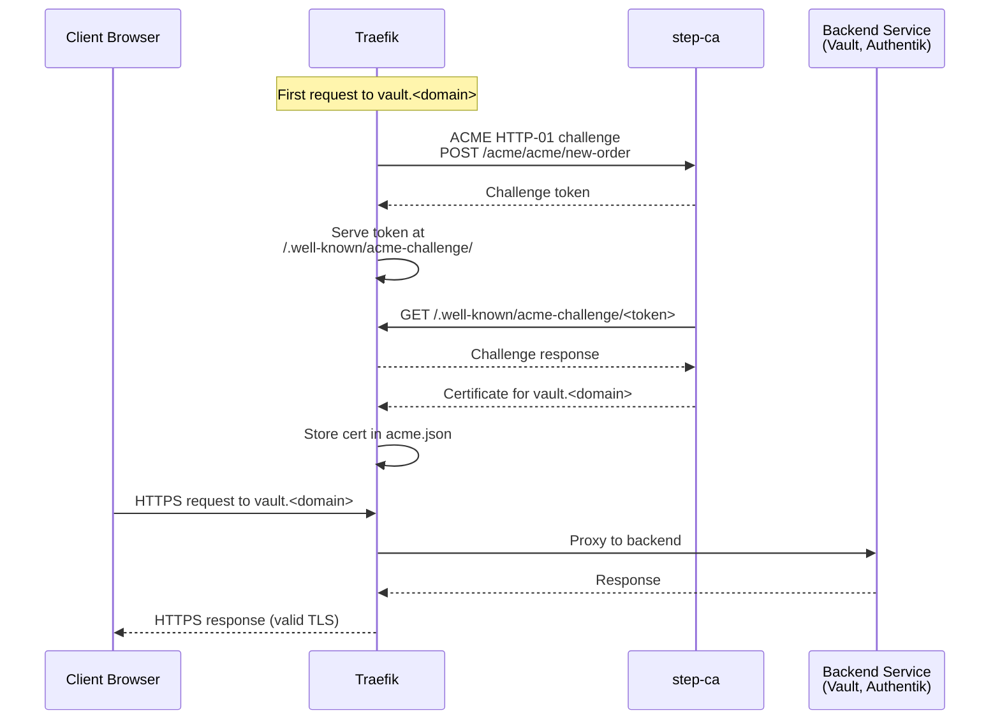
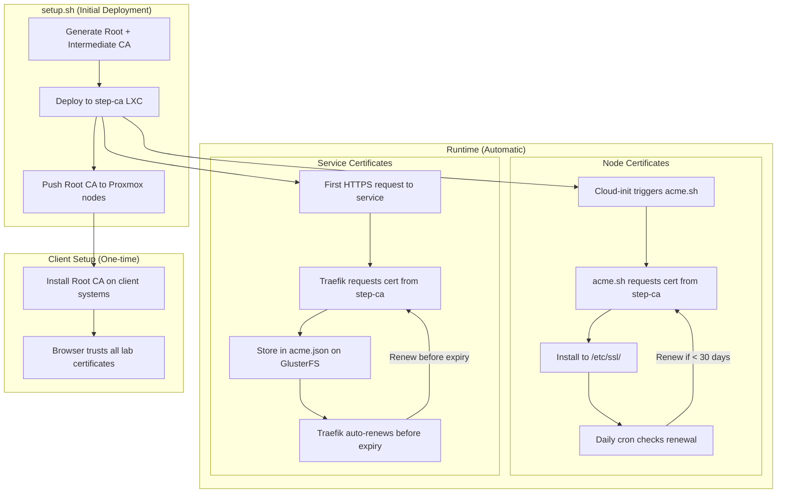

# Certificate Chain

This page explains the TLS certificate hierarchy, how certificates are issued and renewed, and how trust is distributed across the Proxmox Lab infrastructure.

## PKI Hierarchy

Proxmox Lab uses a two-tier certificate authority powered by step-ca:



## Why Two Tiers?

| Tier | Purpose | Key Location | Validity |
|------|---------|-------------|----------|
| **Root CA** | Trust anchor distributed to all clients | step-ca LXC + local backup | 10 years |
| **Intermediate CA** | Active certificate issuer | step-ca LXC only | 5 years |

!!! info "Security Best Practice"
    If the Intermediate CA is compromised, you can revoke it and create a new one
    without redistributing a new Root CA to all clients. The Root CA private key
    ideally should be backed up securely and could be removed from the step-ca
    LXC after initial setup.

## Certificate Issuance Methods

There are two distinct paths for obtaining certificates from step-ca:

### 1. acme.sh on Nomad Nodes (Infrastructure Certificates)

Used for: Nomad node host certificates, Kasm, Proxmox host



### 2. Traefik Certresolver (Service Certificates)

Used for: Vault, Authentik, and any other Nomad service behind Traefik



### Comparison of Issuance Methods

| Aspect | acme.sh (nodes) | Traefik certresolver (services) |
|--------|----------------|---------------------------------|
| **Challenge type** | TLS-ALPN-01 | HTTP-01 |
| **Triggered by** | Cloud-init / cron | First HTTPS request to service |
| **Certificate stored at** | `/etc/ssl/certs/` and `/etc/ssl/private/` | `/srv/gluster/nomad-data/traefik/acme.json` |
| **Renewal** | Cron job (daily check) | Traefik automatic renewal |
| **Used for** | Host-level TLS (SSH, node APIs) | Service-level TLS (web UIs, APIs) |

## Certificate Files and Storage

### step-ca (LXC 902)

The CA files are generated by `setup.sh` and deployed to the step-ca LXC:

```
terraform/lxc-step-ca/step-ca/
  certs/
    root_ca.crt              # Root CA certificate (public)
    intermediate_ca.crt      # Intermediate CA certificate (public)
  config/
    ca.json                  # step-ca configuration
  secrets/
    root_ca_key              # Root CA private key
    intermediate_ca_key      # Intermediate CA private key
    password                 # Key encryption password
```

!!! danger "Security Warning"
    The `secrets/` directory contains private keys. After deployment:

    1. Back up the secrets securely (e.g., to an encrypted USB drive)
    2. Consider deleting private keys from your workstation
    3. Never commit to version control (already in `.gitignore`)

### Nomad Nodes (acme.sh)

Each Nomad node stores its own certificates:

| Path | Contents |
|------|----------|
| `/etc/ssl/certs/<hostname>.crt` | Node certificate (full chain) |
| `/etc/ssl/private/<hostname>.key` | Node private key |
| `/root/.acme.sh/<hostname>/` | acme.sh certificate data |

### Traefik (ACME storage)

Traefik stores all service certificates in a single JSON file on GlusterFS:

| Path | Contents |
|------|----------|
| `/srv/gluster/nomad-data/traefik/acme.json` | All Traefik-managed certificates |
| `/srv/gluster/nomad-data/traefik/root_ca.crt` | Root CA (for Traefik to trust step-ca) |

### Root CA on Nomad Nodes

The root CA certificate is distributed to Nomad nodes so that services can trust the internal CA:

| Path | Purpose |
|------|---------|
| `/usr/local/share/ca-certificates/root_ca.crt` | System trust store |
| `/srv/gluster/nomad-data/traefik/root_ca.crt` | Traefik CA trust (mounted into container) |

Traefik uses environment variables to trust the internal CA:

```
SSL_CERT_FILE=/data/certs/root_ca.crt
LEGO_CA_CERTIFICATES=/data/certs/root_ca.crt
```

## step-ca Configuration

The ACME endpoint is configured in `config/ca.json`:

```json
{
  "root": "/etc/step-ca/certs/root_ca.crt",
  "crt": "/etc/step-ca/certs/intermediate_ca.crt",
  "key": "/etc/step-ca/secrets/intermediate_ca_key",
  "address": ":443",
  "dnsNames": ["ca.mylab.lan", "step-ca"],
  "authority": {
    "provisioners": [
      {
        "type": "ACME",
        "name": "acme"
      }
    ]
  }
}
```

The ACME directory URL used by all clients:

```
https://ca.<dns_postfix>/acme/acme/directory
```

## Root CA Distribution

For browsers and tools to trust certificates issued by the internal CA, the root CA must be installed on client systems and Proxmox nodes.

### Distributing to Proxmox Nodes

Use `setup.sh` option **12) Update root certificates** to push the root CA to all Proxmox nodes in the cluster. This runs:

1. Copies `root_ca.crt` to `/usr/local/share/ca-certificates/` on each Proxmox node
2. Runs `update-ca-certificates` to add it to the system trust store
3. Proxmox web UI and API then trust the internal CA

### Download Root CA

```bash
# From step-ca (over the network)
curl -k -o proxmox-lab-ca.crt https://ca.mylab.lan/roots.pem

# From local project files
cp terraform/lxc-step-ca/step-ca/certs/root_ca.crt proxmox-lab-ca.crt
```

### Install on Client Systems

=== "macOS"

    ```bash
    sudo security add-trusted-cert -d -r trustRoot \
      -k /Library/Keychains/System.keychain proxmox-lab-ca.crt
    ```

    Verify:
    ```bash
    security find-certificate -c "proxmox-lab" /Library/Keychains/System.keychain
    ```

=== "Ubuntu/Debian"

    ```bash
    sudo cp proxmox-lab-ca.crt /usr/local/share/ca-certificates/
    sudo update-ca-certificates
    ```

    Verify:
    ```bash
    ls /etc/ssl/certs/ | grep proxmox
    ```

=== "RHEL/CentOS/Fedora"

    ```bash
    sudo cp proxmox-lab-ca.crt /etc/pki/ca-trust/source/anchors/
    sudo update-ca-trust
    ```

=== "Windows (PowerShell as Admin)"

    ```powershell
    Import-Certificate -FilePath .\proxmox-lab-ca.crt `
      -CertStoreLocation Cert:\LocalMachine\Root
    ```

=== "Firefox (Manual)"

    Firefox uses its own certificate store:

    1. Open **Settings > Privacy & Security**
    2. Scroll to **Certificates > View Certificates**
    3. Go to **Authorities** tab
    4. Click **Import** and select `proxmox-lab-ca.crt`
    5. Check **Trust this CA to identify websites**

## Certificate Renewal

### acme.sh Automatic Renewal

acme.sh installs a daily cron job on each node:

```bash
# View cron entry
crontab -l | grep acme
```

Typical output:
```
0 0 * * * "/root/.acme.sh/acme.sh" --cron --home "/root/.acme.sh" > /dev/null
```

Certificates are renewed automatically when they are within 30 days of expiration (default for 90-day certificates).

### Traefik Automatic Renewal

Traefik handles renewal automatically for all service certificates stored in `acme.json`. No manual intervention is required. Traefik checks certificate expiration periodically and renews before expiry.

### Manual Renewal

```bash
# Renew all certificates on a node
~/.acme.sh/acme.sh --cron

# Force renewal of a specific certificate
~/.acme.sh/acme.sh --renew -d nomad01.mylab.lan --force
```

### CA Certificate Regeneration

If the CA certificates need to be regenerated (e.g., compromise or expiration), use `setup.sh` option **11) Regenerate CA**. This will:

1. Generate new root and intermediate CA certificates
2. Redeploy to the step-ca LXC
3. All existing service certificates will need to be re-issued
4. The new root CA must be redistributed to all clients

After regenerating, run option **12) Update root certificates** to push to Proxmox nodes.

## End-to-End Certificate Flow

This diagram shows the complete certificate lifecycle from CA creation to client trust:



## Viewing Certificate Information

```bash
# View certificate details
openssl x509 -in /etc/ssl/certs/nomad01.crt -text -noout

# Check expiration date
openssl x509 -in /etc/ssl/certs/nomad01.crt -enddate -noout

# Verify certificate chain
openssl verify -CAfile /usr/local/share/ca-certificates/root_ca.crt \
  /etc/ssl/certs/nomad01.crt

# Test TLS connection to a service
openssl s_client -connect vault.mylab.lan:443 -servername vault.mylab.lan

# View Traefik's stored certificates
# (SSH to nomad01, then inspect the acme.json file)
cat /srv/gluster/nomad-data/traefik/acme.json | jq '.Certificates'
```

## Troubleshooting Certificates

??? question "Certificate not trusted in browser"
    The Root CA is not installed on your client system.
    See [Install on Client Systems](#install-on-client-systems) above.

??? question "ACME challenge failed (acme.sh)"
    - Verify DNS resolves: `nslookup ca.mylab.lan`
    - Check step-ca is running: `curl -k https://ca.mylab.lan/health`
    - Ensure port 443 is not already in use on the node during TLS-ALPN-01 challenge
    - Check acme.sh logs: `cat ~/.acme.sh/acme.sh.log`

??? question "ACME challenge failed (Traefik)"
    - Ensure DNS for the service (e.g., `vault.mylab.lan`) resolves to nomad01
    - Check Traefik logs: `nomad alloc logs -job traefik`
    - Verify step-ca is reachable from nomad01
    - Clear stale ACME data: `rm /srv/gluster/nomad-data/traefik/acme.json` and restart Traefik
    - Verify `LEGO_CA_CERTIFICATES` points to the correct root CA file

??? question "Certificate expired"
    ```bash
    # Force renewal with acme.sh
    ~/.acme.sh/acme.sh --renew -d nomad01.mylab.lan --force

    # Check cron is running
    systemctl status cron
    ```

    For Traefik-managed certificates, restart the Traefik job:
    ```bash
    nomad job restart traefik
    ```

## Next Steps

- [:octicons-arrow-right-24: Certificate Operations](../operations/certificate-operations.md) -- Day-to-day certificate management
- [:octicons-arrow-right-24: Service Relationships](service-relationships.md) -- How services interact
- [:octicons-arrow-right-24: Troubleshooting](../troubleshooting/common-issues.md) -- Common issues and fixes
