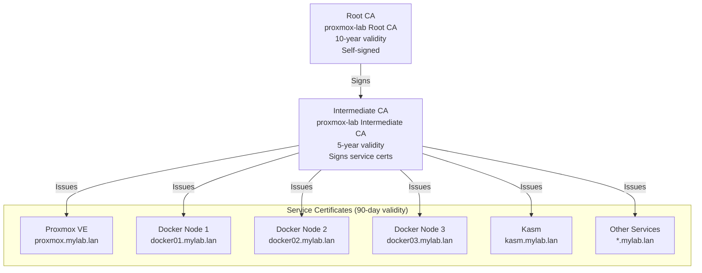
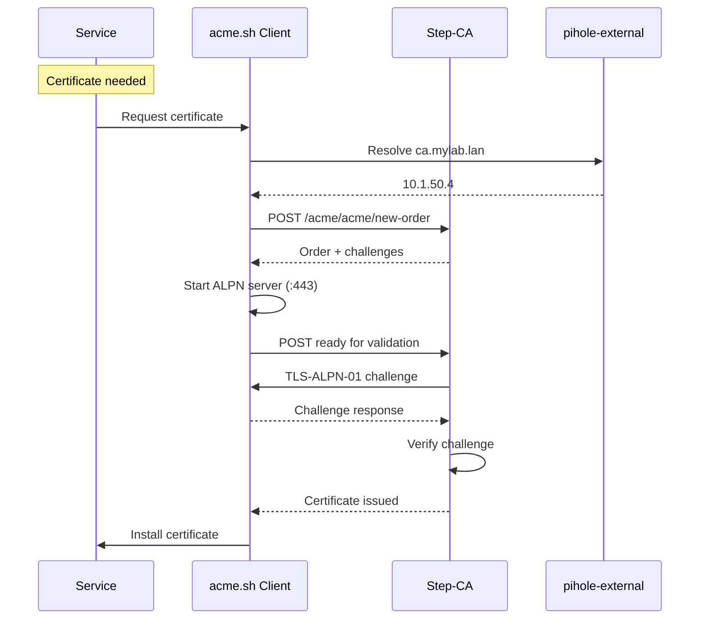

# Certificate Chain

This page explains the TLS certificate hierarchy and how certificates are issued in Proxmox Lab.

## Certificate Hierarchy

Proxmox Lab uses a two-tier certificate authority:



## Why Two Tiers?

| Tier | Purpose | Security |
|------|---------|----------|
| **Root CA** | Trust anchor | Private key should be kept offline after setup |
| **Intermediate CA** | Issues certificates | Active, used by Step-CA |

!!! info "Security Best Practice"
    If the Intermediate CA is compromised, you can revoke it and create a new one
    without having to redistribute a new Root CA to all clients.

## Certificate Files

The setup script generates these files in `terraform/lxc-step-ca/step-ca/`:

```
step-ca/
├── certs/
│   ├── root_ca.crt              # Root CA certificate (public)
│   └── intermediate_ca.crt      # Intermediate CA certificate (public)
├── config/
│   └── ca.json                  # Step-CA configuration
└── secrets/
    ├── root_ca_key              # Root CA private key
    ├── intermediate_ca_key      # Intermediate CA private key
    └── password                 # Key encryption password
```

!!! danger "Security Warning"
    The `secrets/` directory contains private keys. After deployment:

    1. Back up the secrets securely
    2. Consider deleting from your workstation
    3. Never commit to version control

## Step-CA Service

Step-CA runs as a container on the `step-ca` LXC and provides:

- **ACME Protocol** - Automated certificate issuance
- **REST API** - Manual certificate operations
- **Certificate Database** - Tracks issued certificates

### ACME Endpoint

All services request certificates from:

```
https://ca.<dns_postfix>/acme/acme/directory
```

Example: `https://ca.mylab.lan/acme/acme/directory`

### Configuration

The CA is configured via `config/ca.json`:

```json
{
  "root": "/etc/step-ca/certs/root_ca.crt",
  "crt": "/etc/step-ca/certs/intermediate_ca.crt",
  "key": "/etc/step-ca/secrets/intermediate_ca_key",
  "address": ":443",
  "dnsNames": ["ca.mylab.lan", "step-ca"],
  "authority": {
    "provisioners": [
      {
        "type": "ACME",
        "name": "acme"
      }
    ]
  }
}
```

## Certificate Issuance Flow

### Automated (ACME)



### Challenge Types

| Challenge | Port | How It Works |
|-----------|------|--------------|
| TLS-ALPN-01 | 443 | Client proves control by serving special TLS cert |
| HTTP-01 | 80 | Client serves token at `/.well-known/acme-challenge/` |

!!! note "Default Challenge"
    Proxmox Lab uses TLS-ALPN-01 (`--alpn` flag) by default.

## Installing Certificates

### On Services (Automated)

VMs include acme.sh pre-configured. Certificates are:

- **Requested** during cloud-init
- **Stored** in `/etc/ssl/certs/` and `/etc/ssl/private/`
- **Renewed** automatically via cron

### acme.sh Commands

```bash
# Set Step-CA as default
~/.acme.sh/acme.sh --set-default-ca \
  --server https://ca.mylab.lan/acme/acme/directory

# Issue certificate
~/.acme.sh/acme.sh --issue --alpn -d myservice.mylab.lan

# Issue with multiple domains (SANs)
~/.acme.sh/acme.sh --issue --alpn \
  -d myservice.mylab.lan \
  -d alias.mylab.lan

# Install certificate
~/.acme.sh/acme.sh --install-cert -d myservice.mylab.lan \
  --key-file /etc/ssl/private/myservice.key \
  --fullchain-file /etc/ssl/certs/myservice.crt \
  --reloadcmd "systemctl reload nginx"
```

## Trusting the Root CA

For browsers and tools to trust certificates, install the Root CA:

### Download Root CA

```bash
# From Step-CA
curl -k -o proxmox-lab-ca.crt https://ca.mylab.lan/roots.pem

# Or from local files
cp terraform/lxc-step-ca/step-ca/certs/root_ca.crt proxmox-lab-ca.crt
```

### Install on Systems

=== "macOS"

    ```bash
    sudo security add-trusted-cert -d -r trustRoot \
      -k /Library/Keychains/System.keychain proxmox-lab-ca.crt
    ```

    Verify:
    ```bash
    security find-certificate -c "proxmox-lab" /Library/Keychains/System.keychain
    ```

=== "Ubuntu/Debian"

    ```bash
    sudo cp proxmox-lab-ca.crt /usr/local/share/ca-certificates/
    sudo update-ca-certificates
    ```

    Verify:
    ```bash
    ls /etc/ssl/certs/ | grep proxmox
    ```

=== "RHEL/CentOS/Fedora"

    ```bash
    sudo cp proxmox-lab-ca.crt /etc/pki/ca-trust/source/anchors/
    sudo update-ca-trust
    ```

=== "Windows (PowerShell as Admin)"

    ```powershell
    Import-Certificate -FilePath .\proxmox-lab-ca.crt `
      -CertStoreLocation Cert:\LocalMachine\Root
    ```

=== "Firefox (Manual)"

    Firefox uses its own certificate store:

    1. Open **Settings > Privacy & Security**
    2. Scroll to **Certificates > View Certificates**
    3. Go to **Authorities** tab
    4. Click **Import** and select `proxmox-lab-ca.crt`
    5. Check **Trust this CA to identify websites**

## Certificate Renewal

### Automatic Renewal

acme.sh installs a cron job:

```bash
# View cron entry
crontab -l | grep acme
```

Typical output:
```
0 0 * * * "/root/.acme.sh/acme.sh" --cron --home "/root/.acme.sh" > /dev/null
```

### Manual Renewal

```bash
# Renew all certificates
~/.acme.sh/acme.sh --cron

# Force renewal of specific cert
~/.acme.sh/acme.sh --renew -d myservice.mylab.lan --force
```

### Renewal Hooks

Configure commands to run after renewal:

```bash
~/.acme.sh/acme.sh --install-cert -d myservice.mylab.lan \
  --key-file /etc/ssl/private/myservice.key \
  --fullchain-file /etc/ssl/certs/myservice.crt \
  --reloadcmd "systemctl reload nginx"
```

## Viewing Certificate Information

```bash
# View certificate details
openssl x509 -in /etc/ssl/certs/myservice.crt -text -noout

# Check expiration date
openssl x509 -in /etc/ssl/certs/myservice.crt -enddate -noout

# Verify certificate chain
openssl verify -CAfile /usr/local/share/ca-certificates/proxmox-lab-ca.crt \
  /etc/ssl/certs/myservice.crt

# Test TLS connection
openssl s_client -connect myservice.mylab.lan:443 -servername myservice.mylab.lan
```

## Troubleshooting Certificates

??? question "Certificate not trusted in browser"
    The Root CA is not installed on your system.
    See [Install on Systems](#install-on-systems) above.

??? question "ACME challenge failed"
    - Verify DNS resolves: `nslookup ca.mylab.lan`
    - Check Step-CA is running: `curl -k https://ca.mylab.lan/health`
    - Ensure port 443 is not in use during challenge

??? question "Certificate expired"
    ```bash
    # Force renewal
    ~/.acme.sh/acme.sh --renew -d myservice.mylab.lan --force

    # Check cron is running
    systemctl status cron
    ```

## Next Steps

- [:octicons-arrow-right-24: Certificate Operations](../operations/certificate-operations.md) - Day-to-day certificate management
- [:octicons-arrow-right-24: Troubleshooting](../troubleshooting/common-issues.md) - Common certificate issues
