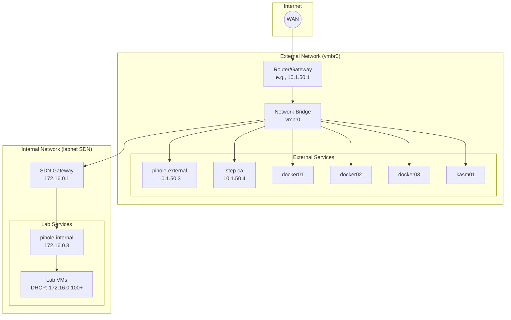
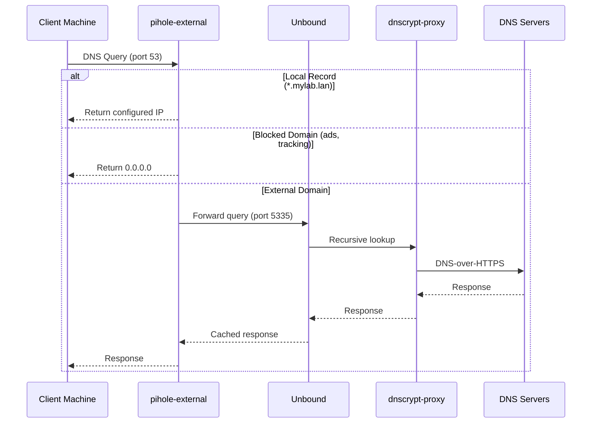
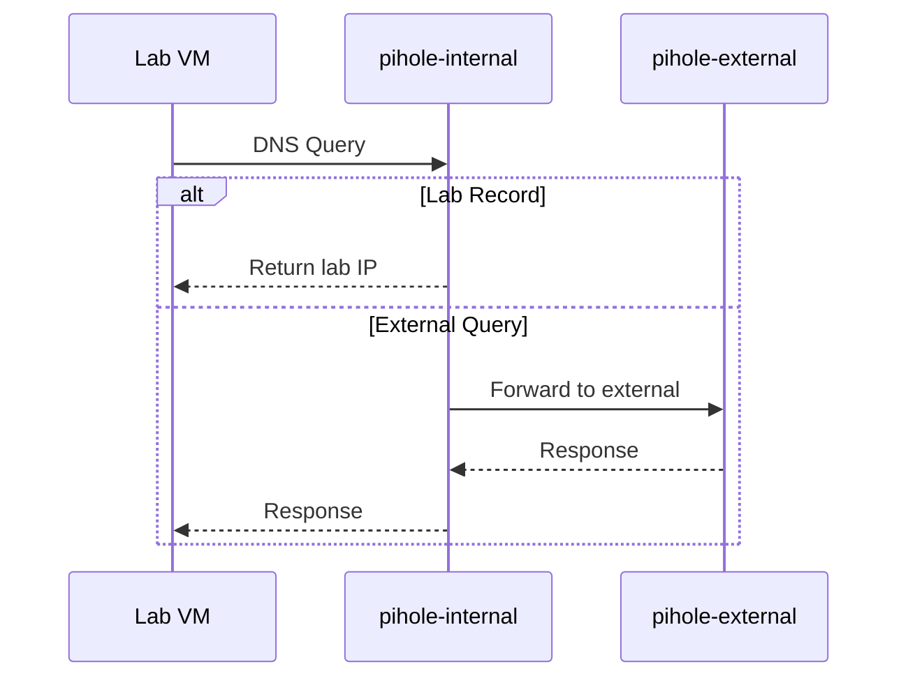
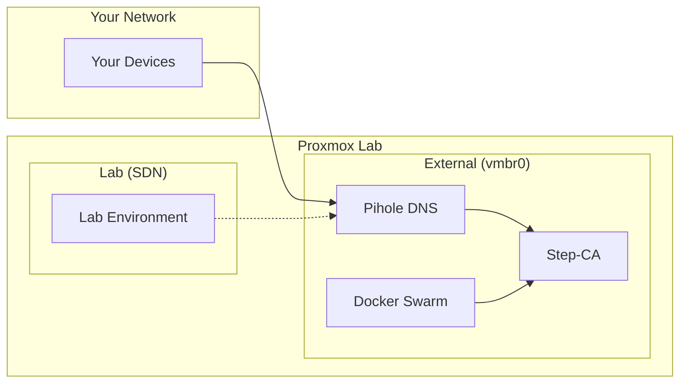

# Network Topology

This page details the network architecture of Proxmox Lab.

## Dual Network Design

Proxmox Lab uses two separate networks:

1. **External Network (vmbr0)** - Your existing LAN
2. **Internal Network (labnet)** - Isolated SDN for lab testing

## External Network (vmbr0)

The external network connects to your physical LAN.

### Configuration

| Setting | Example Value | Description |
|---------|---------------|-------------|
| Bridge Name | `vmbr0` | Proxmox network bridge |
| Network Range | `10.1.50.0/24` | Your LAN subnet |
| Gateway | `10.1.50.1` | Your router IP |

### IP Assignments

| Service | IP Address | Assignment Type |
|---------|------------|-----------------|
| Router/Gateway | 10.1.50.1 | Static (your router) |
| Proxmox Host | 10.1.50.2 | Static |
| pihole-external | 10.1.50.3 | Static (configured) |
| step-ca | 10.1.50.4 | Static (configured) |
| docker01 | Dynamic | DHCP |
| docker02 | Dynamic | DHCP |
| docker03 | Dynamic | DHCP |
| kasm01 | Dynamic | DHCP |

!!! tip "Static IP Reservation"
    For Docker and Kasm VMs, you can set DHCP reservations in your router
    or configure static IPs in the Terraform variables.

## Internal Network (labnet)

The internal network is a Software Defined Network (SDN) for isolated testing.

### Configuration

| Setting | Value | Description |
|---------|-------|-------------|
| Network Name | `labnet` | SDN zone name |
| Network Range | `172.16.0.0/24` | Private IP range |
| Gateway | `172.16.0.1` | Proxmox SDN gateway |
| DNS Server | `172.16.0.3` | pihole-internal |
| DHCP Range | `172.16.0.100-200` | Dynamic assignments |

### IP Assignments

| Service | IP Address | Purpose |
|---------|------------|---------|
| SDN Gateway | 172.16.0.1 | Proxmox routing |
| pihole-internal | 172.16.0.3 | DNS + DHCP server |
| Lab VMs | 172.16.0.100+ | DHCP assigned |

## DNS Resolution Architecture

### External DNS Flow

### Internal DNS Flow

### DNS Server Stack

Each Pihole container includes:

| Component | Port | Purpose |
|-----------|------|---------|
| **Pihole** | 53 | DNS server + ad blocking |
| **Unbound** | 5335 | Recursive DNS resolver |
| **dnscrypt-proxy** | 5053 | DNS-over-HTTPS encryption |

## Port Reference

### Services Listening

| Service | Port(s) | Protocol | Purpose |
|---------|---------|----------|---------|
| Proxmox Web UI | 8006 | HTTPS | Management interface |
| SSH | 22 | TCP | Remote access |
| Pihole Admin | 80 | HTTP | Web interface |
| Pihole DNS | 53 | UDP/TCP | DNS queries |
| Step-CA ACME | 443 | HTTPS | Certificate requests |
| Kasm | 443 | HTTPS | Web interface |
| Docker Swarm | 2377 | TCP | Cluster management |
| Docker Swarm | 7946 | TCP/UDP | Node communication |
| Docker Overlay | 4789 | UDP | Overlay network |

### Firewall Rules (if applicable)

If you have a firewall between segments:

| From | To | Port | Purpose |
|------|-----|------|---------|
| Workstation | Proxmox | 8006/tcp | Web UI access |
| Workstation | Proxmox | 22/tcp | SSH access |
| All services | pihole-external | 53/udp | DNS resolution |
| All services | step-ca | 443/tcp | Certificate requests |
| Docker nodes | Docker nodes | 2377,7946/tcp | Swarm management |
| Docker nodes | Docker nodes | 4789/udp | Overlay network |

## Routing Between Networks

### External to Internal

By default, external network clients **cannot** directly access labnet services.

To access labnet:

1. **Through a dual-homed VM** - Kasm is connected to both networks
2. **Via Proxmox routing** - Configure routes on your router
3. **Through a VPN** - Set up WireGuard on a labnet VM

### Internal to External

Labnet VMs can access:

- External DNS (via pihole-internal forwarding to pihole-external)
- Internet (via Proxmox NAT through vmbr0)
- Step-CA for certificates

## Network Diagram for Documentation

Use this simplified diagram for presentations:

## Next Steps

- [:octicons-arrow-right-24: Service Relationships](service-relationships.md) - How services depend on each other
- [:octicons-arrow-right-24: Certificate Chain](certificate-chain.md) - TLS certificate architecture
- [:octicons-arrow-right-24: DNS Management](../operations/dns-management.md) - Managing DNS records
