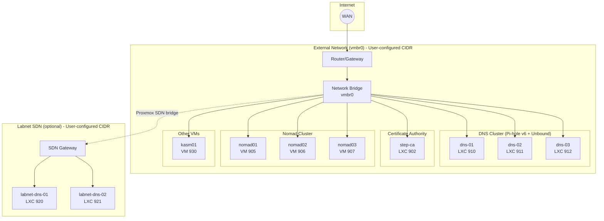
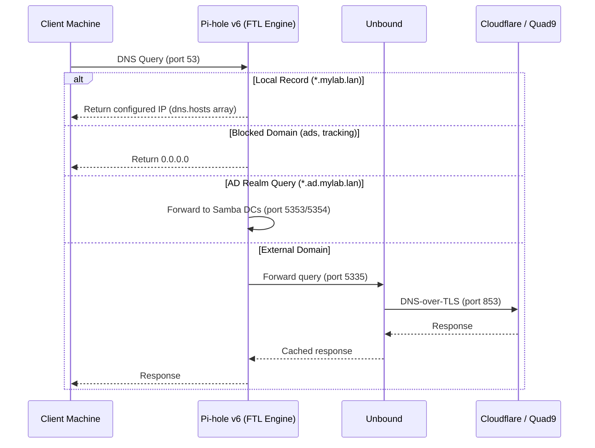
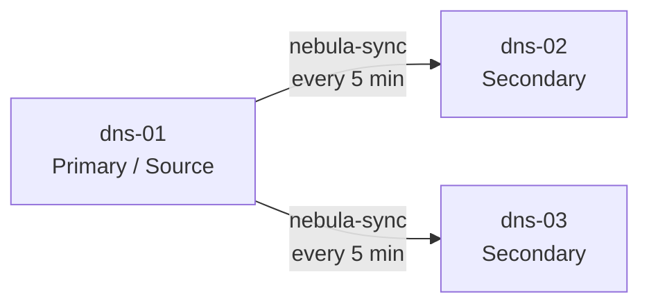

# Network Topology

This page details the network architecture of Proxmox Lab, including both the external and internal networks, DNS resolution, and service addressing.

## Dual Network Design

Proxmox Lab uses two separate networks, both with user-configurable CIDR ranges:

1. **External Network (vmbr0)** -- Your existing LAN; all production services live here
2. **Internal Network (labnet SDN)** -- Optional isolated Proxmox SDN for lab experimentation



## External Network (vmbr0)

The external network connects to your physical LAN. All production infrastructure lives on this network.

### Configuration

Network settings are captured during `setup.sh` and stored in `cluster-info.json`:

| Setting | Example Value | Description |
|---------|---------------|-------------|
| Bridge Name | `vmbr0` | Proxmox network bridge |
| Network Range | `10.1.50.0/24` | Your LAN subnet (user-configured) |
| Gateway | `10.1.50.1` | Your router IP |
| DNS Postfix | `mylab.lan` | Domain suffix for all hosts |

### IP Assignments

| Service | Hostname | Assignment | Purpose |
|---------|----------|------------|---------|
| Router/Gateway | -- | Static (your router) | Default gateway |
| Proxmox Host(s) | -- | Static | Hypervisor management |
| dns-01 | `dns-01.<domain>` | Static (configured) | Primary DNS |
| dns-02 | `dns-02.<domain>` | Static (configured) | Secondary DNS |
| dns-03 | `dns-03.<domain>` | Static (configured) | Tertiary DNS |
| step-ca | `ca.<domain>` | Static (configured) | Certificate Authority |
| nomad01 | `nomad01.<domain>` | Static (configured) | Nomad server + services |
| nomad02 | `nomad02.<domain>` | Static (configured) | Nomad server |
| nomad03 | `nomad03.<domain>` | Static (configured) | Nomad server |
| kasm01 | `kasm01.<domain>` | Static (configured) | Kasm Workspaces |

!!! info "Cluster Scaling"
    DNS node count (910-912) matches your Proxmox cluster size -- one Pi-hole per Proxmox node.
    A single-node Proxmox host deploys only dns-01.

## Internal Network (labnet)

The internal network is a Proxmox Software Defined Network (SDN) for isolated testing. It is optional and configured during setup.

### Configuration

| Setting | Example Value | Description |
|---------|---------------|-------------|
| Network Name | `labnet` | SDN zone name |
| Network Range | `172.16.0.0/24` | Private IP range (user-configured) |
| Gateway | `172.16.0.1` | Proxmox SDN gateway |
| DNS Nodes | Max 2 | labnet-dns-01, labnet-dns-02 |

### IP Assignments

| Service | IP Address | Purpose |
|---------|------------|---------|
| SDN Gateway | First usable IP | Proxmox routing |
| labnet-dns-01 | Configured | DNS for labnet |
| labnet-dns-02 | Configured | DNS for labnet (secondary) |

!!! note "Labnet Provisioning"
    Labnet DNS containers are provisioned via `pct exec` because the SDN is not directly
    reachable from your workstation.

## DNS Resolution Architecture

### DNS Resolution Chain

All DNS resolution follows this path:

```
Client --> Pi-hole v6 (ad blocking + local records) --> Unbound (DNS-over-TLS) --> Cloudflare / Quad9
```



### Pi-hole v6 Configuration

Pi-hole v6 uses a TOML configuration file instead of the legacy `setupVars.conf`:

| Item | Details |
|------|---------|
| Config file | `/etc/pihole/pihole.toml` |
| Local DNS records | `dns.hosts` array in TOML config |
| DNS engine | FTL (Faster Than Light) |
| Upstream resolver | Unbound on port 5335 |
| Replication | nebula-sync every 5 minutes from primary |

### DNS Replication (nebula-sync)



The primary DNS node (dns-01) serves as the nebula-sync source. Secondary nodes pull configuration changes every 5 minutes, keeping ad-blocking lists and local DNS records synchronized.

## Service DNS Records

Nomad services are exposed via DNS records that point to nomad01 (where all pinned services run):

| DNS Record | Target | Port(s) | Service |
|------------|--------|---------|---------|
| `vault.<domain>` | nomad01 IP | 8200 | HashiCorp Vault |
| `auth.<domain>` | nomad01 IP | 9000, 9443 | Authentik |
| `traefik.<domain>` | nomad01 IP | 80, 443, 8081 | Traefik reverse proxy |
| `samba-dc01.<ad_realm>` | nomad01 IP | 5353 (DNS) | Samba AD DC01 |
| `samba-dc02.<ad_realm>` | nomad02 IP | 5354 (DNS) | Samba AD DC02 |

These records are created by the `updateDNSRecords` function in `setup.sh` (menu option 10).

### Samba AD DNS Forwarding

Pi-hole is configured to forward Active Directory realm queries to the Samba domain controllers:

```
*.ad.<domain> --> DC01 on nomad01 (port 5353)
*.ad.<domain> --> DC02 on nomad02 (port 5354)
```

This allows domain-joined clients to resolve AD service records (SRV, LDAP, Kerberos) through the standard DNS infrastructure.

## Port Reference

### Infrastructure Services

| Service | Port(s) | Protocol | Purpose |
|---------|---------|----------|---------|
| Proxmox Web UI | 8006 | HTTPS | Management interface |
| SSH | 22 | TCP | Remote access to all hosts |
| Pi-hole DNS | 53 | UDP/TCP | DNS queries |
| Pi-hole Admin | 80 | HTTP | Web interface |
| Step-CA ACME | 443 | HTTPS | Certificate requests |

### Nomad Cluster

| Service | Port(s) | Protocol | Purpose |
|---------|---------|----------|---------|
| Nomad HTTP API | 4646 | TCP | API and web UI |
| Nomad RPC | 4647 | TCP | Internal RPC |
| Nomad Serf | 4648 | TCP/UDP | Cluster gossip |

### Nomad-Managed Services

| Service | Port(s) | Protocol | Purpose |
|---------|---------|----------|---------|
| Traefik HTTP | 80 | TCP | HTTP ingress / ACME challenges |
| Traefik HTTPS | 443 | TCP | HTTPS ingress |
| Traefik Dashboard | 8081 | TCP | Traefik API and dashboard |
| Vault | 8200 | TCP | Secrets management API + UI |
| Authentik HTTP | 9000 | TCP | Identity provider (HTTP) |
| Authentik HTTPS | 9443 | TCP | Identity provider (HTTPS) |
| Samba AD (DC01) | 88, 389, 445, 5353 | TCP/UDP | Kerberos, LDAP, SMB, DNS |
| Samba AD (DC02) | 88, 389, 445, 5354 | TCP/UDP | Kerberos, LDAP, SMB, DNS |

### GlusterFS

| Service | Port(s) | Protocol | Purpose |
|---------|---------|----------|---------|
| GlusterFS Daemon | 24007 | TCP | Management daemon |
| GlusterFS Bricks | 49152+ | TCP | Data transport |

### Firewall Rules (if applicable)

If you have a firewall between network segments:

| From | To | Port | Purpose |
|------|-----|------|---------|
| Workstation | Proxmox | 8006/tcp | Web UI access |
| Workstation | All hosts | 22/tcp | SSH access |
| All hosts | dns-01/02/03 | 53/udp,tcp | DNS resolution |
| All hosts | step-ca | 443/tcp | Certificate requests |
| Nomad nodes | Nomad nodes | 4646-4648/tcp | Cluster communication |
| Nomad nodes | Nomad nodes | 4648/udp | Serf gossip |
| Clients | nomad01 | 80,443/tcp | Traefik ingress |
| Clients | nomad01 | 8200/tcp | Vault access |
| Clients | nomad01 | 9000,9443/tcp | Authentik access |

## Routing Between Networks

### External to Internal

By default, external network clients **cannot** directly access labnet services.

To access labnet:

1. **Via Proxmox routing** -- Configure routes on your router to reach the SDN subnet through Proxmox
2. **Through a VPN** -- Set up WireGuard on a labnet-connected VM
3. **Through Kasm** -- If Kasm is configured with dual-homed networking

### Internal to External

Labnet VMs can access:

- External DNS (via labnet-dns forwarding to main DNS cluster)
- Internet (via Proxmox NAT through vmbr0)
- Step-CA for certificate requests

## Network Configuration via setup.sh

All network parameters are captured interactively during `setup.sh` and stored in `cluster-info.json`:

```json
{
  "network": {
    "external_cidr": "10.1.50.0/24",
    "external_gateway": "10.1.50.1",
    "labnet_cidr": "172.16.0.0/24",
    "labnet_gateway": "172.16.0.1"
  },
  "dns_postfix": "mylab.lan",
  "proxmox_nodes": {
    "pve1": "10.1.50.2"
  }
}
```

To rebuild DNS records after changes, run `setup.sh` and select option **10) Build DNS records**.

## Next Steps

- [:octicons-arrow-right-24: Service Relationships](service-relationships.md) -- How services depend on each other
- [:octicons-arrow-right-24: Certificate Chain](certificate-chain.md) -- TLS certificate architecture
- [:octicons-arrow-right-24: DNS Management](../operations/dns-management.md) -- Managing DNS records
