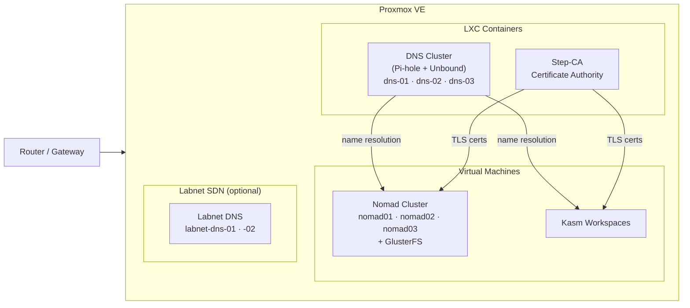
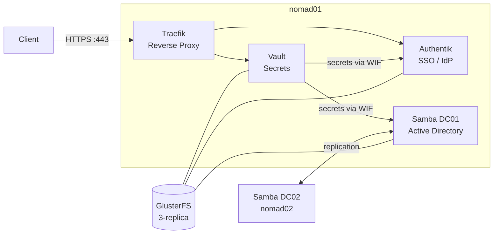
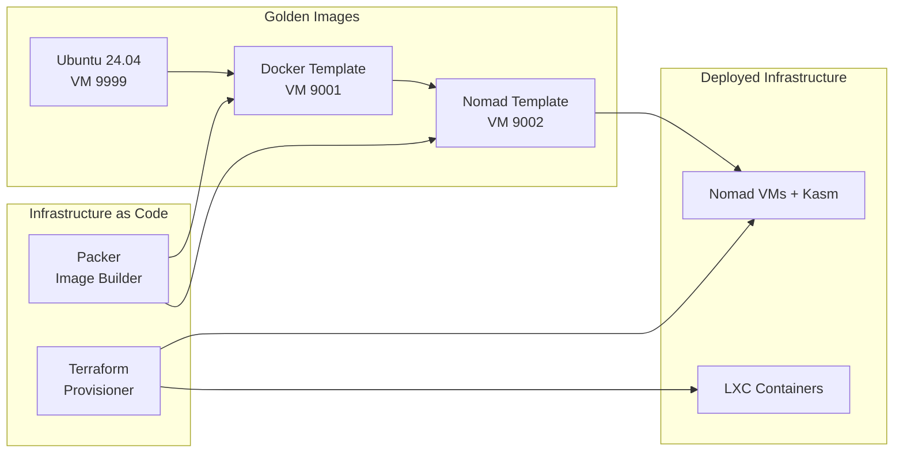

# Architecture Overview

This page provides a high-level view of the Proxmox Lab infrastructure, built on a Nomad-based container orchestration platform with GlusterFS distributed storage.

## System Architecture

The infrastructure has two layers: a **platform layer** (VMs and containers managed by Terraform) and a **services layer** (applications scheduled by Nomad).

### Platform Layer

### Services Layer (Nomad)

All services run as Docker containers scheduled by Nomad. Core services are pinned to **nomad01** for consistent DNS and routing.

For detailed diagrams of individual components, see [Network Topology](network-topology.md) and [Service Relationships](service-relationships.md).

## Component Summary

| Component | Type | VMID | Network | Purpose |
|-----------|------|------|---------|---------|
| dns-01 | LXC | 910 | vmbr0 | Primary DNS + ad-blocking (Pi-hole v6 + Unbound) |
| dns-02 | LXC | 911 | vmbr0 | Secondary DNS (nebula-sync replication) |
| dns-03 | LXC | 912 | vmbr0 | Tertiary DNS (nebula-sync replication) |
| labnet-dns-01 | LXC | 920 | labnet | Labnet DNS (Pi-hole v6) |
| labnet-dns-02 | LXC | 921 | labnet | Labnet DNS secondary |
| step-ca | LXC | 902 | vmbr0 | Internal Certificate Authority (ACME) |
| nomad01 | VM | 905 | vmbr0 | Nomad server+client, runs all pinned services |
| nomad02 | VM | 906 | vmbr0 | Nomad server+client, Samba DC02 |
| nomad03 | VM | 907 | vmbr0 | Nomad server+client |
| kasm01 | VM | 930 | vmbr0 | Kasm Workspaces (browser-based desktops) |

### Packer Templates

| Template | VMID | Purpose |
|----------|------|---------|
| Ubuntu Server 24.04 | 9999 | Base template for all VMs |
| Docker template | 9001 | Ubuntu + Docker + GlusterFS + acme.sh |
| Nomad template | 9002 | Docker template + Nomad + Consul |

## Technology Stack

### Infrastructure Layer

| Tool | Purpose |
|------|---------|
| **Proxmox VE** | Hypervisor platform (7.x+) |
| **Terraform** | Infrastructure provisioning (bpg/proxmox provider) |
| **Packer** | Golden image creation (hashicorp/proxmox plugin) |
| **Docker** | Container runtime on all VMs |
| **Cloud-init** | VM/LXC first-boot configuration |

### Networking Layer

| Component | Technology | Purpose |
|-----------|------------|---------|
| External Bridge | vmbr0 | Physical LAN connectivity (user-configured CIDR) |
| Lab SDN | Proxmox SDN (labnet) | Optional isolated virtual network |
| DNS | Pi-hole v6 + Unbound | Ad-blocking + DNS-over-TLS to Cloudflare/Quad9 |
| DNS Replication | nebula-sync | Replicates Pi-hole config every 5 minutes |
| Reverse Proxy | Traefik | HTTP/HTTPS routing with automatic TLS |

### Security Layer

| Component | Technology | Purpose |
|-----------|------------|---------|
| Certificate Authority | step-ca | Internal PKI with ACME protocol |
| Node Certificates | acme.sh | Automated cert management on Nomad nodes |
| Service Certificates | Traefik certresolver | Automatic TLS for Nomad services via step-ca |
| Secrets Management | HashiCorp Vault | KV secrets engine, auto-unseal |
| Vault Integration | Workload Identity Federation | JWT-based auth (no tokens stored on nodes) |
| Authentication | ed25519 SSH keys | Secure remote access |

### Orchestration Layer

| Component | Technology | Purpose |
|-----------|------------|---------|
| Container Orchestration | HashiCorp Nomad | Job scheduling and service discovery |
| Distributed Storage | GlusterFS | 3-replica shared volume at `/srv/gluster/nomad-data` |
| Service Discovery | Nomad native | Traefik discovers services via Nomad API |
| Load Balancing | Traefik | Reverse proxy with automatic TLS |

### Identity Layer

| Component | Technology | Purpose |
|-----------|------------|---------|
| SSO / Identity Provider | Authentik | OAuth2, OIDC, SAML, LDAP |
| Active Directory | Samba AD | Domain controllers (DC01 + DC02) |
| AD Sync | Authentik LDAP source | Synchronizes AD users to Authentik |

## Resource Allocation

### Nomad VM Specifications

| VM | CPU Cores | Memory | Disk | Role |
|----|-----------|--------|------|------|
| nomad01 | 4 | 8 GB | 100 GB | Server + Client (pinned services) |
| nomad02 | 4 | 8 GB | 100 GB | Server + Client (Samba DC02) |
| nomad03 | 4 | 8 GB | 100 GB | Server + Client |

### Other VM Specifications

| VM | CPU Cores | Memory | Disk |
|----|-----------|--------|------|
| kasm01 | 4 | 8 GB | 100 GB |

### LXC Container Specifications

| Container | CPU Cores | Memory | Disk |
|-----------|-----------|--------|------|
| dns-01 (primary) | 2 | 1 GB | 4 GB |
| dns-02 | 2 | 1 GB | 4 GB |
| dns-03 | 2 | 1 GB | 4 GB |
| labnet-dns-01 | 2 | 1 GB | 4 GB |
| labnet-dns-02 | 2 | 1 GB | 4 GB |
| step-ca | 2 | 2 GB | 8 GB |

### Total Resource Usage (Full Deployment)

| Resource | Amount |
|----------|--------|
| **CPU Cores** | 28 cores |
| **Memory** | 40 GB |
| **Disk Space** | 424 GB |

!!! tip "Customization"
    Resource allocations are configurable via Terraform module variables.
    DNS node count scales with your Proxmox cluster size (one per node).
    Labnet DNS is optional and deploys a maximum of 2 nodes.

## Design Principles

### 1. Infrastructure as Code

All infrastructure is defined in code (Terraform HCL and Packer HCL), enabling:

- **Reproducibility** -- Deploy the same infrastructure consistently across environments
- **Version Control** -- Track all changes over time with Git
- **Living Documentation** -- Code serves as the authoritative source of truth

### 2. Immutable Infrastructure

VMs are created from golden images (Packer templates) rather than configured in place:

- **Consistency** -- Every VM starts from the same validated base image
- **No Configuration Drift** -- Rebuild rather than patch
- **Speed** -- Provisioning from a template is faster than configuring from scratch

### 3. Security by Default

- **Internal CA** -- All services use TLS certificates issued by step-ca
- **ACME Protocol** -- Automated certificate issuance and renewal
- **Workload Identity Federation** -- Vault integration via JWT, no long-lived tokens
- **Network Segmentation** -- Optional labnet SDN isolates lab traffic
- **SSH Key Authentication** -- No password-based SSH access

### 4. High Availability via Nomad Cluster

The 3-node Nomad cluster provides resilience at multiple layers:

- **Raft Consensus** -- Nomad servers use Raft for distributed state management; the cluster tolerates a single node failure while maintaining quorum
- **GlusterFS Replication** -- Data written to `/srv/gluster/nomad-data` is replicated across all 3 nodes, surviving any single disk or node failure
- **Service Rescheduling** -- If a Nomad client node fails, jobs are rescheduled to healthy nodes (with the exception of services pinned to specific hosts)
- **DNS Redundancy** -- Multiple Pi-hole instances synced via nebula-sync provide DNS failover

!!! note "Service Pinning"
    Core services (Traefik, Vault, Authentik) are pinned to nomad01 via hostname constraints.
    This simplifies DNS (all service records point to nomad01) and ensures ACME challenges
    are handled by a single Traefik instance. The trade-off is that nomad01 is a critical node
    for these services.

## Next Steps

- [:octicons-arrow-right-24: Network Topology](network-topology.md) -- Detailed network architecture
- [:octicons-arrow-right-24: Service Relationships](service-relationships.md) -- How services interact
- [:octicons-arrow-right-24: Certificate Chain](certificate-chain.md) -- TLS certificate hierarchy
