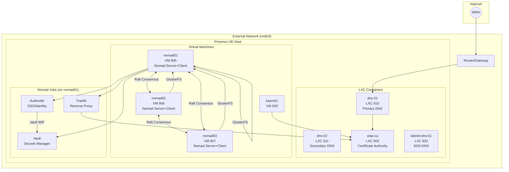
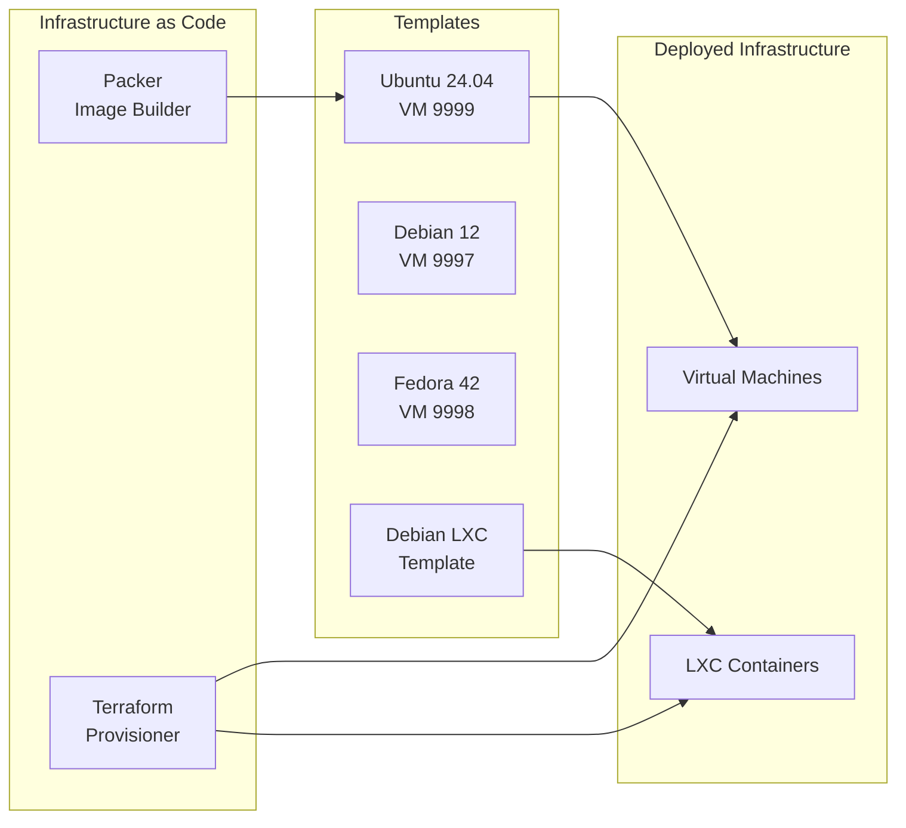

# Architecture Overview

This page provides a high-level view of the Proxmox Lab infrastructure.

## System Architecture

## Component Summary

| Component | Type | VMID | Network | IP Address | Purpose |
|-----------|------|------|---------|------------|---------|
| step-ca | LXC | 902 | vmbr0 | User-defined | Certificate Authority with ACME |
| nomad01 | VM | 905 | vmbr0 | User-defined | Nomad server+client, GlusterFS |
| nomad02 | VM | 906 | vmbr0 | User-defined | Nomad server+client, GlusterFS |
| nomad03 | VM | 907 | vmbr0 | User-defined | Nomad server+client, GlusterFS |
| dns-01 | LXC | 910 | vmbr0 | User-defined | Pi-hole v6 + Unbound (Primary) |
| dns-02 | LXC | 911 | vmbr0 | User-defined | Pi-hole v6 + Unbound (Secondary) |
| dns-03 | LXC | 912 | vmbr0 | User-defined | Pi-hole v6 + Unbound (Tertiary) |
| labnet-dns-01 | LXC | 920 | labnet | SDN internal | Pi-hole v6 for SDN network |
| labnet-dns-02 | LXC | 921 | labnet | SDN internal | Pi-hole v6 for SDN network |
| kasm01 | VM | 930 | vmbr0 | User-defined | Kasm Workspaces |
| **Nomad Jobs** | | | | | |
| traefik | Nomad Job | - | nomad01 | nomad01 IP:80/443 | Reverse proxy, load balancer |
| vault | Nomad Job | - | nomad01 | nomad01 IP:8200 | Secrets manager |
| authentik | Nomad Job | - | nomad01 | nomad01 IP:9000 | SSO/Identity provider |

## Technology Stack

### Infrastructure Layer

| Tool | Version | Purpose |
|------|---------|---------|
| **Proxmox VE** | 8.x+ | Hypervisor platform |
| **Terraform** | Latest | Infrastructure provisioning |
| **Packer** | Latest | Golden image creation |
| **HashiCorp Nomad** | Latest | Container orchestration |
| **HashiCorp Vault** | 1.15+ | Secrets management |
| **Docker** | Latest | Container runtime |
| **GlusterFS** | Latest | Distributed file system |

### Networking Layer

| Component | Technology | Purpose |
|-----------|------------|---------|
| External Bridge | vmbr0 | Physical network connectivity |
| Lab SDN | Proxmox SDN (labnet) | Isolated virtual network |
| DNS (Main) | Pi-hole v6 + Unbound | Secure DNS with Gravity Sync |
| DNS (Labnet) | Pi-hole v6 | SDN network DNS |
| Reverse Proxy | Traefik | Load balancing, TLS termination |

### Security Layer

| Component | Technology | Purpose |
|-----------|------------|---------|
| Certificate Authority | Step-CA | TLS certificate issuance |
| ACME Protocol | Traefik + step-ca | Automated certificate management |
| Secrets Management | HashiCorp Vault | Centralized secrets storage |
| Workload Identity | Vault WIF (JWT) | Token-less authentication |
| SSO/Identity | Authentik | OAuth2/OIDC/SAML provider |
| Key Management | ed25519 SSH keys | Secure authentication |

### Application Layer

| Component | Technology | Purpose |
|-----------|------------|---------|
| Container Orchestration | HashiCorp Nomad | Cluster scheduler and orchestration |
| Distributed Storage | GlusterFS | Replicated volume for Nomad jobs |
| Remote Workspaces | Kasm | Browser-based desktops |
| Reverse Proxy | Traefik | Service discovery and routing |

## Resource Allocation

### Default VM Specifications

| VM | CPU Cores | Memory | Disk |
|----|-----------|--------|------|
| nomad01 | 4 | 8 GB | 100 GB |
| nomad02 | 4 | 8 GB | 100 GB |
| nomad03 | 4 | 8 GB | 100 GB |
| kasm01 | 4 | 8 GB | 100 GB |

### Default LXC Specifications

| Container | CPU Cores | Memory | Disk |
|-----------|-----------|--------|------|
| dns-01/02/03 | 2 | 2 GB | 8 GB |
| labnet-dns-01/02 | 2 | 2 GB | 8 GB |
| step-ca | 2 | 2 GB | 8 GB |

### Total Resource Usage

| Resource | Amount |
|----------|--------|
| **CPU Cores** | 24+ cores (base infra + Nomad jobs) |
| **Memory** | 44+ GB (base infra + Nomad jobs) |
| **Disk Space** | 450+ GB |

Note: Nomad jobs (Vault, Authentik, Traefik) run on nomad01 and consume additional resources.

!!! tip "Customization"
    These values can be adjusted in the Terraform module variables.
    See [Configuration Reference](../configuration/terraform-variables.md).

## Design Principles

### 1. Infrastructure as Code

All infrastructure is defined in code (Terraform HCL and Packer HCL), enabling:

- **Reproducibility** - Deploy the same infrastructure consistently
- **Version Control** - Track changes over time
- **Documentation** - Code serves as living documentation

### 2. Immutable Infrastructure

VMs are created from golden images (Packer templates) rather than configured in place:

- **Consistency** - Every VM starts from the same base
- **Reliability** - No configuration drift
- **Speed** - Faster provisioning than configuring from scratch

### 3. Security by Default

- **Internal CA** - All services use TLS certificates
- **ACME Protocol** - Automated certificate management
- **Network Segmentation** - Lab traffic isolated on SDN
- **SSH Key Authentication** - No password-based SSH

### 4. High Availability

Nomad cluster provides:

- **3 Server Nodes** - Survives single node failure
- **Raft Consensus** - Distributed state management
- **GlusterFS Replication** - Shared storage across all nodes
- **Job Scheduling** - Automatic rescheduling on node failure

## Next Steps

- [:octicons-arrow-right-24: Network Topology](network-topology.md) - Detailed network architecture
- [:octicons-arrow-right-24: Service Relationships](service-relationships.md) - How services interact
- [:octicons-arrow-right-24: Certificate Chain](certificate-chain.md) - TLS certificate hierarchy
