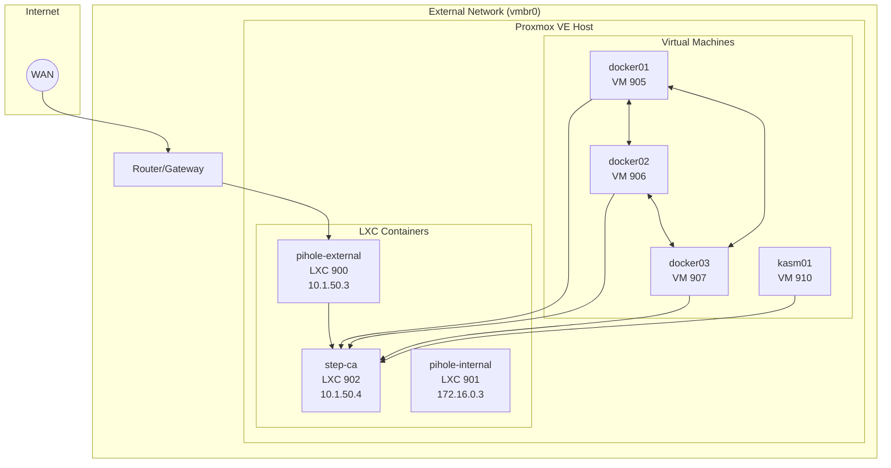
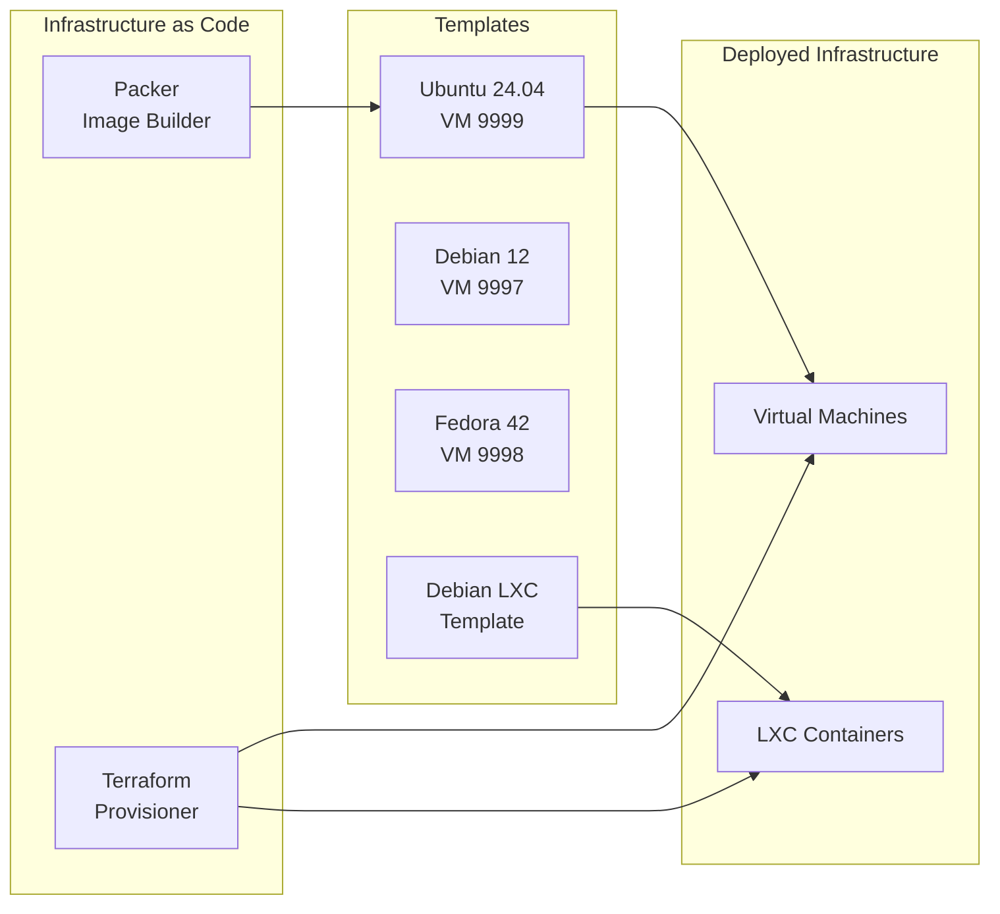

# Architecture Overview

This page provides a high-level view of the Proxmox Lab infrastructure.

## System Architecture

## Component Summary

| Component | Type | VMID | Network | IP Address | Purpose |
|-----------|------|------|---------|------------|---------|
| pihole-external | LXC | 900 | vmbr0 | Configurable | External DNS + ad-blocking |
| pihole-internal | LXC | 901 | labnet | 172.16.0.3 | Lab DNS + DHCP |
| step-ca | LXC | 902 | vmbr0 | Configurable | Certificate Authority |
| docker01 | VM | 905 | vmbr0 | DHCP | Docker Swarm manager |
| docker02 | VM | 906 | vmbr0 | DHCP | Docker Swarm manager |
| docker03 | VM | 907 | vmbr0 | DHCP | Docker Swarm manager |
| kasm01 | VM | 910 | vmbr0 | DHCP | Kasm Workspaces |

## Technology Stack

### Infrastructure Layer

| Tool | Version | Purpose |
|------|---------|---------|
| **Proxmox VE** | 8.x+ | Hypervisor platform |
| **Terraform** | Latest | Infrastructure provisioning |
| **Packer** | Latest | Golden image creation |
| **Docker** | Latest | Container runtime |

### Networking Layer

| Component | Technology | Purpose |
|-----------|------------|---------|
| External Bridge | vmbr0 | Physical network connectivity |
| Lab SDN | Proxmox SDN | Isolated virtual network |
| DNS (External) | Pihole + Unbound + dnscrypt-proxy | Secure DNS resolution |
| DNS (Internal) | Pihole | Lab DNS + DHCP |

### Security Layer

| Component | Technology | Purpose |
|-----------|------------|---------|
| Certificate Authority | Step-CA | TLS certificate issuance |
| ACME Client | acme.sh | Automated certificate management |
| Key Management | ed25519 SSH keys | Secure authentication |

### Application Layer

| Component | Technology | Purpose |
|-----------|------------|---------|
| Container Orchestration | Docker Swarm | HA container management |
| Distributed Storage | GlusterFS | Shared storage for containers |
| Remote Workspaces | Kasm | Browser-based desktops |
| Container Management | Portainer | Web UI for Docker |

## Resource Allocation

### Default VM Specifications

| VM | CPU Cores | Memory | Disk |
|----|-----------|--------|------|
| docker01 | 4 | 8 GB | 100 GB |
| docker02 | 4 | 8 GB | 100 GB |
| docker03 | 4 | 8 GB | 100 GB |
| kasm01 | 4 | 8 GB | 100 GB |

### Default LXC Specifications

| Container | CPU Cores | Memory | Disk |
|-----------|-----------|--------|------|
| pihole-external | 2 | 1 GB | 4 GB |
| pihole-internal | 2 | 1 GB | 4 GB |
| step-ca | 2 | 2 GB | 8 GB |

### Total Resource Usage

| Resource | Amount |
|----------|--------|
| **CPU Cores** | 22 cores |
| **Memory** | 38 GB |
| **Disk Space** | 424 GB |

!!! tip "Customization"
    These values can be adjusted in the Terraform module variables.
    See [Configuration Reference](../configuration/terraform-variables.md).

## Design Principles

### 1. Infrastructure as Code

All infrastructure is defined in code (Terraform HCL and Packer HCL), enabling:

- **Reproducibility** - Deploy the same infrastructure consistently
- **Version Control** - Track changes over time
- **Documentation** - Code serves as living documentation

### 2. Immutable Infrastructure

VMs are created from golden images (Packer templates) rather than configured in place:

- **Consistency** - Every VM starts from the same base
- **Reliability** - No configuration drift
- **Speed** - Faster provisioning than configuring from scratch

### 3. Security by Default

- **Internal CA** - All services use TLS certificates
- **ACME Protocol** - Automated certificate management
- **Network Segmentation** - Lab traffic isolated on SDN
- **SSH Key Authentication** - No password-based SSH

### 4. High Availability

Docker Swarm provides:

- **3 Manager Nodes** - Survives single node failure
- **Raft Consensus** - Distributed state management
- **Service Replication** - Containers can run on any node

## Next Steps

- [:octicons-arrow-right-24: Network Topology](network-topology.md) - Detailed network architecture
- [:octicons-arrow-right-24: Service Relationships](service-relationships.md) - How services interact
- [:octicons-arrow-right-24: Certificate Chain](certificate-chain.md) - TLS certificate hierarchy
