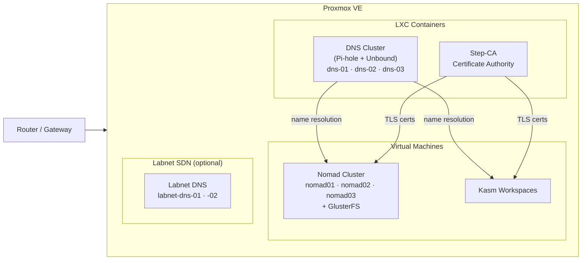
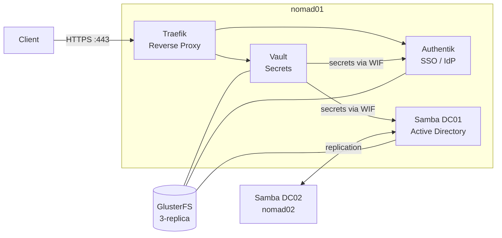
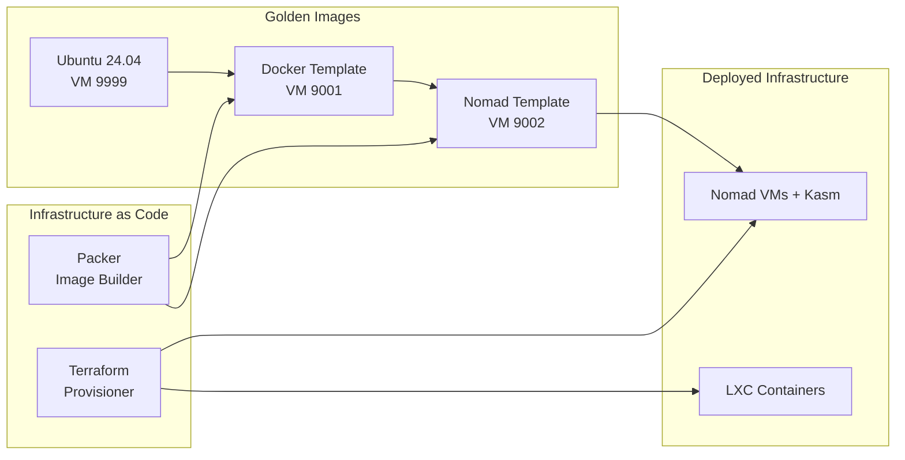

# Architecture Overview

This page describes the two-layer Terraform architecture, module structure, and design principles of Proxmox Lab.

## Two-Layer Terraform Architecture

The project uses a deliberately separated two-layer architecture. This separation exists because Vault must be initialized by an imperative script before Terraform can use it as a provider — you cannot declaratively create the very token you need to authenticate with.

```
Layer 1: terraform/
  Provisions physical infrastructure (VMs, LXC containers)
  Provider: bpg/proxmox
  Knows nothing about what runs inside those VMs

Layer 2: terraform/services/
  Configures services running on the infrastructure
  Providers: hashicorp/vault, hashicorp/nomad
  Requires Vault to be initialized (from Layer 1) before it can run
```

### Layer 1 — Infrastructure

Directory: `terraform/`

| Resource | Type | VMID | Module |
|----------|------|------|--------|
| nomad01, nomad02, nomad03 | Proxmox VMs | 905-907 | `vm-nomad/` |
| dns-01, dns-02, dns-03 | Proxmox LXC | 910-912 | `lxc-pihole/` |
| kasm01 (optional) | Proxmox VM | 930 | `vm-kasm/` |
| vault | Nomad job | — | `main.tf` |

Layer 1 also deploys the Vault Nomad job (TLS disabled initially) so it is available for Layer 2 to configure.

### Layer 2 — Services

Directory: `terraform/services/`

| Resource type | Examples |
|---------------|---------|
| Vault mounts | `secret/` (KV v2), `pki/`, `pki_int/` |
| Vault auth backends | `jwt-nomad` (Workload Identity Federation) |
| Vault JWT roles | authentik, samba-ad, backup, lam, netbox, tailscale |
| Vault policies | per-service read policies |
| Vault KV secrets | randomly generated passwords for all services |
| Nomad jobs | traefik, authentik, samba-ad, uptime-kuma, lam, netbox, backup, tailscale |
| DNS records | custom entries in Pi-hole via SSH |
| Authentik apps | configured via REST API (Authentik provider has provider bugs) |
| NAS domain joins | TrueNAS and Synology via REST API |
| Netbox inventory | populated via REST API |

## Deployment Flow

```
bootstrap.yml
     |
     v
runBootstrap()
  discovers Proxmox cluster, creates API token
  generates terraform.tfvars and packer vars
     |
     v
Packer builds (Phase 1)
  9999: base-ubuntu (cloud image)
  9001: ubuntu-docker (Docker, GlusterFS)
  9002: ubuntu-nomad  (Nomad, Consul, keepalived)
     |
     v
Layer 1: terraform apply — partial (Phase 2)
  module.nomad: 3 VMs with GlusterFS
  nomad_job.vault (TLS disabled)
     |
     v
initAndUnsealVault() (Phase 3)
  initializes Vault, saves unseal key + root token
  writes terraform/services/terraform.tfvars
     |
     v
Layer 2: terraform apply (Phase 4)
  Vault PKI (root + intermediate CA)
  JWT auth + per-service roles and policies
  KV secrets (generated passwords)
  Traefik wildcard TLS cert from pki_int
  Nomad job: traefik (system job, all nodes)
     |
     v
Layer 1: terraform apply — full (Phase 4 continued)
  module.dns-main: Pi-hole LXCs (passwords from Vault)
  nomad_job.vault: redeploy with TLS enabled
     |
     v
Layer 2: terraform apply — again
  DNS records in Pi-hole
  Authentik job + application configuration
```

## System Architecture

The infrastructure has two layers: a **platform layer** (VMs and containers managed by Terraform) and a **services layer** (applications scheduled by Nomad).

### Platform Layer


```mermaid
graph LR
    ROUTER[Router / Gateway] --> PROXMOX

    subgraph PROXMOX["Proxmox VE"]
        direction TB

        subgraph lxc["LXC Containers"]
            DNS["DNS Cluster\n(Pi-hole + Unbound)\ndns-01 · dns-02 · dns-03"]
            CA["Step-CA\nCertificate Authority"]
        end

        subgraph vms["Virtual Machines"]
            NOMAD["Nomad Cluster\nnomad01 · nomad02 · nomad03\n+ GlusterFS"]
            KASM["Kasm Workspaces"]
        end

        subgraph labnet["Labnet SDN (optional)"]
            LABDNS["Labnet DNS\nlabnet-dns-01 · -02"]
        end
    end

    DNS -->|name resolution| NOMAD
    DNS -->|name resolution| KASM
    CA -->|TLS certs| NOMAD
    CA -->|TLS certs| KASM
```

### Services Layer (Nomad)

All services run as Docker containers scheduled by Nomad. Core services are pinned to **nomad01** for consistent DNS and routing.


```mermaid
graph LR
    CLIENT[Client] -->|HTTPS :443| TRAEFIK

    subgraph nomad01["nomad01"]
        TRAEFIK[Traefik\nReverse Proxy]
        VAULT[Vault\nSecrets]
        AUTH[Authentik\nSSO / IdP]
        SAMBA1[Samba DC01\nActive Directory]
    end

    TRAEFIK --> VAULT
    TRAEFIK --> AUTH

    VAULT -->|secrets via WIF| AUTH
    VAULT -->|secrets via WIF| SAMBA1

    SAMBA2[Samba DC02\nnomad02] <-->|replication| SAMBA1

    GFS[(GlusterFS\n3-replica)] --- VAULT
    GFS --- AUTH
    GFS --- SAMBA1
```

For detailed diagrams of individual components, see [Network Topology](network-topology.md) and [Service Relationships](service-relationships.md).

## Component Summary

| Component | Type | VMID | Network | Purpose |
|-----------|------|------|---------|---------|
| dns-01 | LXC | 910 | vmbr0 | Primary DNS + ad-blocking (Pi-hole v6 + Unbound) |
| dns-02 | LXC | 911 | vmbr0 | Secondary DNS (nebula-sync replication) |
| dns-03 | LXC | 912 | vmbr0 | Tertiary DNS (nebula-sync replication) |
| labnet-dns-01 | LXC | 920 | labnet | Labnet DNS (Pi-hole v6) |
| labnet-dns-02 | LXC | 921 | labnet | Labnet DNS secondary |
| step-ca | LXC | 902 | vmbr0 | Internal Certificate Authority (ACME) |
| nomad01 | VM | 905 | vmbr0 | Nomad server+client, runs all pinned services |
| nomad02 | VM | 906 | vmbr0 | Nomad server+client, Samba DC02 |
| nomad03 | VM | 907 | vmbr0 | Nomad server+client |
| kasm01 | VM | 930 | vmbr0 | Kasm Workspaces (browser-based desktops) |

### Packer Templates

| Template | VMID | Purpose |
|----------|------|---------|
| Ubuntu Server 24.04 | 9999 | Base template for all VMs |
| Docker template | 9001 | Ubuntu + Docker + GlusterFS + acme.sh |
| Nomad template | 9002 | Docker template + Nomad + Consul |

## Technology Stack

### Infrastructure Layer


```mermaid
graph LR
    subgraph iac["Infrastructure as Code"]
        PACKER[Packer<br/>Image Builder]
        TERRAFORM[Terraform<br/>Provisioner]
    end

    subgraph templates["Golden Images"]
        UBUNTU[Ubuntu 24.04<br/>VM 9999]
        DOCKER_TPL[Docker Template<br/>VM 9001]
        NOMAD_TPL[Nomad Template<br/>VM 9002]
    end

    subgraph deployed["Deployed Infrastructure"]
        VMS[Nomad VMs + Kasm]
        CONTAINERS[LXC Containers]
    end

    PACKER --> DOCKER_TPL
    PACKER --> NOMAD_TPL
    UBUNTU --> DOCKER_TPL
    DOCKER_TPL --> NOMAD_TPL
    TERRAFORM --> VMS
    TERRAFORM --> CONTAINERS
    NOMAD_TPL --> VMS
```

| Tool | Purpose |
|------|---------|
| **Proxmox VE** | Hypervisor platform (7.x+) |
| **Terraform** | Infrastructure provisioning (bpg/proxmox provider) |
| **Packer** | Golden image creation (hashicorp/proxmox plugin) |
| **Docker** | Container runtime on all VMs |
| **Cloud-init** | VM/LXC first-boot configuration |

### Networking Layer

| Component | Technology | Purpose |
|-----------|------------|---------|
| External Bridge | vmbr0 | Physical LAN connectivity (user-configured CIDR) |
| Lab SDN | Proxmox SDN (labnet) | Optional isolated virtual network |
| DNS | Pi-hole v6 + Unbound | Ad-blocking + DNS-over-TLS to Cloudflare/Quad9 |
| DNS Replication | nebula-sync | Replicates Pi-hole config every 5 minutes |
| Reverse Proxy | Traefik | HTTP/HTTPS routing with automatic TLS |

### Security Layer

| Component | Technology | Purpose |
|-----------|------------|---------|
| Certificate Authority | step-ca | Internal PKI with ACME protocol |
| Node Certificates | acme.sh | Automated cert management on Nomad nodes |
| Service Certificates | Traefik certresolver | Automatic TLS for Nomad services via step-ca |
| Secrets Management | HashiCorp Vault | KV secrets engine, auto-unseal |
| Vault Integration | Workload Identity Federation | JWT-based auth (no tokens stored on nodes) |
| Authentication | ed25519 SSH keys | Secure remote access |

### Orchestration Layer

| Component | Technology | Purpose |
|-----------|------------|---------|
| Container Orchestration | HashiCorp Nomad | Job scheduling and service discovery |
| Distributed Storage | GlusterFS | 3-replica shared volume at `/srv/gluster/nomad-data` |
| Service Discovery | Nomad native | Traefik discovers services via Nomad API |
| Load Balancing | Traefik | Reverse proxy with automatic TLS |

### Identity Layer

| Component | Technology | Purpose |
|-----------|------------|---------|
| SSO / Identity Provider | Authentik | OAuth2, OIDC, SAML, LDAP |
| Active Directory | Samba AD | Domain controllers (DC01 + DC02) |
| AD Sync | Authentik LDAP source | Synchronizes AD users to Authentik |

## Resource Allocation

### Nomad VM Specifications

| VM | CPU Cores | Memory | Disk | Role |
|----|-----------|--------|------|------|
| nomad01 | 4 | 8 GB | 100 GB | Server + Client (pinned services) |
| nomad02 | 4 | 8 GB | 100 GB | Server + Client (Samba DC02) |
| nomad03 | 4 | 8 GB | 100 GB | Server + Client |

### Other VM Specifications

| VM | CPU Cores | Memory | Disk |
|----|-----------|--------|------|
| kasm01 | 4 | 8 GB | 100 GB |

### LXC Container Specifications

| Container | CPU Cores | Memory | Disk |
|-----------|-----------|--------|------|
| dns-01 (primary) | 2 | 1 GB | 4 GB |
| dns-02 | 2 | 1 GB | 4 GB |
| dns-03 | 2 | 1 GB | 4 GB |
| labnet-dns-01 | 2 | 1 GB | 4 GB |
| labnet-dns-02 | 2 | 1 GB | 4 GB |
| step-ca | 2 | 2 GB | 8 GB |

### Total Resource Usage (Full Deployment)

| Resource | Amount |
|----------|--------|
| **CPU Cores** | 28 cores |
| **Memory** | 40 GB |
| **Disk Space** | 424 GB |

!!! tip "Customization"
    Resource allocations are configurable via Terraform module variables.
    DNS node count scales with your Proxmox cluster size (one per node).
    Labnet DNS is optional and deploys a maximum of 2 nodes.

## Design Principles

### 1. Infrastructure as Code

All infrastructure is defined in code (Terraform HCL and Packer HCL), enabling:

- **Reproducibility** -- Deploy the same infrastructure consistently across environments
- **Version Control** -- Track all changes over time with Git
- **Living Documentation** -- Code serves as the authoritative source of truth

### 2. Immutable Infrastructure

VMs are created from golden images (Packer templates) rather than configured in place:

- **Consistency** -- Every VM starts from the same validated base image
- **No Configuration Drift** -- Rebuild rather than patch
- **Speed** -- Provisioning from a template is faster than configuring from scratch

### 3. Security by Default

- **Internal CA** -- All services use TLS certificates issued by step-ca
- **ACME Protocol** -- Automated certificate issuance and renewal
- **Workload Identity Federation** -- Vault integration via JWT, no long-lived tokens
- **Network Segmentation** -- Optional labnet SDN isolates lab traffic
- **SSH Key Authentication** -- No password-based SSH access

### 4. High Availability via Nomad Cluster

The 3-node Nomad cluster provides resilience at multiple layers:

- **Raft Consensus** -- Nomad servers use Raft for distributed state management; the cluster tolerates a single node failure while maintaining quorum
- **GlusterFS Replication** -- Data written to `/srv/gluster/nomad-data` is replicated across all 3 nodes, surviving any single disk or node failure
- **Service Rescheduling** -- If a Nomad client node fails, jobs are rescheduled to healthy nodes (with the exception of services pinned to specific hosts)
- **DNS Redundancy** -- Multiple Pi-hole instances synced via nebula-sync provide DNS failover

!!! note "Service Pinning"
    Core services (Traefik, Vault, Authentik) are pinned to nomad01 via hostname constraints.
    This simplifies DNS (all service records point to nomad01) and ensures ACME challenges
    are handled by a single Traefik instance. The trade-off is that nomad01 is a critical node
    for these services.

## Next Steps

- [:octicons-arrow-right-24: Network Topology](network-topology.md) -- Detailed network architecture
- [:octicons-arrow-right-24: Service Relationships](service-relationships.md) -- How services interact
- [:octicons-arrow-right-24: Certificate Chain](certificate-chain.md) -- TLS certificate hierarchy
