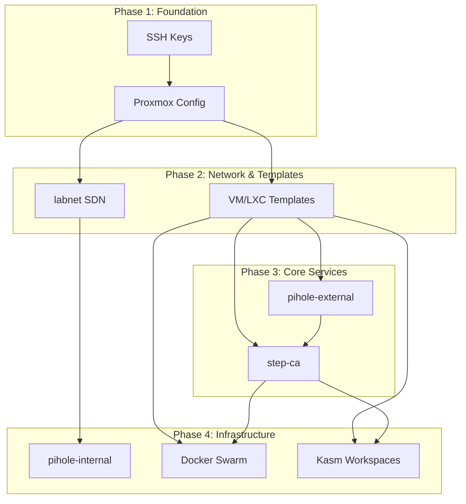
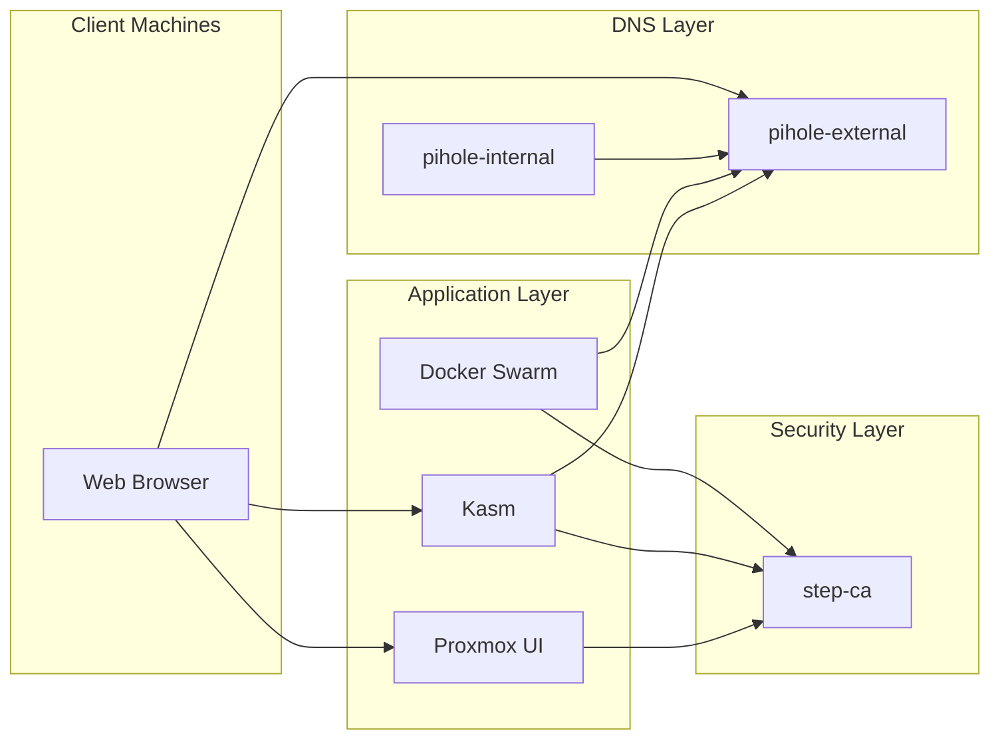
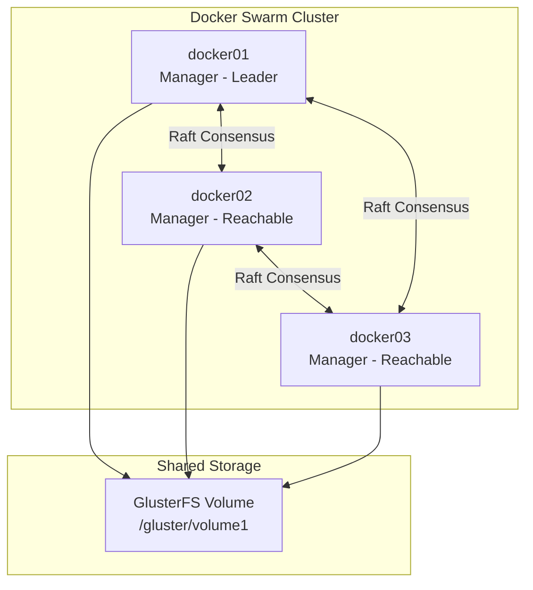
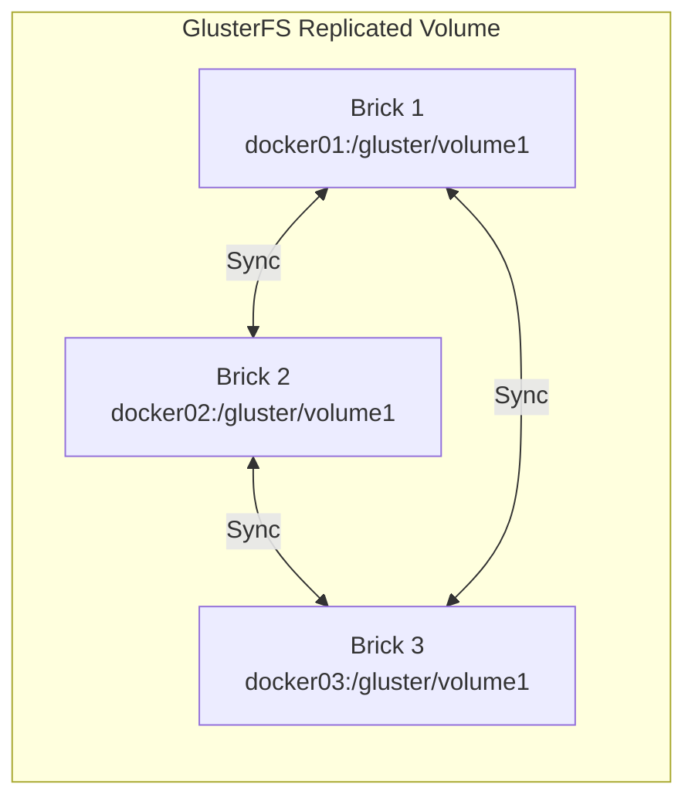
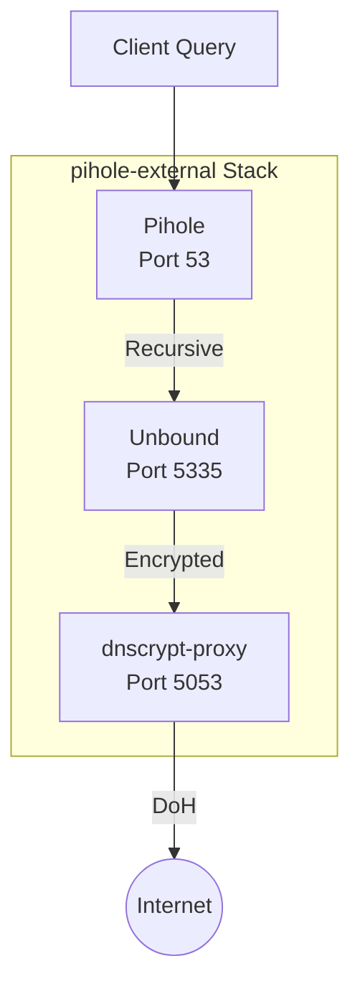
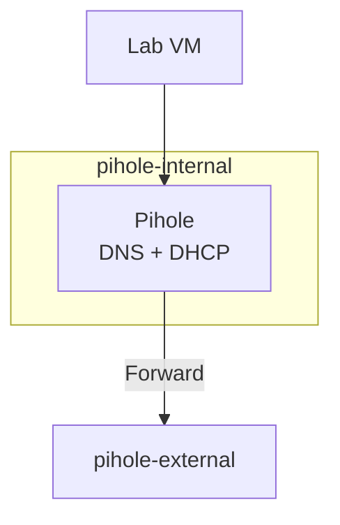
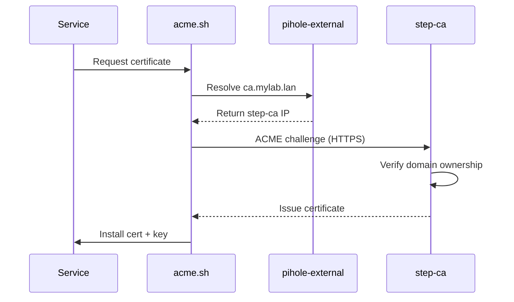
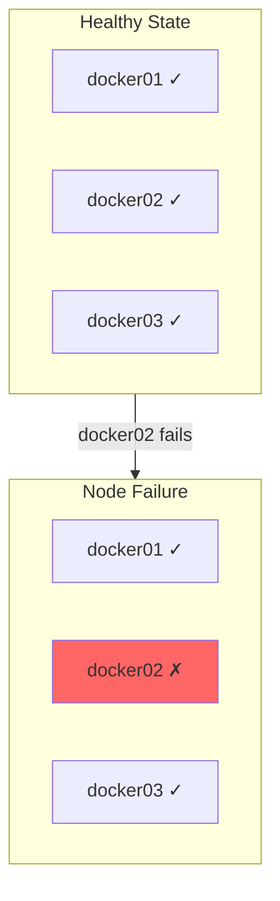

# Service Relationships

This page explains how services in Proxmox Lab depend on and interact with each other.

## Deployment Order

Services must be deployed in a specific order due to dependencies:

### Dependency Explanation

| Phase | Service | Depends On | Reason |
|-------|---------|------------|--------|
| 1 | SSH Keys | - | Required for all remote operations |
| 1 | Proxmox Config | SSH Keys | Needs SSH access to configure |
| 2 | SDN (labnet) | Proxmox Config | SDN is a Proxmox feature |
| 2 | Templates | Proxmox Config | Need storage and network |
| 3 | pihole-external | Templates | Cloned from LXC template |
| 3 | step-ca | pihole-external | Needs DNS resolution |
| 4 | pihole-internal | SDN | Runs on labnet |
| 4 | Docker Swarm | step-ca | Needs TLS certificates |
| 4 | Kasm | step-ca | Needs TLS certificates |

## Service Communication Matrix

### Runtime Dependencies

| Service | Talks To | Protocol | Purpose |
|---------|----------|----------|---------|
| **All Services** | pihole-external | DNS (53) | Name resolution |
| **Docker VMs** | step-ca | HTTPS (443) | Certificate requests |
| **Kasm** | step-ca | HTTPS (443) | Certificate requests |
| **Docker nodes** | Docker nodes | TCP 2377, 7946 | Swarm management |
| **Proxmox** | step-ca | HTTPS (443) | Web UI certificate |
| **pihole-internal** | pihole-external | DNS (53) | Forwarded queries |
| **Clients** | Kasm | HTTPS (443) | Web access |
| **Clients** | pihole-external | HTTP (80) | Admin interface |

### Communication Flow Diagram

## Docker Swarm Topology

### Manager Node Relationships

All three Docker nodes are configured as Swarm managers for high availability:

### Swarm Port Usage

| Port | Protocol | Purpose |
|------|----------|---------|
| 2377 | TCP | Cluster management |
| 7946 | TCP/UDP | Node discovery and gossip |
| 4789 | UDP | Overlay network (VXLAN) |

### GlusterFS Replication

Data written to any node is replicated to all three nodes.

## Pihole DNS Relationships

### External Pihole (pihole-external)

### Internal Pihole (pihole-internal)

## Certificate Request Flow

When a service needs a TLS certificate:

## Failure Scenarios

### Single Docker Node Failure

**Impact:** Swarm continues operating. Services on failed node are rescheduled.

### Pihole-External Failure

**Impact:** All DNS resolution fails for external network.

**Mitigation:** Configure a backup DNS in your router.

### Step-CA Failure

**Impact:** New certificates cannot be issued. Existing certificates continue working.

**Mitigation:** Restore from backup. See [Backup & Recovery](../operations/backup-recovery.md).

## Health Check Endpoints

| Service | Health Check | Expected Response |
|---------|--------------|-------------------|
| step-ca | `https://ca.mylab.lan/health` | `{"status":"ok"}` |
| pihole | `http://pihole-ip/admin/api.php` | JSON response |
| Docker | `docker node ls` | Node list |

## Next Steps

- [:octicons-arrow-right-24: Certificate Chain](certificate-chain.md) - TLS certificate hierarchy
- [:octicons-arrow-right-24: Docker Swarm Operations](../operations/docker-swarm-operations.md) - Managing the cluster
- [:octicons-arrow-right-24: Troubleshooting](../troubleshooting/common-issues.md) - When things go wrong
