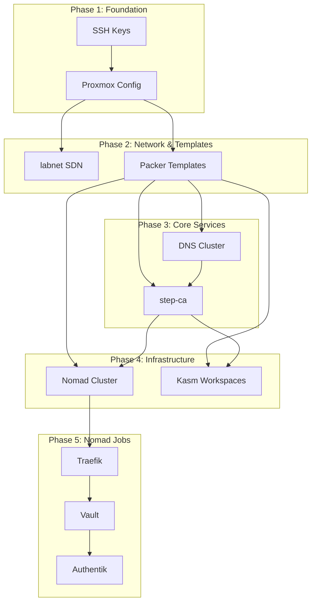
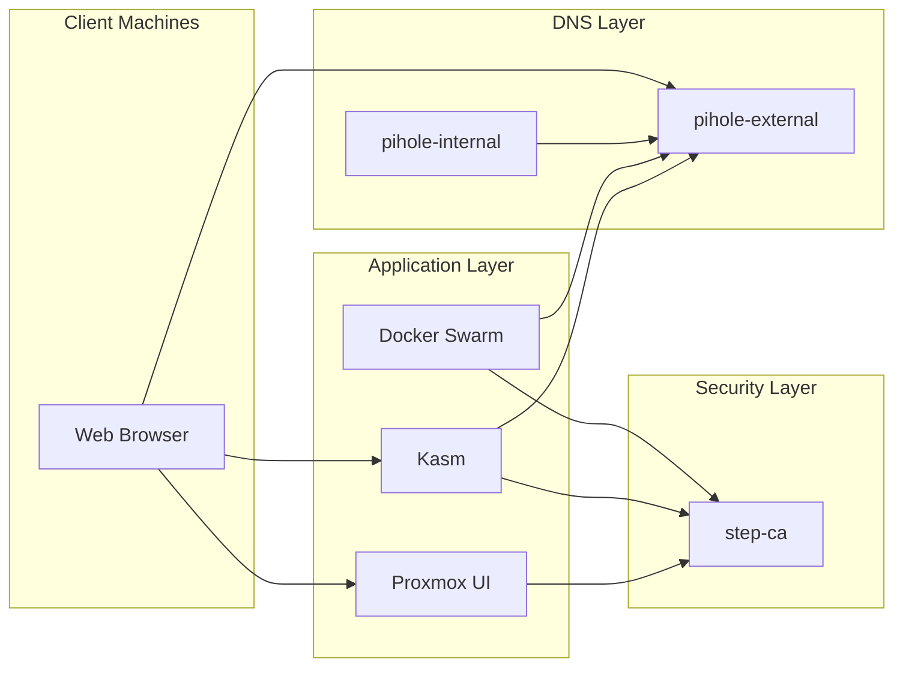
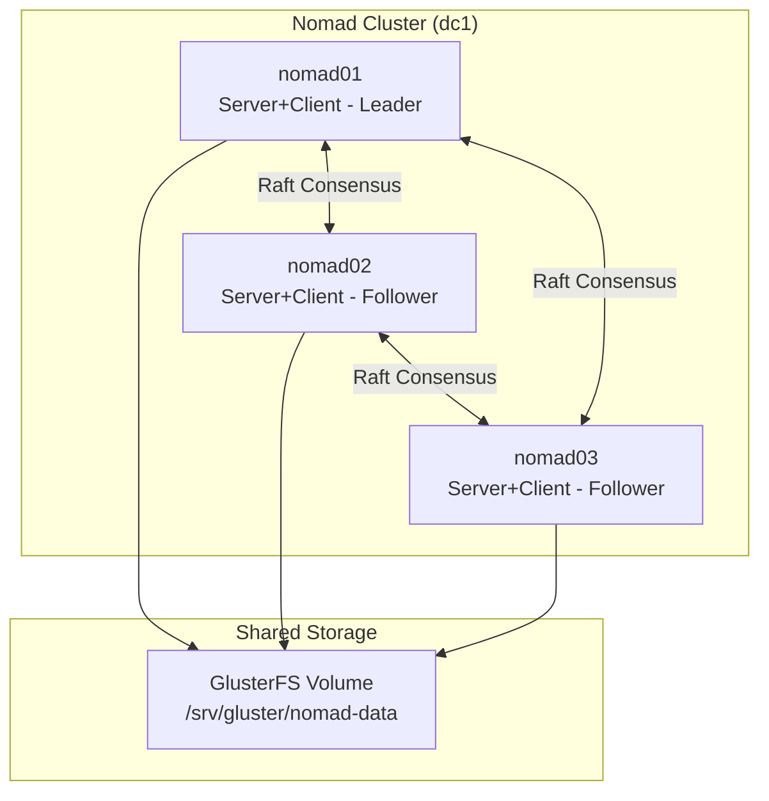
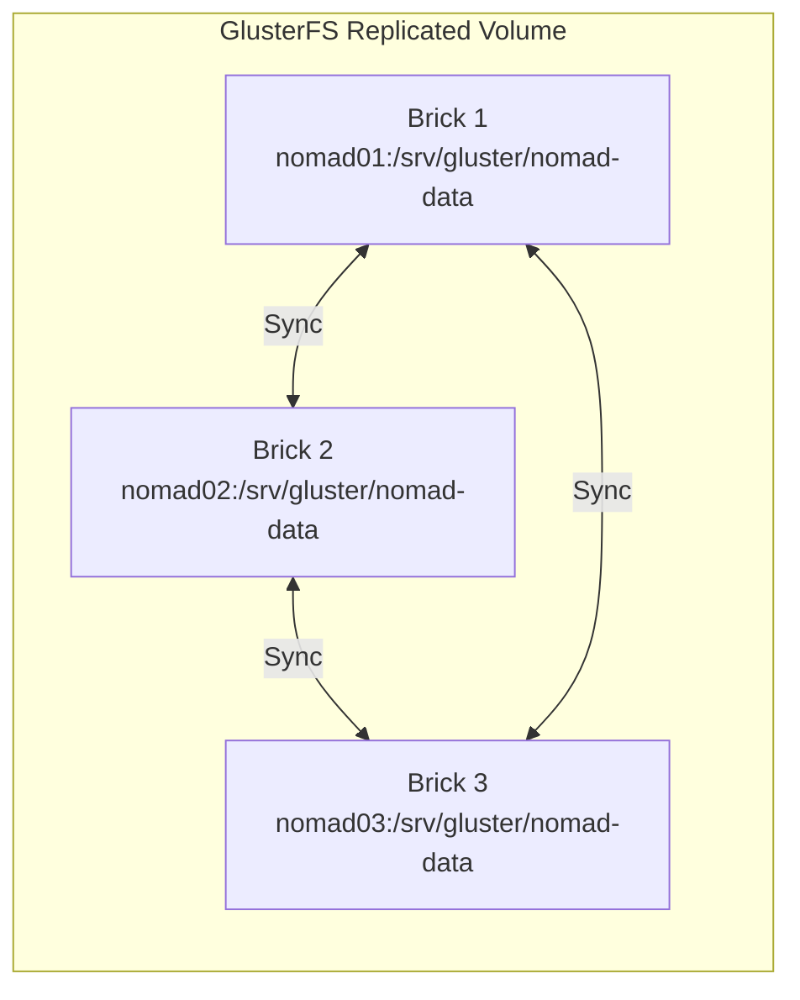
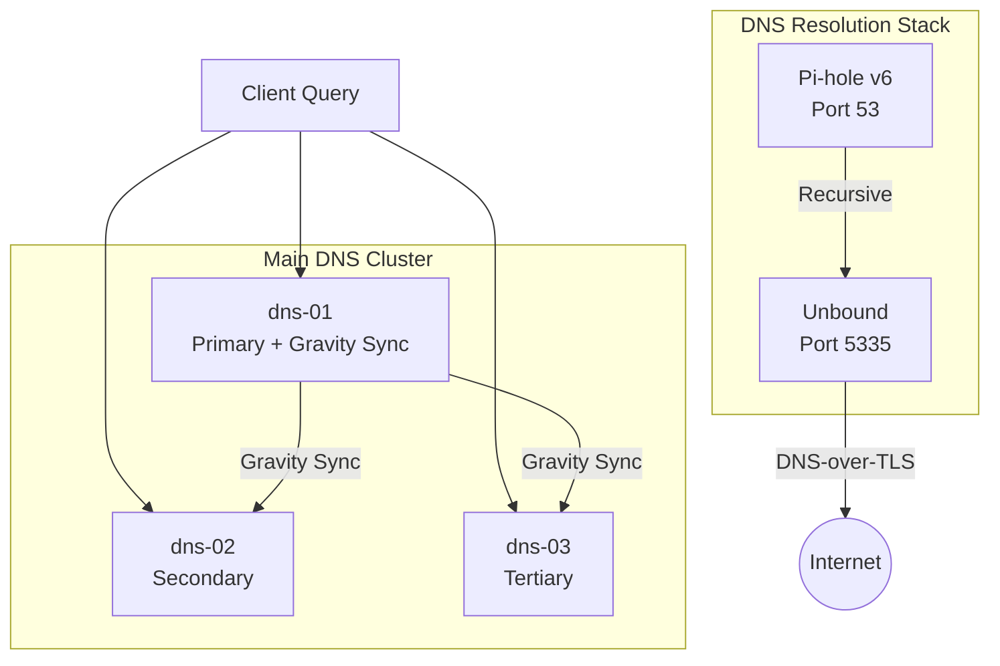
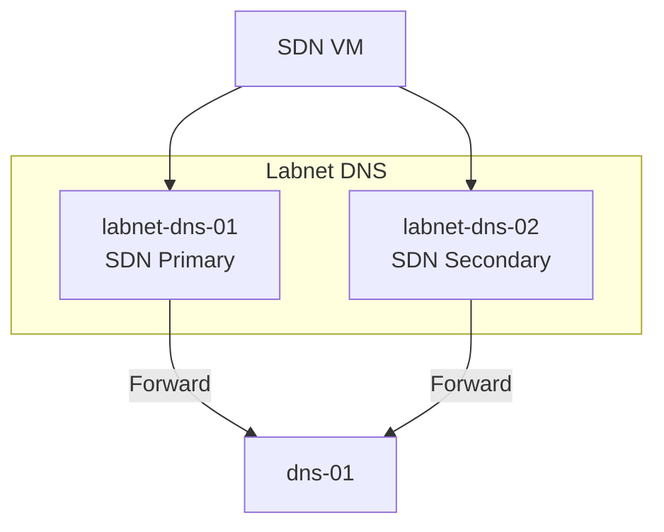
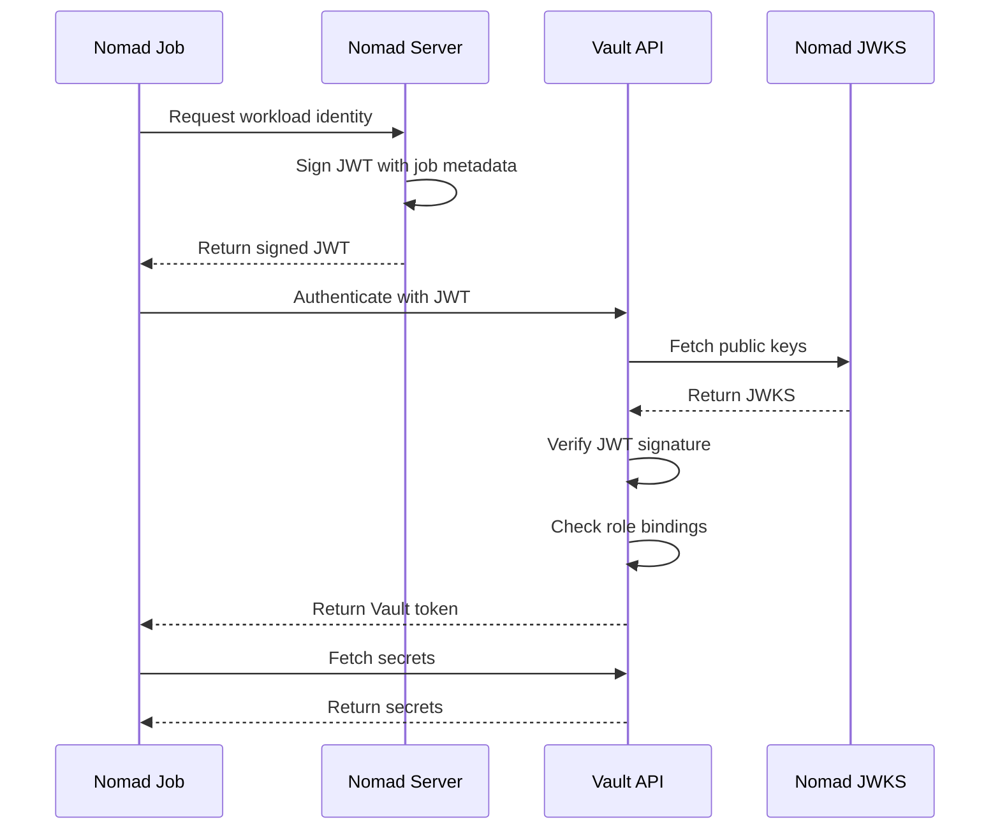
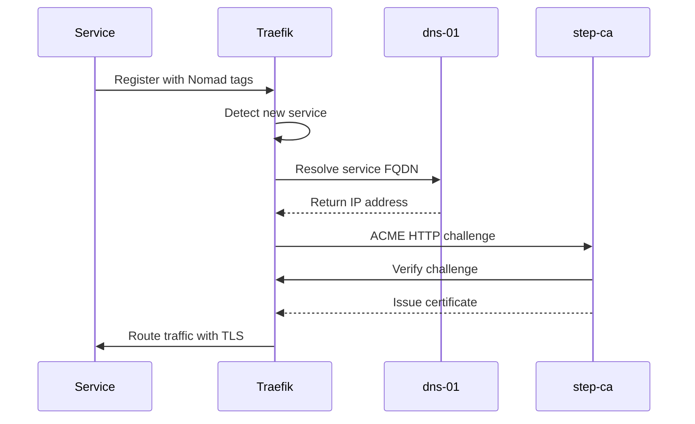
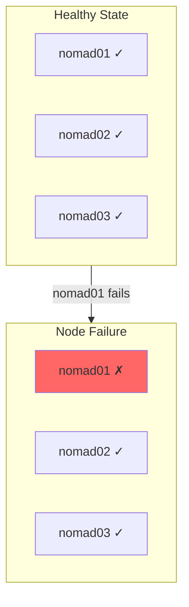

# Service Relationships

This page explains how services in Proxmox Lab depend on and interact with each other.

## Deployment Order

Services must be deployed in a specific order due to dependencies:

### Dependency Explanation

| Phase | Service | Depends On | Reason |
|-------|---------|------------|--------|
| 1 | SSH Keys | - | Required for all remote operations |
| 1 | Proxmox Config | SSH Keys | Needs SSH access to configure |
| 2 | SDN (labnet) | Proxmox Config | SDN is a Proxmox feature |
| 2 | Packer Templates | Proxmox Config | Need storage and network |
| 3 | DNS Cluster | Packer Templates | Deploy from templates |
| 3 | step-ca | DNS Cluster | Needs DNS resolution |
| 4 | Nomad Cluster | step-ca, Templates | Needs TLS certificates |
| 4 | Kasm | step-ca, Templates | Needs TLS certificates |
| 5 | Traefik | Nomad Cluster | Runs as Nomad job |
| 5 | Vault | Traefik | Needs ingress routing |
| 5 | Authentik | Vault | Fetches secrets from Vault |

## Service Communication Matrix

### Runtime Dependencies

| Service | Talks To | Protocol | Purpose |
|---------|----------|----------|---------|
| **All Services** | DNS Cluster | DNS (53) | Name resolution |
| **Nomad VMs** | step-ca | HTTPS (443) | Certificate requests |
| **Kasm** | step-ca | HTTPS (443) | Certificate requests |
| **Nomad nodes** | Nomad nodes | TCP 4646-4648 | Cluster management |
| **Nomad nodes** | Nomad nodes | GlusterFS | Replicated storage |
| **Traefik** | Nomad API | HTTP (4646) | Service discovery |
| **Traefik** | step-ca | HTTPS (443) | ACME challenges |
| **Authentik** | Vault | HTTP (8200) | Fetch secrets via WIF |
| **Proxmox** | step-ca | HTTPS (443) | Web UI certificate |
| **labnet-dns** | dns-01 | DNS (53) | Forwarded queries |
| **Clients** | Traefik | HTTPS (443) | Service access |
| **Clients** | DNS Cluster | HTTP (80) | Admin interface |

### Communication Flow Diagram

## Nomad Cluster Topology

### Server Node Relationships

All three Nomad nodes are configured as both servers and clients for high availability:

### Nomad Port Usage

| Port | Protocol | Purpose |
|------|----------|---------|
| 4646 | TCP | HTTP API and UI |
| 4647 | TCP | RPC (server-to-server) |
| 4648 | TCP/UDP | Serf gossip |

### GlusterFS Replication

Data written to any node is replicated to all three nodes. Nomad jobs store persistent data here.

## Pi-hole DNS Relationships

### Main DNS Cluster (dns-01, dns-02, dns-03)

### Labnet DNS (labnet-dns-01, labnet-dns-02)

## Vault Workload Identity Federation (WIF)

Nomad jobs authenticate to Vault using JWT-based Workload Identity instead of long-lived tokens:

Key points:

- No secrets stored on Nomad nodes
- JWT contains job metadata (job ID, task, namespace)
- Vault validates JWT against Nomad's JWKS endpoint
- Each job maps to a Vault role with specific policies

## Certificate Request Flow

When a service needs a TLS certificate:

## Failure Scenarios

### Single Nomad Node Failure

**Impact:**
- If nomad01 fails: Traefik, Vault, and Authentik become unavailable (pinned to nomad01)
- Cluster remains operational with 2 servers (quorum maintained)
- GlusterFS continues with 2 replicas

**Mitigation:**
- Redeploy jobs without node constraint, or
- Restore nomad01 from backup

### DNS Cluster Failure

**Impact:** DNS resolution fails if all DNS nodes are down.

**Mitigation:**
- Multiple DNS nodes provide redundancy
- Configure secondary DNS in router settings

### Vault Sealed/Failure

**Impact:**
- Authentik cannot fetch secrets (fails to start)
- New certificates can still be issued via Traefik

**Mitigation:**
- Unseal Vault using stored unseal key
- See [Vault Operations](../operations/vault-operations.md)

### Step-CA Failure

**Impact:** New certificates cannot be issued. Existing certificates continue working.

**Mitigation:** Restore from backup. See [Backup & Recovery](../operations/backup-recovery.md).

## Health Check Endpoints

| Service | Health Check | Expected Response |
|---------|--------------|-------------------|
| step-ca | `https://ca.mylab.lan/health` | `{"status":"ok"}` |
| Pi-hole | `http://dns-ip/admin/api.php` | JSON response |
| Nomad | `nomad server members` | Server list |
| Vault | `curl http://nomad01:8200/v1/sys/health` | JSON with `initialized: true` |
| Traefik | `http://nomad01:8081/api/http/routers` | JSON router list |
| Authentik | `http://nomad01:9000/-/health/live/` | HTTP 200 |

## Next Steps

- [:octicons-arrow-right-24: Certificate Chain](certificate-chain.md) - TLS certificate hierarchy
- [:octicons-arrow-right-24: Nomad Operations](../operations/nomad-operations.md) - Managing the cluster
- [:octicons-arrow-right-24: Vault Operations](../operations/vault-operations.md) - Secrets management
- [:octicons-arrow-right-24: Troubleshooting](../troubleshooting/common-issues.md) - When things go wrong
