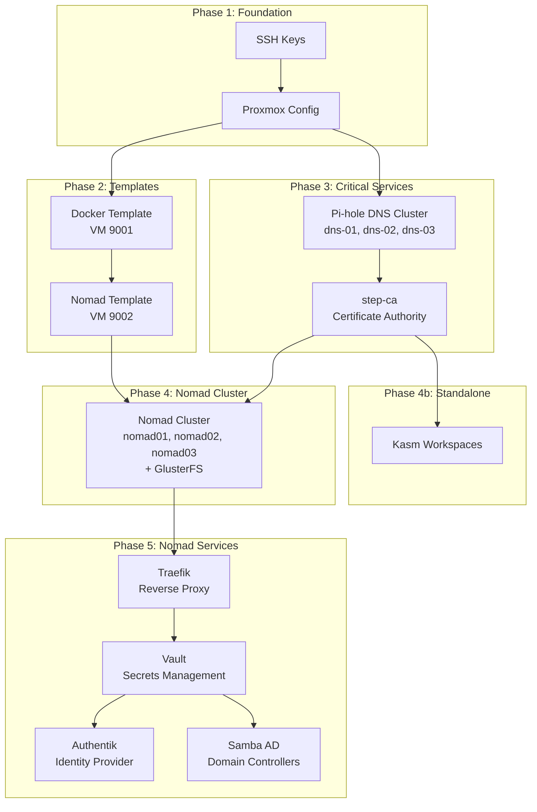
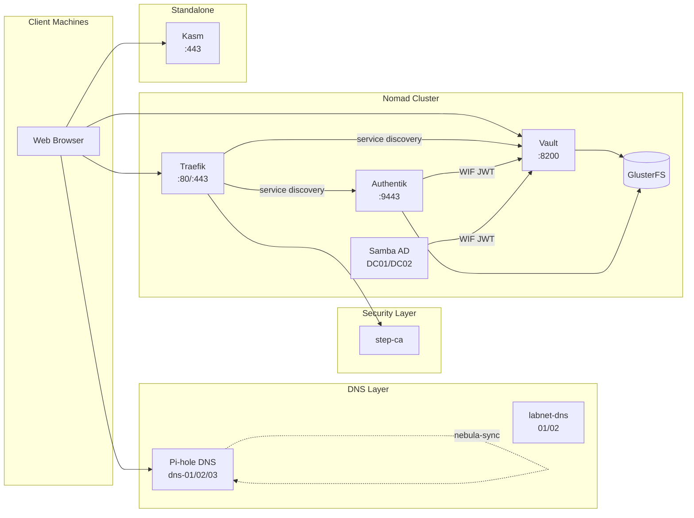
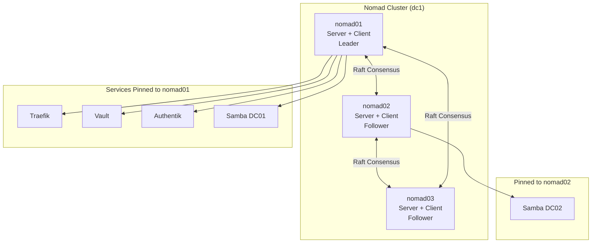
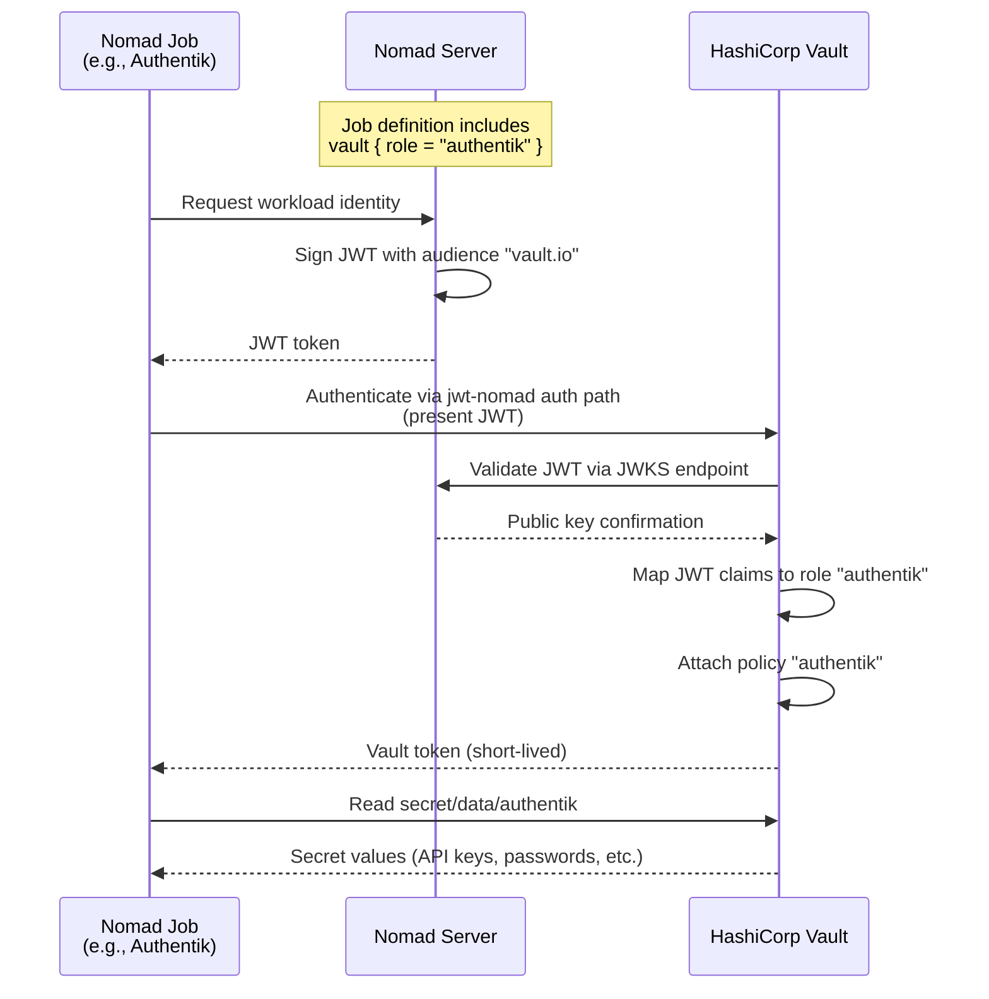
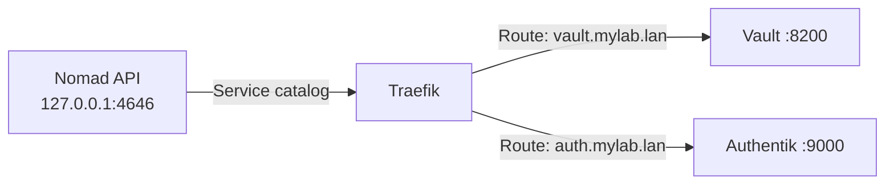

# Service Relationships

This page explains how services in Proxmox Lab depend on and interact with each other, including deployment order, runtime communication, and the Vault Workload Identity Federation integration.

## Deployment Order

Services must be deployed in a specific order due to dependencies. The `setup.sh` script enforces this automatically.



### Dependency Explanation

| Phase | Service | Depends On | Reason |
|-------|---------|------------|--------|
| 1 | SSH Keys | -- | Required for all remote operations |
| 1 | Proxmox Config | SSH Keys | Needs SSH access to configure API tokens, storage, SDN |
| 2 | Docker Template | Proxmox Config | Packer needs API access and storage |
| 2 | Nomad Template | Docker Template | Built on top of Docker template |
| 3 | Pi-hole DNS | Proxmox Config | LXC containers cloned from Debian template |
| 3 | step-ca | DNS | Needs DNS resolution for ACME directory |
| 4 | Nomad Cluster | step-ca + Nomad Template | Needs TLS certificates and Nomad image |
| 4b | Kasm | step-ca | Needs TLS certificates |
| 5 | Traefik | Nomad Cluster | First Nomad job; provides reverse proxy for other services |
| 5 | Vault | Traefik | Needs Traefik for TLS termination and routing |
| 5 | Authentik | Vault | Reads secrets from Vault via WIF |
| 5 | Samba AD | Vault | Reads AD admin password and sync credentials from Vault |

### setup.sh Menu Mapping

| Menu Option | What It Deploys | Prerequisites |
|-------------|-----------------|---------------|
| 3) Deploy all services | DNS + CA + Nomad + Kasm | Templates built |
| 4) Deploy critical services | DNS + CA only | Templates built |
| 5) Deploy Nomad only | Nomad cluster | Critical services running |
| 6) Deploy Kasm only | Kasm VM | Critical services + Docker template |
| 7) Deploy Traefik | Traefik Nomad job | Nomad cluster running |
| 8) Deploy Vault | Vault Nomad job | Traefik running |
| 9) Deploy Authentik | Authentik Nomad job | Vault running (secrets stored) |
| 16) Deploy Samba AD | Samba DC Nomad job | Vault running (secrets stored) |

## Service Communication Matrix

### Runtime Dependencies

| Service | Talks To | Protocol/Port | Purpose |
|---------|----------|---------------|---------|
| **All hosts** | Pi-hole DNS | DNS (53) | Name resolution |
| **Nomad nodes** | step-ca | HTTPS (443) | Certificate requests via acme.sh |
| **Nomad nodes** | Nomad nodes | TCP 4646-4648 | Cluster management (Raft, RPC, Serf) |
| **Nomad nodes** | Nomad nodes | TCP 24007, 49152+ | GlusterFS replication |
| **Traefik** | Nomad API | HTTP (4646) | Service discovery |
| **Traefik** | step-ca | HTTPS (443) | ACME certificate requests |
| **Vault** | GlusterFS | Filesystem | Persistent storage at `/srv/gluster/nomad-data/vault` |
| **Authentik** | Vault | HTTP (8200) | Fetch secrets via WIF JWT |
| **Authentik** | PostgreSQL | TCP (5432) | Local database (same task group) |
| **Samba AD** | Vault | HTTP (8200) | Fetch secrets via WIF JWT |
| **Kasm** | step-ca | HTTPS (443) | Certificate requests |
| **Clients** | Traefik | HTTP/HTTPS (80/443) | Access all web services |
| **Clients** | Vault | HTTP (8200) | Vault UI and API |
| **Clients** | Authentik | HTTPS (9443) | SSO authentication |

### Communication Flow Diagram



## Nomad Cluster Topology

### Server and Client Roles

All three Nomad nodes serve as both server and client:



### Service Pinning Rationale

All core services (Traefik, Vault, Authentik) are pinned to nomad01 using Nomad constraints:

```hcl
constraint {
  attribute = "${attr.unique.hostname}"
  value     = "nomad01"
}
```

This design ensures:

- **Consistent DNS** -- All service DNS records point to a single IP (nomad01)
- **ACME reliability** -- A single Traefik instance handles all HTTP-01 challenges
- **Simplified routing** -- No cross-node traffic for service-to-service communication
- **Predictable debugging** -- All service logs are on one node

Samba AD DC02 is pinned to nomad02 for Active Directory replication across separate hosts.

## GlusterFS Shared Storage

### Replication Topology


### Storage Paths

| Service | Storage Path | Mount Type |
|---------|-------------|------------|
| Traefik | `/srv/gluster/nomad-data/traefik` | GlusterFS (Docker bind mount) |
| Vault | `/srv/gluster/nomad-data/vault` | GlusterFS (Docker bind mount) |
| Authentik (PostgreSQL) | `/srv/gluster/nomad-data/authentik/postgres` | GlusterFS |
| Authentik (Redis) | `/srv/gluster/nomad-data/authentik/redis` | GlusterFS |
| Authentik (Media) | `/srv/gluster/nomad-data/authentik/media` | GlusterFS |
| Samba DC01 | Local `/opt/samba-dc01/` | Local filesystem |
| Samba DC02 | Local `/opt/samba-dc02/` | Local filesystem |

!!! warning "Samba AD Storage"
    Samba AD uses local filesystem paths instead of GlusterFS because Active Directory
    requires POSIX ACL support, which GlusterFS does not provide reliably for Samba's
    needs.

## Vault Workload Identity Federation (WIF)

Nomad and Vault integrate using JWT-based Workload Identity Federation. No long-lived Vault tokens are stored on Nomad nodes.

### WIF Authentication Flow



### WIF Configuration Components

| Component | Location | Purpose |
|-----------|----------|---------|
| JWT Auth Backend | Vault path `jwt-nomad` | Trusts Nomad's JWKS endpoint |
| JWKS URL | `http://nomad01:4646/.well-known/jwks.json` | Nomad's public key endpoint |
| Audience | `vault.io` | JWT audience claim |
| Nomad `default_identity` | Nomad server config | Signs JWTs for workloads |
| Per-job roles | Vault auth roles | Maps JWT claims to policies |

### Vault Secret Paths

| Service | Vault Path | Policy File | Secrets Stored |
|---------|------------|-------------|----------------|
| Authentik | `secret/data/authentik` | `nomad/vault-policies/authentik.hcl` | Secret key, PostgreSQL password, API tokens |
| Samba AD | `secret/data/samba-ad` | `nomad/vault-policies/samba-dc.hcl` | Admin password, Authentik sync credentials |

### Per-Job Vault Configuration

Each Nomad job that needs Vault secrets includes a `vault` stanza:

```hcl
# In the Nomad job file
vault {
  role = "authentik"
}

template {
  data = <<-EOT
    {{ with secret "secret/data/authentik" }}
    AUTHENTIK_SECRET_KEY={{ .Data.data.secret_key }}
    PG_PASS={{ .Data.data.pg_pass }}
    {{ end }}
  EOT
  destination = "secrets/env"
  env         = true
}
```

## Traefik Service Discovery

Traefik discovers Nomad services automatically using the Nomad provider:



Services register with Nomad using tags that Traefik interprets:

```hcl
service {
  name = "vault"
  port = "http"
  tags = [
    "traefik.enable=true",
    "traefik.http.routers.vault.rule=Host(`vault.mylab.lan`) || Host(`vault`)",
  ]
}
```

Traefik accepts both FQDN (`vault.mylab.lan`) and short name (`vault`) for each service.

## Failure Scenarios

### nomad01 Failure (Critical)

Since Traefik, Vault, and Authentik are pinned to nomad01, a nomad01 failure means:

- All web service routing is down (Traefik)
- Secrets management is unavailable (Vault)
- SSO authentication is unavailable (Authentik)
- Samba DC01 is unavailable (AD replication continues on DC02)
- Nomad cluster loses one server but maintains quorum (2 of 3)
- GlusterFS continues with 2 of 3 replicas

**Recovery:** Restore nomad01; pinned services automatically restart.

### nomad02 or nomad03 Failure

- Nomad cluster maintains quorum (2 of 3 servers)
- GlusterFS continues with 2 of 3 replicas
- If nomad02 fails, Samba DC02 is unavailable
- All other services are unaffected (pinned to nomad01)

### DNS Failure

- If dns-01 fails, dns-02 and dns-03 continue serving
- nebula-sync ensures all nodes have identical configuration
- Configure multiple DNS servers in your router/DHCP for automatic failover

### step-ca Failure

- New certificates cannot be issued
- Existing certificates continue working until expiration
- Traefik cannot obtain new ACME certificates
- **Recovery:** Restore step-ca LXC; see setup.sh option 11 to regenerate

## Health Check Endpoints

| Service | Health Check | Expected Response |
|---------|--------------|-------------------|
| step-ca | `https://ca.<domain>/health` | `{"status":"ok"}` |
| Pi-hole | `http://<dns-ip>/admin/api.php` | JSON response |
| Nomad | `http://nomad01:4646/v1/status/leader` | Leader address |
| Vault | `http://nomad01:8200/v1/sys/health?uninitcode=200&sealedcode=200` | `200 OK` |
| Traefik | `http://nomad01:8081/api/overview` | JSON dashboard data |

## Next Steps

- [:octicons-arrow-right-24: Certificate Chain](certificate-chain.md) -- TLS certificate hierarchy
- [:octicons-arrow-right-24: Nomad Operations](../operations/nomad-operations.md) -- Managing the cluster
- [:octicons-arrow-right-24: Troubleshooting](../troubleshooting/common-issues.md) -- When things go wrong
