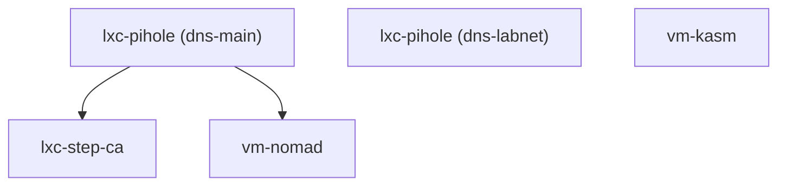

# Module Reference

Proxmox Lab uses four active Terraform modules to provision infrastructure. Each module is a self-contained directory under `terraform/` with its own variables, resources, and outputs.

---

## Module Overview

| Module | Directory | Type | Quantity | VMID Range | Description |
|--------|-----------|------|----------|------------|-------------|
| **vm-nomad** | `terraform/vm-nomad/` | VM (QEMU) | 3 | 905-907 | Nomad cluster with GlusterFS |
| **vm-kasm** | `terraform/vm-kasm/` | VM (QEMU) | 1 | 930 | Kasm Workspaces remote desktops |
| **lxc-pihole** | `terraform/lxc-pihole/` | LXC | 1-5 | 910-912, 920-921 | Pi-hole DNS + Unbound |
| **lxc-step-ca** | `terraform/lxc-step-ca/` | LXC | 1 | 902 | Internal Certificate Authority |

### Dependency Graph



- **lxc-step-ca** depends on `dns-main` (waits for DNS to be available before deploying)
- **vm-nomad** depends on `dns-main` (Nomad nodes use Pi-hole for DNS resolution)
- **lxc-pihole (dns-labnet)** has no dependencies
- **vm-kasm** has no explicit dependencies

---

## vm-nomad

Deploys a 3-node HashiCorp Nomad cluster. Each node runs as both Nomad server and client, with GlusterFS providing distributed storage.

**Source:** `terraform/vm-nomad/`
**Template:** Clones from `nomad-template` (VMID 9002)

### Inputs

| Variable | Type | Required | Default | Description |
|----------|------|----------|---------|-------------|
| `dns_postfix` | `string` | Yes | -- | Domain suffix for service discovery |
| `proxmox_api_url` | `string` | Yes | -- | Proxmox API URL (used to derive SSH host) |
| `proxmox_bridge` | `string` | Yes | -- | Network bridge for VM NICs |
| `ssh_public_key_file` | `string` | Yes | -- | Path to SSH public key |
| `dns_primary_ip` | `string` | No | `""` | Pi-hole IP for DNS override |
| `nomad_datacenter` | `string` | No | `"dc1"` | Nomad datacenter name |
| `nomad_region` | `string` | No | `"global"` | Nomad region name |
| `gluster_mount_path` | `string` | No | `"/srv/gluster/nomad-data"` | GlusterFS mount point |
| `node_ip_map` | `map(string)` | No | `{}` | Proxmox node name to IP mapping |
| `vm_storage` | `string` | No | `"local-lvm"` | Storage pool for VM disks |
| `vm_configs` | `map(object)` | No | *(see below)* | Per-VM configuration |

### Default VM Configuration

```hcl
vm_configs = {
  "nomad01" = {
    vm_id       = 905
    name        = "nomad01"
    cores       = 4
    memory      = 8192    # 8 GB
    disk_size   = "100G"
    vm_state    = "running"
    target_node = "pve01"
  }
  "nomad02" = {
    vm_id       = 906
    name        = "nomad02"
    cores       = 4
    memory      = 8192
    disk_size   = "100G"
    vm_state    = "running"
    target_node = "pve02"
  }
  "nomad03" = {
    vm_id       = 907
    name        = "nomad03"
    cores       = 4
    memory      = 8192
    disk_size   = "100G"
    vm_state    = "running"
    target_node = "pve03"
  }
}
```

### Resources Created

| Resource | Type | Description |
|----------|------|-------------|
| `local_file.nomad_user_data` | `local_file` | Rendered cloud-init YAML per node |
| `null_resource.upload_snippet` | `null_resource` | Uploads cloud-init to each Proxmox node's `/var/lib/vz/snippets/` |
| `proxmox_vm_qemu.nomad` | `proxmox_vm_qemu` | VM instances cloned from `nomad-template` |

### Outputs

| Output | Type | Description |
|--------|------|-------------|
| `nomad` | `map(object)` | Full VM details (name, vmid, IP, SSH info) -- sensitive |
| `nomad-hosts` | `map(object)` | Simplified hostname-to-IP mapping |

---

## vm-kasm

Deploys a single Kasm Workspaces VM for browser-based remote desktops.

**Source:** `terraform/vm-kasm/`
**Template:** Clones from `docker-template` (VMID 9001)

### Inputs

| Variable | Type | Required | Default | Description |
|----------|------|----------|---------|-------------|
| `dns_postfix` | `string` | Yes | -- | Domain suffix for certificates |
| `kasm_admin_password` | `string` | Yes | -- | Kasm web admin password |
| `kasm_version` | `string` | Yes | -- | Kasm version to install (e.g., `1.17.0.7f020d`) |
| `proxmox_api_url` | `string` | Yes | -- | Proxmox API URL |
| `proxmox_bridge` | `string` | Yes | -- | Network bridge for VM NIC |
| `ssh_public_key_file` | `string` | Yes | -- | Path to SSH public key |
| `vm_storage` | `string` | No | `"local-lvm"` | Storage pool for VM disks |
| `vm_configs` | `map(object)` | No | *(see below)* | Per-VM configuration |

### Default VM Configuration

```hcl
vm_configs = {
  "kasm01" = {
    vm_id       = 908
    name        = "kasm01"
    cores       = 4
    memory      = 8192    # 8 GB
    disk_size   = "100G"
    vm_state    = "running"
    target_node = "pve01"
  }
}
```

!!! note "VMID"
    The default `vm_configs` sets `vm_id = 908`, though in the overall project VMID assignment table the Kasm slot is listed at 930. Adjust `vm_configs` as needed for your environment.

### Resources Created

| Resource | Type | Description |
|----------|------|-------------|
| `local_file.kasm_user_data` | `local_file` | Rendered cloud-init YAML |
| `null_resource.upload_snippet` | `null_resource` | Uploads cloud-init to Proxmox snippets directory |
| `proxmox_vm_qemu.kasm` | `proxmox_vm_qemu` | VM cloned from `docker-template` |

### Outputs

| Output | Type | Description |
|--------|------|-------------|
| `kasm` | `map(object)` | Full VM details (name, vmid, IP, SSH info) -- sensitive |
| `kasm-hosts` | `map(object)` | Simplified hostname-to-IP mapping |

---

## lxc-pihole

Deploys Pi-hole v6 DNS servers with Unbound for DNS-over-TLS. This module is used twice: once for the main external cluster and once for the optional labnet SDN cluster.

**Source:** `terraform/lxc-pihole/`
**OS Template:** Debian 12 (`debian-12-standard_12.12-1_amd64.tar.zst`)

### Inputs

| Variable | Type | Required | Default | Description |
|----------|------|----------|---------|-------------|
| `cluster_name` | `string` | Yes | -- | Cluster identifier (e.g., `"main"`, `"labnet"`) |
| `nodes` | `list(object)` | Yes | -- | List of DNS node definitions |
| `network_bridge` | `string` | Yes | -- | Network bridge (e.g., `"vmbr0"`, `"labnet"`) |
| `admin_password` | `string` | Yes (sensitive) | -- | Pi-hole web admin password |
| `root_password` | `string` | Yes (sensitive) | -- | LXC container root password |
| `proxmox_api_url` | `string` | Yes | -- | Proxmox API URL |
| `vmid_start` | `number` | No | `910` | Starting VMID for containers |
| `ostemplate` | `string` | No | `"local:vztmpl/debian-12-standard_12.12-1_amd64.tar.zst"` | OS template |
| `cores` | `number` | No | `2` | CPU cores per container |
| `memory` | `number` | No | `1024` | Memory in MB per container |
| `disk_size` | `string` | No | `"4G"` | Root filesystem size |
| `storage` | `string` | No | `"local-lvm"` | Storage pool |
| `is_sdn_network` | `bool` | No | `false` | Use `pct exec` provisioning instead of direct SSH |
| `proxmox_ssh_host` | `string` | No | `""` | Default Proxmox host for SSH/pct exec |
| `node_ip_map` | `map(string)` | No | `{}` | Proxmox node name to IP mapping |
| `dns_zone` | `string` | No | `""` | DNS zone for local record creation |

### Module Invocations

The module is called twice in `terraform/main.tf`:

```hcl
# Main DNS cluster (external network, VMID 910+)
module "dns-main" {
  source         = "./lxc-pihole"
  cluster_name   = "main"
  nodes          = local.effective_dns_main_nodes
  network_bridge = var.network_interface_bridge  # "vmbr0"
  vmid_start     = 910
  is_sdn_network = false
  # ...
}

# Labnet DNS cluster (SDN network, VMID 920+)
module "dns-labnet" {
  source         = "./lxc-pihole"
  cluster_name   = "labnet"
  nodes          = local.effective_dns_labnet_nodes
  network_bridge = "labnet"
  vmid_start     = 920
  is_sdn_network = true
  # ...
}
```

### Resources Created

| Resource | Type | Count | Description |
|----------|------|-------|-------------|
| `proxmox_lxc.dns` | `proxmox_lxc` | Per node | LXC containers with Pi-hole |
| `null_resource.direct_provision` | `null_resource` | Per node (non-SDN) | SSH-based provisioning |
| `null_resource.sdn_provision` | `null_resource` | Per node (SDN) | `pct exec`-based provisioning |
| `null_resource.nebula_sync_setup` | `null_resource` | 0 or 1 (non-SDN) | Nebula-sync on primary node |
| `null_resource.sdn_nebula_sync_setup` | `null_resource` | 0 or 1 (SDN) | Nebula-sync via `pct exec` |
| `null_resource.configure_local_dns` | `null_resource` | 0 or 1 (non-SDN) | Local DNS record creation |
| `null_resource.sdn_configure_local_dns` | `null_resource` | 0 or 1 (SDN) | DNS records via `pct exec` |

### Outputs

| Output | Type | Description |
|--------|------|-------------|
| `dns-hosts` | `map(object)` | Hostname, IP, VMID, and target node for each DNS container |
| `primary_ip` | `string` | IP address of the primary (first) DNS node |
| `dns_ips` | `list(string)` | List of all DNS server IPs in the cluster |
| `cluster_name` | `string` | Name of this DNS cluster instance |

---

## lxc-step-ca

Deploys a single LXC container running step-ca as an internal Certificate Authority with ACME protocol support.

**Source:** `terraform/lxc-step-ca/`
**OS Template:** Debian 12 (`debian-12-standard_12.12-1_amd64.tar.zst`)

### Inputs

| Variable | Type | Required | Default | Description |
|----------|------|----------|---------|-------------|
| `eth0_vmbr` | `string` | Yes | -- | Network bridge (must match `vmbr[0-9]+` pattern) |
| `eth0_ipv4_cidr` | `string` | Yes | -- | Static IP with CIDR notation (e.g., `10.1.50.10/24`) |
| `eth0_gateway` | `string` | Yes | -- | Gateway IPv4 address |
| `dns_primary_ipv4` | `string` | Yes | -- | Primary DNS server IP (switched to after install) |
| `proxmox_target_node` | `string` | Yes | -- | Proxmox node to deploy on |
| `root_password` | `string` | Yes (sensitive) | -- | Container root password |
| `ostemplate` | `string` | No | `"local:vztmpl/debian-12-standard_12.12-1_amd64.tar.zst"` | OS template |
| `vmid` | `number` | No | `902` | Container VMID |

### Resources Created

| Resource | Type | Description |
|----------|------|-------------|
| `proxmox_lxc.step-ca` | `proxmox_lxc` | LXC container (2 cores, 2 GB RAM, 8 GB disk) with inline provisioners |

The LXC resource includes `file` and `remote-exec` provisioners that:

1. Upload pre-generated CA files from the local `step-ca/` directory
2. Install `step-cli` and `step-ca` from the SmallStep APT repository
3. Configure a systemd service for step-ca
4. Switch DNS resolution to the internal Pi-hole

### Outputs

| Output | Type | Description |
|--------|------|-------------|
| `step-ca` | `object` | Container details (name, vmid, IP, target node) -- sensitive |
| `step-ca-hosts` | `map(object)` | Simplified hostname-to-IP mapping |

### Pre-generated CA Files

The module expects pre-generated CA certificates and keys in `terraform/lxc-step-ca/step-ca/`. These are created by `setup.sh` (menu option 11) using the `init-step-ca.sh` script, which runs `step ca init` to generate:

- Root CA certificate (`certs/root_ca.crt`)
- Intermediate CA certificate (`certs/intermediate_ca.crt`)
- Intermediate CA key (`secrets/intermediate_ca_key`)
- Password file (`secrets/password_file`)
- CA configuration (`config/ca.json`)

---

## Root-Level Configuration

### main.tf

The root `terraform/main.tf` wires modules together, passing variables from `terraform.tfvars` to each module:

```hcl
module "nomad"      { source = "./vm-nomad"     depends_on = [module.dns-main] }
module "dns-main"   { source = "./lxc-pihole"   }
module "dns-labnet" { source = "./lxc-pihole"   }
module "step-ca"    { source = "./lxc-step-ca"  depends_on = [module.dns-main] }
module "kasm"       { source = "./vm-kasm"       }
```

### outputs.tf

Root-level outputs aggregate host information from all modules for use by `setup.sh` when building DNS records:

| Output | Description |
|--------|-------------|
| `hosts` | Combined map of all module host outputs |
| `host-records` | Flattened lists of `{hostname, ip}` pairs, split into `external` and `internal` groups |
| `dns-primary-ip` | Primary DNS server IP for other services |

### data.tf

Defines local values derived from input variables:

- `proxmox_api_host` -- Extracted from `proxmox_api_url`
- `node_ip_map` -- Passed through from `proxmox_node_ips`
- `effective_dns_main_nodes` -- DNS main node list from `terraform.tfvars`
- `effective_dns_labnet_nodes` -- DNS labnet node list from `terraform.tfvars`

---

## Next Steps

- [Cloud-Init Templates](cloudinit-templates.md) -- First-boot configuration injected by these modules
- [Nomad Cluster](../modules/nomad-cluster.md) -- Deep dive into the Nomad module
- [Pi-hole DNS](../modules/pihole.md) -- Deep dive into DNS architecture
- [Step-CA](../modules/step-ca.md) -- Deep dive into the Certificate Authority
