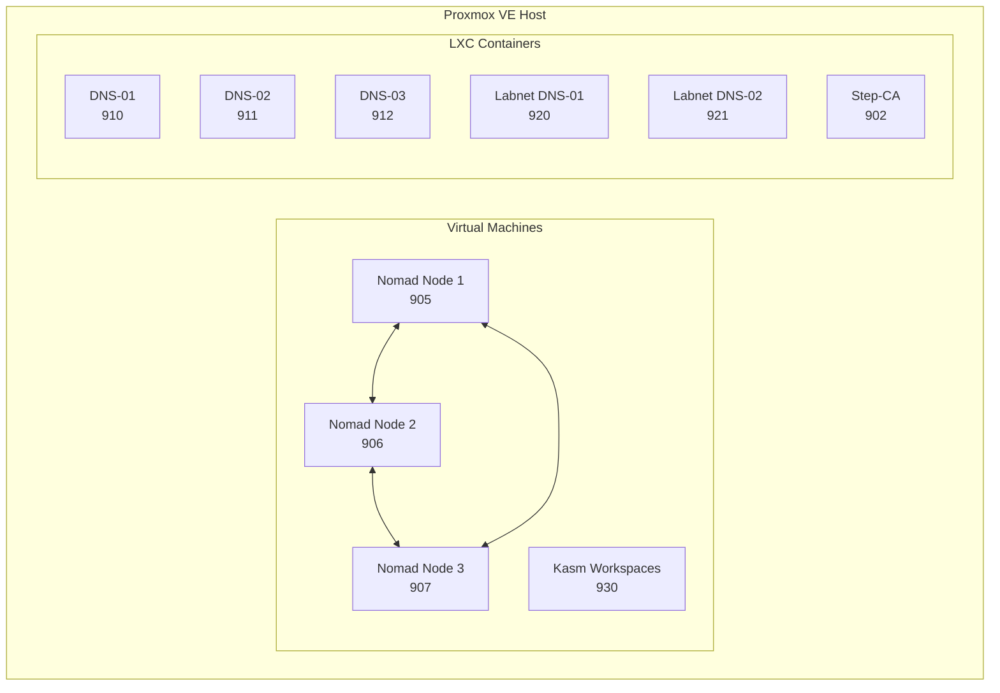

# Introduction

Welcome to Proxmox Lab! This guide will help you understand what this project does and how it works.

## What is Proxmox Lab?

Proxmox Lab is an **Infrastructure-as-Code (IaC)** project that automates the deployment of a complete home lab environment on [Proxmox VE](https://www.proxmox.com/). Instead of manually creating virtual machines and containers, you run a single script that builds everything for you.

!!! tip "Who is this for?"
    This project is designed for:

    - Homelab enthusiasts who want reproducible infrastructure
    - Developers learning about IaC, containers, and networking
    - Anyone who wants a secure, self-hosted environment for testing

## What You'll Build

After running the setup script, you'll have:



| Component | What It Does |
|-----------|--------------|
| **Nomad Cluster** (3 VMs) | HashiCorp Nomad for container orchestration with GlusterFS shared storage |
| **Kasm Workspaces** (1 VM) | Browser-based remote desktops and applications |
| **DNS Cluster** (3 LXCs) | Pi-hole v6 with ad-blocking for your main network, synced via Gravity Sync |
| **Labnet DNS** (2 LXCs) | Pi-hole DNS for the isolated lab SDN network |
| **Step-CA** (1 LXC) | Your own Certificate Authority for issuing TLS certificates via ACME |

## Technology Stack

This project uses industry-standard tools:

=== "Infrastructure"

    | Tool | Purpose |
    |------|---------|
    | **Proxmox VE** | Hypervisor for running VMs and containers |
    | **Terraform** | Provisions infrastructure declaratively |
    | **Packer** | Creates golden VM templates |

=== "Networking"

    | Tool | Purpose |
    |------|---------|
    | **Pi-hole v6** | DNS sinkhole with ad-blocking |
    | **Unbound** | DNS-over-TLS recursive resolver |
    | **Gravity Sync** | Replicates Pi-hole configuration across nodes |

=== "Security"

    | Tool | Purpose |
    |------|---------|
    | **Step-CA** | Internal Certificate Authority with ACME |
    | **HashiCorp Vault** | Secrets management (deployed via Nomad) |
    | **Authentik** | SSO / Identity Provider (OAuth2, OIDC, SAML, LDAP) |
    | **acme.sh** | ACME client for automated certificates |

=== "Orchestration"

    | Tool | Purpose |
    |------|---------|
    | **HashiCorp Nomad** | Container orchestration and scheduling |
    | **Traefik** | Reverse proxy and load balancer |
    | **GlusterFS** | Distributed replicated storage |
    | **Samba AD** | Active Directory Domain Controllers |

## How It Works

The `setup.sh` script orchestrates the entire deployment:

### Phase 1: Preparation

1. **Check Requirements** -- Verifies Docker, jq, and sshpass are installed
2. **Generate SSH Keys** -- Creates `crypto/lab-deploy` key pair for automation
3. **Connect to Proxmox** -- Tests connectivity and installs SSH keys

### Phase 2: Proxmox Configuration

4. **Detect Cluster Nodes** -- Discovers all nodes in the Proxmox cluster
5. **Configure Networking** -- Gathers network info and creates the `labnet` SDN
6. **Select Storage** -- Identifies storage targets for disks and templates
7. **Node Setup** -- Runs Proxmox node setup (SDN, templates, user accounts)

### Phase 3: LXC Containers (Terraform)

8. **Deploy DNS Cluster** -- Provisions Pi-hole v6 + Unbound containers (910-912, 920-921)
9. **Deploy Step-CA** -- Provisions the internal Certificate Authority (902)

### Phase 4: Packer Templates

10. **Build Docker Template** -- Base image with Ubuntu + Docker + GlusterFS + acme.sh (VMID 9001)
11. **Build Nomad Template** -- Docker base + Nomad + Consul (VMID 9002)

### Phase 5: Virtual Machines (Terraform)

12. **Deploy Nomad Cluster** -- Three-node Nomad cluster with GlusterFS (905-907)
13. **Deploy Kasm** -- Browser isolation platform (930)

### Phase 6: Finalization

14. **Setup GlusterFS** -- Configures replicated storage across Nomad nodes
15. **Initialize Nomad** -- Starts the Nomad cluster with DNS-based discovery
16. **Update DNS Records** -- Adds all service records to Pi-hole
17. **Distribute CA Certificates** -- Pushes root CA to Proxmox nodes

!!! info "Deployment Time"
    The full deployment takes approximately **30-45 minutes** depending on your network speed and hardware.

## Project Structure

```
proxmox-lab/
├── setup.sh              # Main orchestration script
├── compose.yml           # Docker Compose for dev tools
├── lib/                  # Bash helper libraries (util.sh)
├── crypto/               # SSH keys and Vault credentials (git-ignored)
├── docs/                 # This documentation
├── packer/               # VM template definitions
│   ├── build_docker.pkr.hcl   # Docker base template (VMID 9001)
│   ├── build_nomad.pkr.hcl    # Nomad template (VMID 9002)
│   └── dev/                   # Development templates
├── terraform/            # Infrastructure modules
│   ├── main.tf
│   ├── vm-nomad/         # 3-node Nomad cluster
│   ├── vm-kasm/          # Kasm Workspaces
│   ├── lxc-pihole/       # Pi-hole + Unbound DNS
│   └── lxc-step-ca/      # Certificate Authority
├── nomad/                # Nomad job definitions
│   ├── jobs/             # traefik, vault, authentik, samba-dc
│   └── vault-policies/   # Vault ACL policies
└── proxmox/              # Proxmox host setup helpers
```

## Next Steps

Ready to get started?

1. [:octicons-arrow-right-24: Check the prerequisites](prerequisites.md)
2. [:octicons-arrow-right-24: Complete the pre-flight checklist](checklist.md)
3. [:octicons-arrow-right-24: Follow the quick start guide](quick-start.md)
