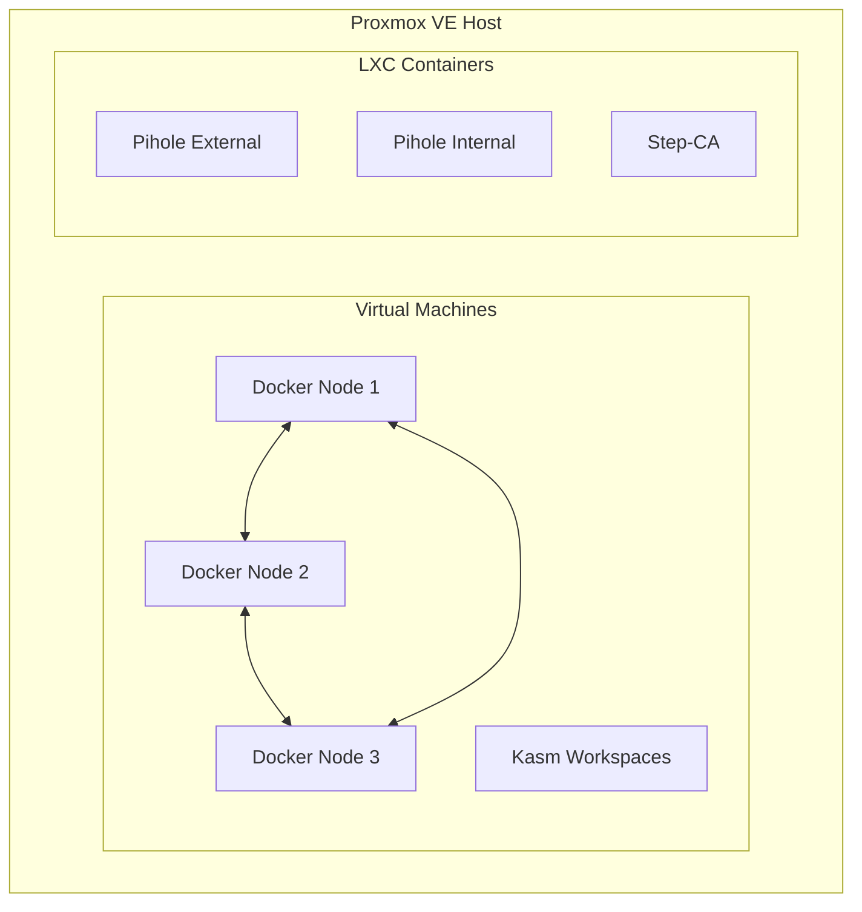

# Introduction

Welcome to Proxmox Lab! This guide will help you understand what this project does and how it works.

## What is Proxmox Lab?

Proxmox Lab is an **Infrastructure-as-Code (IaC)** project that automates the deployment of a complete home lab environment on [Proxmox VE](https://www.proxmox.com/). Instead of manually creating virtual machines and containers, you run a single script that builds everything for you.

!!! tip "Who is this for?"
    This project is designed for:

    - Homelab enthusiasts who want reproducible infrastructure
    - Developers learning about IaC, containers, and networking
    - Anyone who wants a secure, self-hosted environment for testing

## What You'll Build

After running the setup script, you'll have:



| Component | What It Does |
|-----------|--------------|
| **Docker Swarm** (3 VMs) | A cluster of Docker hosts for running containers with high availability |
| **Kasm Workspaces** (1 VM) | Browser-based remote desktops and applications |
| **Pihole External** (LXC) | DNS server with ad-blocking for your main network |
| **Pihole Internal** (LXC) | DNS + DHCP for the isolated lab network |
| **Step-CA** (LXC) | Your own Certificate Authority for issuing TLS certificates |

## Technology Stack

This project uses industry-standard tools:

=== "Infrastructure"

    | Tool | Purpose |
    |------|---------|
    | **Proxmox VE** | Hypervisor for running VMs and containers |
    | **Terraform** | Provisions infrastructure declaratively |
    | **Packer** | Creates golden VM/LXC templates |

=== "Networking"

    | Tool | Purpose |
    |------|---------|
    | **Pihole** | DNS sinkhole with ad-blocking |
    | **Unbound** | Recursive DNS resolver |
    | **dnscrypt-proxy** | DNS-over-HTTPS for privacy |

=== "Security"

    | Tool | Purpose |
    |------|---------|
    | **Step-CA** | Internal Certificate Authority |
    | **acme.sh** | ACME client for automated certificates |

=== "Containers"

    | Tool | Purpose |
    |------|---------|
    | **Docker Swarm** | Container orchestration |
    | **GlusterFS** | Distributed storage |
    | **Portainer** | Container management UI |

## How It Works

The `setup.sh` script orchestrates the entire deployment:

### Phase 1: Preparation

1. **Check Requirements** - Verifies Docker, jq, and sshpass are installed
2. **Generate SSH Keys** - Creates `crypto/lab-deploy` key pair for automation
3. **Verify Proxmox** - Tests connectivity and credentials

### Phase 2: Proxmox Configuration

4. **Install SSH Keys** - Enables passwordless access to Proxmox
5. **Post-Installation** - Runs community script to configure repositories
6. **Build SDN** - Creates the `labnet` Software Defined Network (172.16.0.0/24)

### Phase 3: Templates

7. **Download Images** - Fetches Ubuntu, Fedora, and Debian cloud images
8. **Create Templates** - Converts images to Proxmox templates

### Phase 4: Certificate Authority

9. **Generate CA** - Creates root and intermediate certificates
10. **Deploy Step-CA** - Provisions the CA container

### Phase 5: Services

11. **Deploy Pihole** - Both internal and external DNS servers
12. **Deploy Docker Swarm** - Three-node cluster
13. **Deploy Kasm** - Browser isolation platform

### Phase 6: Finalization

14. **Update DNS** - Adds service records to Pihole
15. **Install Certificates** - Provisions TLS cert for Proxmox UI

!!! info "Deployment Time"
    The full deployment takes approximately **30-45 minutes** depending on your network speed and hardware.

## Project Structure

```
proxmox-lab/
├── setup.sh              # Main orchestration script
├── compose.yml           # Docker Compose for dev tools
├── crypto/               # SSH keys (generated, git-ignored)
├── docs/                 # This documentation
├── packer/               # VM template definitions
│   ├── build_docker.pkr.hcl
│   └── variables.pkr.hcl
├── terraform/            # Infrastructure modules
│   ├── main.tf
│   ├── vm-docker-swarm/
│   ├── vm-kasm/
│   ├── lxc-pihole/
│   └── lxc-step-ca/
└── proxmox/              # Proxmox helper scripts
```

## Next Steps

Ready to get started?

1. [:octicons-arrow-right-24: Check the prerequisites](prerequisites.md)
2. [:octicons-arrow-right-24: Complete the pre-flight checklist](checklist.md)
3. [:octicons-arrow-right-24: Follow the quick start guide](quick-start.md)
