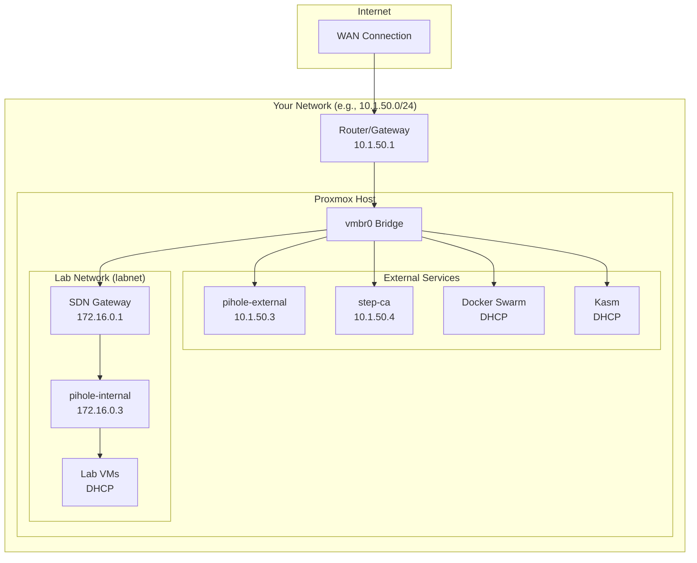
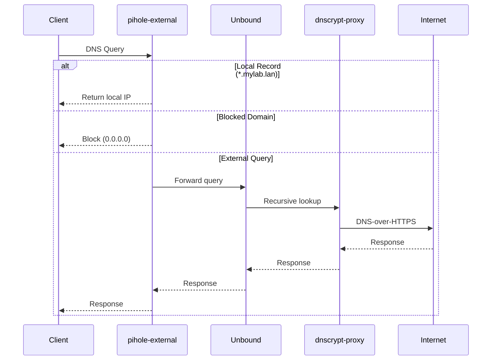

# Prerequisites

Before running Proxmox Lab, ensure you have the required software and have gathered the necessary network information.

## Hardware Requirements

!!! warning "Minimum Specifications"
    Your Proxmox server should have:

    - **CPU**: 4+ cores (more is better for running multiple VMs)
    - **RAM**: 16 GB minimum, 32 GB recommended
    - **Storage**: 100 GB+ available space

The deployed infrastructure requires approximately:

| Component | CPU | RAM | Disk |
|-----------|-----|-----|------|
| Docker Node (x3) | 4 cores each | 8 GB each | 100 GB each |
| Kasm | 4 cores | 8 GB | 100 GB |
| Pihole External | 2 cores | 1 GB | 4 GB |
| Pihole Internal | 2 cores | 1 GB | 4 GB |
| Step-CA | 2 cores | 2 GB | 8 GB |
| **Total** | **18 cores** | **36 GB** | **416 GB** |

!!! tip "Resource Optimization"
    These are default values. You can reduce resources by modifying the Terraform variables if you have limited hardware.

## Software Requirements

### On Your Workstation

Install these tools on the machine where you'll run the setup script:

=== "macOS"

    ```bash
    # Install Homebrew if not already installed
    /bin/bash -c "$(curl -fsSL https://raw.githubusercontent.com/Homebrew/install/HEAD/install.sh)"

    # Install required packages
    brew install docker
    brew install hudochenkov/sshpass/sshpass
    brew install jq
    ```

=== "Ubuntu/Debian"

    ```bash
    # Update package list
    sudo apt update

    # Install Docker
    curl -fsSL https://get.docker.com | sudo sh
    sudo usermod -aG docker $USER

    # Install other requirements
    sudo apt install -y sshpass jq
    ```

=== "Fedora/RHEL"

    ```bash
    # Install Docker
    sudo dnf install -y docker
    sudo systemctl enable --now docker
    sudo usermod -aG docker $USER

    # Install other requirements
    sudo dnf install -y sshpass jq
    ```

### Verify Installation

```bash
# Check Docker
docker --version
docker compose version

# Check other tools
sshpass -V
jq --version
```

### On Proxmox

- **Proxmox VE 8.x** or later
- **Root SSH access** enabled (temporary, for initial setup)
- **API access** enabled (default)

## Proxmox Preparation

Before running the setup, verify these configurations in your Proxmox web UI:

### Storage Configuration

Navigate to **Datacenter > Storage** and note:

- [ ] **Storage name** for VM disks (e.g., `local-lvm`, `zfs-pool`)
- [ ] **Storage name** for ISO/templates (e.g., `local`)
- [ ] Sufficient free space for templates and VMs

!!! info "Common Storage Types"
    - `local` - Directory storage, good for ISOs and templates
    - `local-lvm` - LVM thin-provisioned, good for VM disks
    - `zfs-pool` - ZFS storage, excellent performance

### Network Bridge

Navigate to **Node > Network** and verify:

- [ ] A network bridge exists (typically `vmbr0`)
- [ ] The bridge is connected to your LAN
- [ ] Note the bridge name for configuration

## Network Information

Gather this information before starting:

### External Network (Your LAN)

This is the network where your Proxmox server lives:

| Setting | Example | Your Value |
|---------|---------|------------|
| Network Bridge | `vmbr0` | |
| Gateway IP | `10.1.50.1` | |
| Pihole External IP | `10.1.50.3` | |
| Step-CA IP | `10.1.50.4` | |
| DNS Postfix | `mylab.lan` | |

!!! warning "Static IPs Required"
    You'll need to reserve static IPs for Pihole and Step-CA. Choose IPs outside your router's DHCP range.

### Internal Network (Lab SDN)

The setup script automatically creates this network:

| Setting | Value | Notes |
|---------|-------|-------|
| Network Name | `labnet` | SDN virtual network |
| Network Range | `172.16.0.0/24` | Private range |
| Gateway | `172.16.0.1` | Proxmox SDN |
| Pihole Internal | `172.16.0.3` | DNS + DHCP |

## Network Architecture



## DNS Resolution

After deployment, DNS queries flow through this chain:



## Firewall Considerations

If you have a firewall between your workstation and Proxmox, ensure these ports are open:

| Port | Protocol | Purpose |
|------|----------|---------|
| 22 | TCP | SSH (initial setup) |
| 8006 | TCP | Proxmox Web UI |
| 443 | TCP | ACME certificate requests |

## Next Steps

Once you've verified all prerequisites:

1. [:octicons-arrow-right-24: Complete the pre-flight checklist](checklist.md)
2. [:octicons-arrow-right-24: Follow the quick start guide](quick-start.md)
