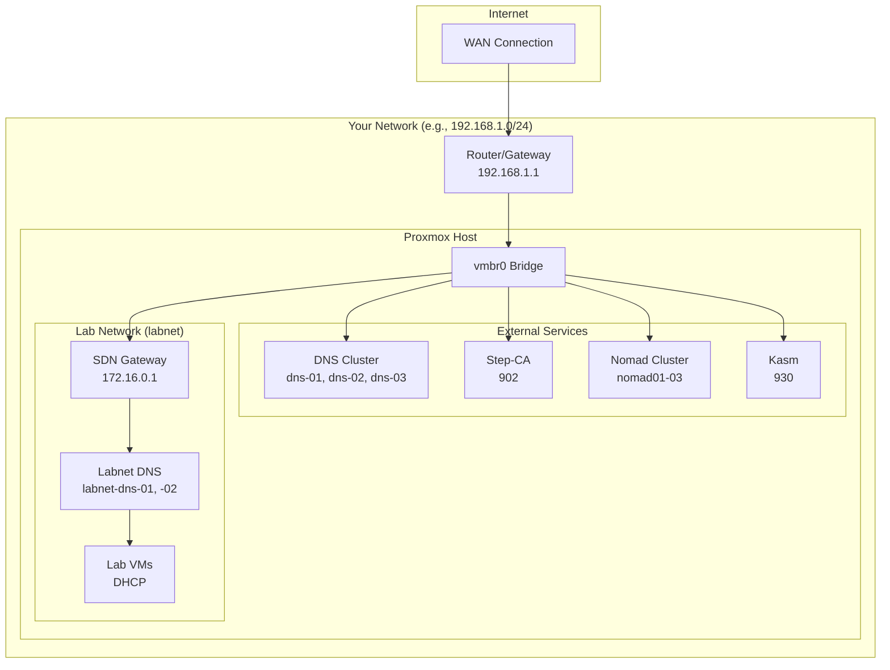
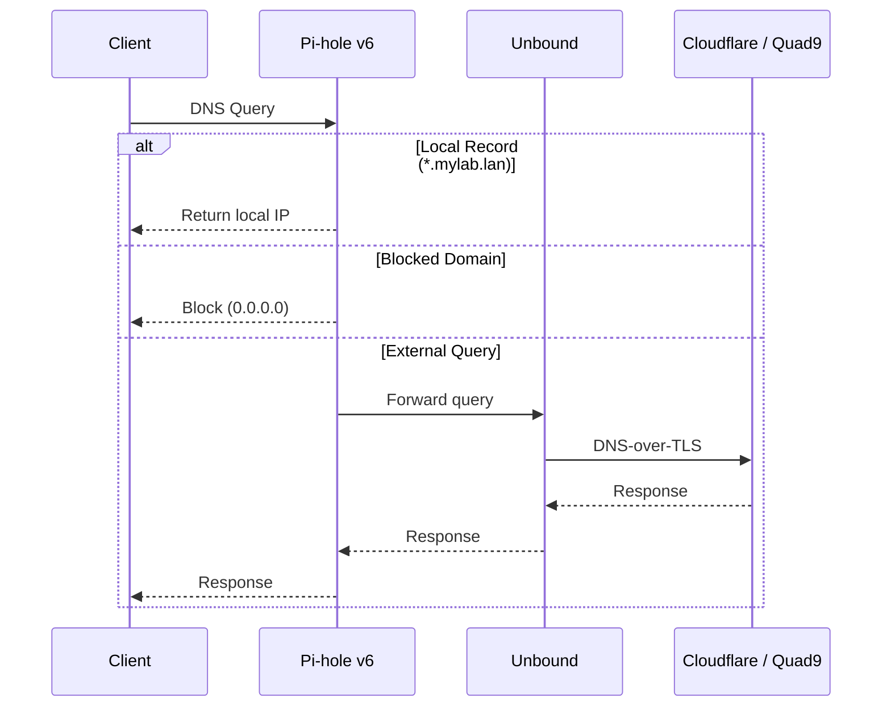

# Prerequisites

Before running Proxmox Lab, ensure you have the required software and have gathered the necessary network information.

## Hardware Requirements

!!! warning "Minimum Specifications"
    Your Proxmox server (or cluster) should have:

    - **CPU**: 8+ cores (more is better for running multiple VMs)
    - **RAM**: 32 GB minimum, 64 GB recommended
    - **Storage**: 500 GB+ available space

The deployed infrastructure requires approximately:

| Component | CPU | RAM | Disk |
|-----------|-----|-----|------|
| Nomad Node (x3) | 4 cores each | 8 GB each | 100 GB each |
| Kasm | 4 cores | 8 GB | 100 GB |
| DNS (x3) | 2 cores each | 1 GB each | 4 GB each |
| DNS Labnet (x2) | 2 cores each | 1 GB each | 4 GB each |
| Step-CA | 2 cores | 2 GB | 8 GB |
| **Total (max)** | **28 cores** | **42 GB** | **428 GB** |

!!! tip "Resource Optimization"
    These are default values. You can reduce resources by modifying the Terraform variables if you have limited hardware. For a minimal deployment, use menu option 4 (critical services only) to deploy just DNS and Step-CA, then add Nomad later.

## Software Requirements

### On Your Workstation

Install these tools on the machine where you'll run the setup script:

=== "macOS"

    ```bash
    # Install Homebrew if not already installed
    /bin/bash -c "$(curl -fsSL https://raw.githubusercontent.com/Homebrew/install/HEAD/install.sh)"

    # Install required packages
    brew install docker
    brew install hudochenkov/sshpass/sshpass
    brew install jq
    ```

=== "Ubuntu/Debian"

    ```bash
    # Update package list
    sudo apt update

    # Install Docker
    curl -fsSL https://get.docker.com | sudo sh
    sudo usermod -aG docker $USER

    # Install other requirements
    sudo apt install -y sshpass jq
    ```

=== "Fedora/RHEL"

    ```bash
    # Install Docker
    sudo dnf install -y docker
    sudo systemctl enable --now docker
    sudo usermod -aG docker $USER

    # Install other requirements
    sudo dnf install -y sshpass jq
    ```

### Verify Installation

```bash
# Check Docker
docker --version
docker compose version

# Check other tools
sshpass -V
jq --version
```

### On Proxmox

- **Proxmox VE 7.x** or later
- **Root SSH access** enabled (temporary, for initial setup)
- **API access** enabled (default)

## Proxmox Preparation

Before running the setup, verify these configurations in your Proxmox web UI:

### Storage Configuration

Navigate to **Datacenter > Storage** and note:

- [ ] **Storage name** for VM disks (e.g., `local-lvm`, `zfs-pool`)
- [ ] **Storage name** for ISO/templates (e.g., `local`)
- [ ] Sufficient free space for templates and VMs (~428 GB total)

!!! info "Common Storage Types"
    - `local` -- Directory storage, good for ISOs and templates
    - `local-lvm` -- LVM thin-provisioned, good for VM disks
    - `zfs-pool` -- ZFS storage, excellent performance

!!! tip "Cluster Considerations"
    If running a Proxmox cluster, the **template storage** must be shared storage accessible by all nodes (e.g., NFS, Ceph, or shared LVM).

### Network Bridge

Navigate to **Node > Network** and verify:

- [ ] A network bridge exists (typically `vmbr0`)
- [ ] The bridge is connected to your LAN
- [ ] Note the bridge name for configuration

## Network Information

Gather this information before starting. You'll need to know your own network subnet — the examples below use `192.168.1.0/24` but **your network will likely be different**. Check your router's admin page to confirm your subnet, gateway, and DHCP range.

### External Network (Your LAN)

This is the network where your Proxmox server lives:

| Setting | Example | Your Value |
|---------|---------|------------|
| Network Bridge | `vmbr0` | |
| Network Subnet | `192.168.1.0/24` | |
| Gateway IP | `192.168.1.1` | |
| DNS Postfix | `mylab.lan` | |

!!! tip "Find Your Network Details"
    Most home routers use `192.168.1.0/24` or `192.168.0.0/24`. Check your router's admin page or run `ip route` (Linux/macOS) to find your gateway and subnet.

### DNS Cluster IPs (Static)

Reserve static IPs **outside your router's DHCP range** for each DNS node. For example, if your DHCP range is `192.168.1.100-200`, choose IPs below 100 or above 200:

| Node | Example IP | Your Value |
|------|------------|------------|
| dns-01 (VMID 910) | `192.168.1.10` | |
| dns-02 (VMID 911) | `192.168.1.11` | |
| dns-03 (VMID 912) | `192.168.1.12` | |
| Step-CA (VMID 902) | `192.168.1.13` | |

!!! warning "Static IPs Required"
    DNS and Step-CA nodes must have static IPs outside your router's DHCP range. The number of DNS nodes matches the number of Proxmox cluster nodes (one per node, up to 3).

### Nomad Cluster and Kasm

Nomad nodes and Kasm can use DHCP or static IPs:

| Node | VMID | Notes |
|------|------|-------|
| nomad01 | 905 | Hosts all pinned services (Traefik, Vault, Authentik) |
| nomad02 | 906 | Worker node |
| nomad03 | 907 | Worker node |
| Kasm | 930 | Remote desktop platform |

### Internal Network (Lab SDN)

The setup script automatically creates this network. Values are user-configured during setup:

| Setting | Default Example | Notes |
|---------|-----------------|-------|
| Network Name | `labnet` | SDN virtual network |
| Network Range | `172.16.0.0/24` | User-defined CIDR |
| Gateway | `172.16.0.1` | Proxmox SDN |
| labnet-dns-01 (VMID 920) | `172.16.0.3` | DNS for labnet |
| labnet-dns-02 (VMID 921) | `172.16.0.4` | DNS for labnet |

## Network Architecture



## DNS Resolution

After deployment, DNS queries flow through this chain:



The DNS resolution chain is: **Client** --> **Pi-hole** (ad blocking) --> **Unbound** (DNS-over-TLS) --> **Cloudflare/Quad9**

## Firewall Considerations

If you have a firewall between your workstation and Proxmox, ensure these ports are open:

| Port | Protocol | Purpose |
|------|----------|---------|
| 22 | TCP | SSH (initial setup) |
| 8006 | TCP | Proxmox Web UI |
| 443 | TCP | ACME certificate requests |

## Next Steps

Once you've verified all prerequisites:

1. [:octicons-arrow-right-24: Complete the pre-flight checklist](checklist.md)
2. [:octicons-arrow-right-24: Follow the quick start guide](quick-start.md)
