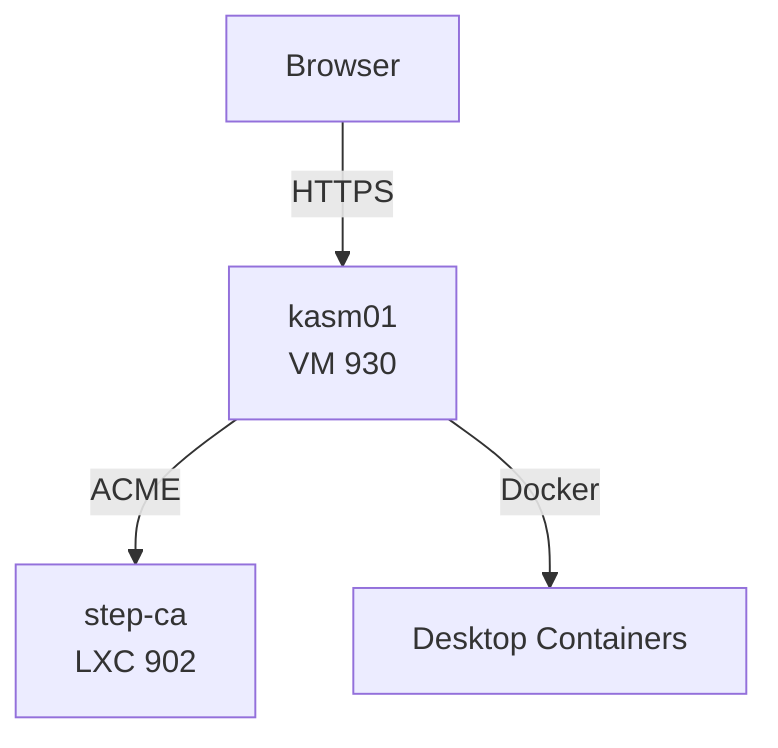

# Kasm Workspaces

Kasm Workspaces provides browser-based remote desktops and applications. It is deployed as a single VM cloned from the Docker base template, with automated installation, TLS certificate management, and swap configuration handled by cloud-init.

---

## Overview

| Property | Value |
|----------|-------|
| **VMID** | 930 (configurable via `vm_configs`) |
| **Template** | `docker-template` (VMID 9001) |
| **CPU Cores** | 4 |
| **Memory** | 8 GB |
| **Disk** | 100 GB |
| **Network** | DHCP on `vmbr0` |
| **Access URL** | `https://kasm.<dns_postfix>` |

---

## Architecture



Kasm runs entirely within a single VM. It uses Docker to spin up isolated desktop environments (browser tabs, full desktops, specific applications) that users access through a web browser.

---

## Deployment

### What Terraform Does

1. **Renders cloud-init** -- `templatefile()` processes `kasm-user-data.tmpl` with configuration variables
2. **Uploads snippet** -- The rendered YAML is uploaded to `/var/lib/vz/snippets/kasm01-user-data.yml` on the Proxmox host
3. **Creates VM** -- Clones from `docker-template` (VMID 9001) and attaches the cloud-init snippet

### What Cloud-Init Does on First Boot

1. Creates `labadmin` and `root` user accounts with SSH keys
2. Installs packages: `curl`, `jq`, `socat`, `ca-certificates`
3. Creates the Kasm certificate installation script at `/root/kasm-install.sh`
4. Enables and waits for NTP synchronization
5. Creates a 4 GB swap file
6. Downloads and installs Kasm from the S3-hosted release tarball
7. Installs acme.sh for certificate management
8. Creates a renewal script and configures a cron job for automatic certificate renewal

---

## VM Configuration

| Setting | Value |
|---------|-------|
| Clone source | `docker-template` |
| Full clone | Yes |
| QEMU agent | Enabled |
| Start on boot | Yes |
| SCSI controller | `virtio-scsi-pci` |
| NIC model | `virtio` |
| IP assignment | DHCP |
| Cloud-init user | `labadmin` |
| Tags | `terraform,infra,vm` |

---

## Kasm Installation

Kasm is installed from the official S3-hosted release tarball during cloud-init. The installation uses retry logic with exponential backoff (up to 5 attempts) to handle transient network issues.

### Download URL

```
https://kasm-static-content.s3.amazonaws.com/kasm_release_<version>.tar.gz
```

The version is set by the `kasm_version` Terraform variable (default: `1.17.0.7f020d`).

### Installation Command

```bash
tar -xf kasm_release_<version>.tar.gz
cd ~/kasm_release
bash install.sh --accept-eula --admin-password <kasm_admin_password>
```

### Kasm Directory Structure

After installation, Kasm lives at `/opt/kasm/`:

```
/opt/kasm/
  +-- current/
        +-- bin/
        |     +-- start
        |     +-- stop
        +-- certs/
        |     +-- kasm_nginx.crt
        |     +-- kasm_nginx.key
        +-- ...
```

---

## Swap Configuration

Kasm requires additional memory headroom for running multiple desktop containers. Cloud-init creates a 4 GB swap file:

```bash
fallocate -l 4G /swapfile
chmod 600 /swapfile
mkswap /swapfile
swapon /swapfile
echo "/swapfile none swap sw 0 0" >> /etc/fstab
```

The swap file is persistent across reboots via the `/etc/fstab` entry.

---

## Certificate Management

Kasm obtains TLS certificates from the internal step-ca using acme.sh, ensuring HTTPS access without browser warnings (when the root CA is trusted).

### Certificate Issuance

The cloud-init template creates `/root/kasm-install.sh`, which:

1. Stops Kasm
2. Sets acme.sh default CA to `https://ca.<dns_postfix>/acme/acme/directory`
3. Issues a certificate using the TLS-ALPN-01 challenge for:
    - `kasm01.<dns_postfix>` (primary)
    - `kasm.<dns_postfix>` (SAN)
4. Backs up existing certificates
5. Installs the new certificate to Kasm's cert directory
6. Restarts Kasm

### Certificate Paths

| File | Path |
|------|------|
| Private key | `/opt/kasm/current/certs/kasm_nginx.key` |
| Certificate chain | `/opt/kasm/current/certs/kasm_nginx.crt` |

### Automatic Renewal

Certificate renewal is automated via cron:

- **Cron schedule:** Daily at 3:00 AM
- **Renewal script:** `/root/kasm-renew.sh` (stops and restarts Kasm)
- **acme.sh cron:** Also installed via `acme.sh --install-cronjob`

```
0 3 * * * /root/.acme.sh/acme.sh --cron --home /root/.acme.sh --reloadcmd "/root/kasm-renew.sh"
```

!!! info "Certificate Duration"
    Certificates issued by step-ca have a default duration of 90 days (`2160h`). The daily cron job checks for upcoming expiry and renews as needed.

---

## Accessing Kasm

Once deployed, Kasm is accessible at:

```
https://kasm.<dns_postfix>
```

Or using the VM hostname:

```
https://kasm01.<dns_postfix>
```

### Default Credentials

| Field | Value |
|-------|-------|
| Username | `admin@kasm.local` |
| Password | Value of `kasm_admin_password` variable |

!!! warning "DNS Requirement"
    Ensure that `kasm.<dns_postfix>` resolves to the Kasm VM's IP address. Run setup.sh option **10** (Build DNS records) to update Pi-hole with the correct host records.

---

## Module Variables

Key variables from `terraform/vm-kasm/variables.tf`:

| Variable | Type | Default | Description |
|----------|------|---------|-------------|
| `dns_postfix` | `string` | -- | Domain suffix |
| `kasm_admin_password` | `string` | -- | Kasm admin password |
| `kasm_version` | `string` | -- | Kasm release version |
| `proxmox_api_url` | `string` | -- | Proxmox API URL |
| `proxmox_bridge` | `string` | -- | Network bridge |
| `ssh_public_key_file` | `string` | -- | SSH public key path |
| `vm_storage` | `string` | `"local-lvm"` | VM disk storage pool |
| `vm_configs` | `map(object)` | 1 VM | VM specifications |

See [Module Reference](../configuration/module-reference.md) for the full variable specification.

---

## Troubleshooting

### Kasm not accessible

1. Verify the VM is running:
   ```bash
   ssh labadmin@<kasm-ip> "sudo /opt/kasm/current/bin/start"
   ```

2. Check if Kasm services are up:
   ```bash
   ssh labadmin@<kasm-ip> "docker ps"
   ```

3. Verify DNS resolution:
   ```bash
   dig kasm.mylab.lan
   ```

### Certificate issues

If the browser shows certificate warnings:

1. Verify step-ca is running and accessible
2. Check acme.sh logs:
   ```bash
   ssh labadmin@<kasm-ip> "cat /root/.acme.sh/acme.sh.log"
   ```
3. Re-run the certificate script:
   ```bash
   ssh labadmin@<kasm-ip> "sudo /root/kasm-install.sh"
   ```

### Installation failed

Check cloud-init logs for errors:

```bash
ssh labadmin@<kasm-ip> "sudo cat /var/log/cloud-init-output.log"
```

---

## Next Steps

- [Cloud-Init Templates](../configuration/cloudinit-templates.md) -- Detailed cloud-init configuration
- [Module Reference](../configuration/module-reference.md) -- Full module inputs and outputs
- [Step-CA](step-ca.md) -- Certificate Authority that issues Kasm's TLS certificates
