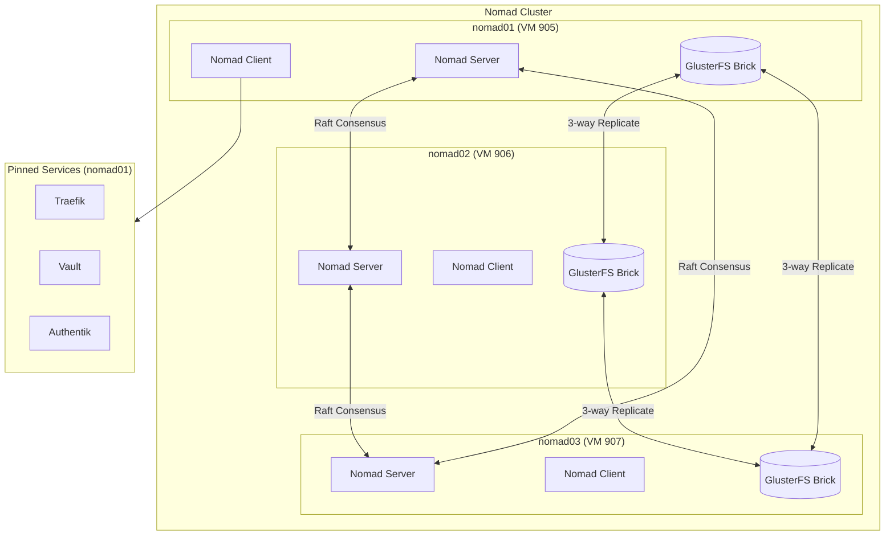

# Nomad Cluster

The Nomad cluster is the core orchestration platform for Proxmox Lab. It consists of three VMs running HashiCorp Nomad in a combined server+client configuration, with GlusterFS providing replicated distributed storage across all nodes.

---

## Architecture



### Key Design Decisions

- **Combined server+client** -- Each node runs both roles, reducing VM count while maintaining a 3-node quorum for fault tolerance.
- **DNS-based discovery** -- Nodes find each other via `retry_join` using FQDNs resolved by Pi-hole, avoiding hardcoded IPs.
- **Service pinning** -- Core services (Traefik, Vault, Authentik) are constrained to nomad01 for consistent DNS and simplified ACME challenge handling.
- **GlusterFS shared storage** -- All three nodes mount a 3-replica GlusterFS volume at `/srv/gluster/nomad-data`, providing data persistence that survives single-node failures.

---

## VM Specifications

| Node | VMID | CPU Cores | Memory | Disk | Target Node |
|------|------|-----------|--------|------|-------------|
| nomad01 | 905 | 4 | 8 GB | 100 GB | pve01 |
| nomad02 | 906 | 4 | 8 GB | 100 GB | pve02 |
| nomad03 | 907 | 4 | 8 GB | 100 GB | pve03 |

All VMs are cloned from the `nomad-template` (VMID 9002), which includes:

- Ubuntu Server 24.04
- Docker CE
- GlusterFS client
- acme.sh
- HashiCorp Nomad
- Consul (installed but not actively used)

### VM Configuration

| Setting | Value |
|---------|-------|
| Clone source | `nomad-template` |
| Full clone | Yes |
| QEMU agent | Enabled |
| Start on boot | Yes |
| SCSI controller | `virtio-scsi-pci` |
| NIC model | `virtio` |
| Network bridge | Configurable (default: `vmbr0`) |
| IP assignment | DHCP |
| Cloud-init user | `labadmin` |
| Tags | `terraform,infra,vm,nomad` |

---

## Nomad Configuration

The Nomad agent is configured via cloud-init, which writes `/etc/nomad.d/nomad.hcl` on first boot.

### Server Settings

```hcl
server {
  enabled          = true
  bootstrap_expect = 3

  server_join {
    retry_join     = ["nomad01.mylab.lan", "nomad02.mylab.lan", "nomad03.mylab.lan"]
    retry_max      = 10
    retry_interval = "15s"
  }
}
```

| Setting | Value | Purpose |
|---------|-------|---------|
| `enabled` | `true` | Run as a Nomad server |
| `bootstrap_expect` | `3` | Wait for 3 servers before electing a leader |
| `retry_join` | FQDN list | DNS-based server discovery via Pi-hole |
| `retry_max` | `10` | Maximum join attempts |
| `retry_interval` | `15s` | Delay between retry attempts |

### Client Settings

```hcl
client {
  enabled = true

  host_volume "gluster-data" {
    path      = "/srv/gluster/nomad-data"
    read_only = false
  }
}
```

| Setting | Value | Purpose |
|---------|-------|---------|
| `enabled` | `true` | Run as a Nomad client (can execute jobs) |
| `host_volume` | `gluster-data` | Exposes GlusterFS mount to Nomad jobs |

### Docker Plugin

```hcl
plugin "docker" {
  config {
    allow_privileged = true
    volumes {
      enabled = true
    }
  }
}
```

- **`allow_privileged`** -- Required for services like Vault that need to write to GlusterFS-mounted directories.
- **`volumes.enabled`** -- Allows Docker bind mounts from the host filesystem.

### Consul Integration

Consul is installed on the template but is explicitly disabled in the Nomad configuration:

```hcl
consul {
  auto_advertise   = false
  server_auto_join = false
  client_auto_join = false
}
```

### Network Advertisement

```hcl
advertise {
  http = "{{ GetPrivateIP }}:4646"
  rpc  = "{{ GetPrivateIP }}:4647"
  serf = "{{ GetPrivateIP }}:4648"
}
```

Nomad uses its `GetPrivateIP` function to automatically determine the correct IP address for each node.

---

## GlusterFS

GlusterFS provides a replicated distributed filesystem across all three Nomad nodes. Data written to any node is automatically replicated to the other two.

### Volume Configuration

| Setting | Value |
|---------|-------|
| Volume name | `nomad-data` |
| Mount point | `/srv/gluster/nomad-data` |
| Replica count | 3 |
| Transport | TCP |

### Directory Structure

```
/srv/gluster/nomad-data/
  +-- traefik/          # Traefik ACME certificates and config
  +-- vault/            # Vault persistent storage
  +-- authentik/        # Authentik data (postgres, redis, media, templates)
  +-- samba-dc01/       # Samba AD DC01 data
  +-- samba-dc02/       # Samba AD DC02 data
```

### GlusterFS Setup

GlusterFS is **not** configured by cloud-init or Terraform. After Terraform provisions the VMs, `setup.sh` handles GlusterFS setup:

1. Probes peer nodes from nomad01
2. Creates the replicated volume across all three nodes
3. Mounts the volume on each node
4. Starts the Nomad service (which was only enabled, not started, by cloud-init)

!!! important "Post-Provisioning"
    The Nomad service is intentionally left in an `enabled` but `stopped` state after cloud-init. This ensures GlusterFS is fully configured and mounted before Nomad starts scheduling jobs that depend on the shared storage.

---

## DNS Override

When the `dns_primary_ip` variable is set, cloud-init configures each Nomad node to use Pi-hole as its primary DNS server. This is done in two ways for persistence:

1. **Immediate** -- `resolvectl dns eth0 <pihole_ip> 1.1.1.1` for immediate effect
2. **Persistent** -- Creates `/etc/netplan/99-dns-override.yaml` with DHCP DNS override:

```yaml
network:
  version: 2
  ethernets:
    eth0:
      dhcp4: true
      dhcp4-overrides:
        use-dns: false
      nameservers:
        addresses: [<pihole_ip>, 1.1.1.1]
        search: [<dns_postfix>]
```

This ensures that Nomad nodes can resolve service FQDNs (e.g., `vault.mylab.lan`) via Pi-hole, with Cloudflare DNS (`1.1.1.1`) as a fallback.

---

## Certificate Management

Each Nomad node can obtain TLS certificates from the internal step-ca using acme.sh. The cloud-init template writes a certificate installation script at `/root/nomad-cert-install.sh`.

### Certificate Flow

1. acme.sh is installed during cloud-init (if not present on the template)
2. The default CA is set to the internal step-ca ACME directory
3. A certificate is issued using the TLS-ALPN-01 challenge for `<hostname>.<dns_postfix>`
4. The certificate is installed to `/etc/nomad.d/tls/`

### Certificate Paths

| File | Path |
|------|------|
| Private key | `/etc/nomad.d/tls/nomad.key` |
| Full chain certificate | `/etc/nomad.d/tls/nomad.crt` |

---

## VMID Assignments

| VMID | Hostname | Role |
|------|----------|------|
| 905 | nomad01 | Server + Client, runs pinned services (Traefik, Vault, Authentik) |
| 906 | nomad02 | Server + Client, runs Samba DC02 |
| 907 | nomad03 | Server + Client |

---

## Ports

| Port | Protocol | Service |
|------|----------|---------|
| 4646 | TCP | Nomad HTTP API |
| 4647 | TCP | Nomad RPC |
| 4648 | TCP/UDP | Nomad Serf (gossip) |
| 80 | TCP | Traefik HTTP (nomad01) |
| 443 | TCP | Traefik HTTPS (nomad01) |
| 8081 | TCP | Traefik dashboard (nomad01) |
| 8200 | TCP | Vault API (nomad01) |
| 9000 | TCP | Authentik HTTP (nomad01) |
| 9443 | TCP | Authentik HTTPS (nomad01) |

---

## Troubleshooting

### Nomad cluster not forming

Check that DNS resolution works for all node FQDNs:

```bash
dig nomad01.mylab.lan
dig nomad02.mylab.lan
dig nomad03.mylab.lan
```

Verify Nomad server status:

```bash
docker compose run --rm nomad server members
```

### GlusterFS mount issues

Check GlusterFS volume status from any Nomad node:

```bash
sudo gluster volume status nomad-data
sudo gluster volume info nomad-data
```

Verify the mount on each node:

```bash
df -h /srv/gluster/nomad-data
```

### Nomad not starting

If Nomad fails to start, check the systemd journal:

```bash
journalctl -u nomad -f
```

Common causes:

- GlusterFS not mounted (check `/srv/gluster/nomad-data`)
- DNS not resolving peer hostnames
- Clock skew between nodes (NTP sync issues)

---

## Next Steps

- [Cloud-Init Templates](../configuration/cloudinit-templates.md) -- Detailed cloud-init configuration
- [Module Reference](../configuration/module-reference.md) -- Module inputs and outputs
- [Pi-hole DNS](pihole.md) -- DNS infrastructure that Nomad depends on
