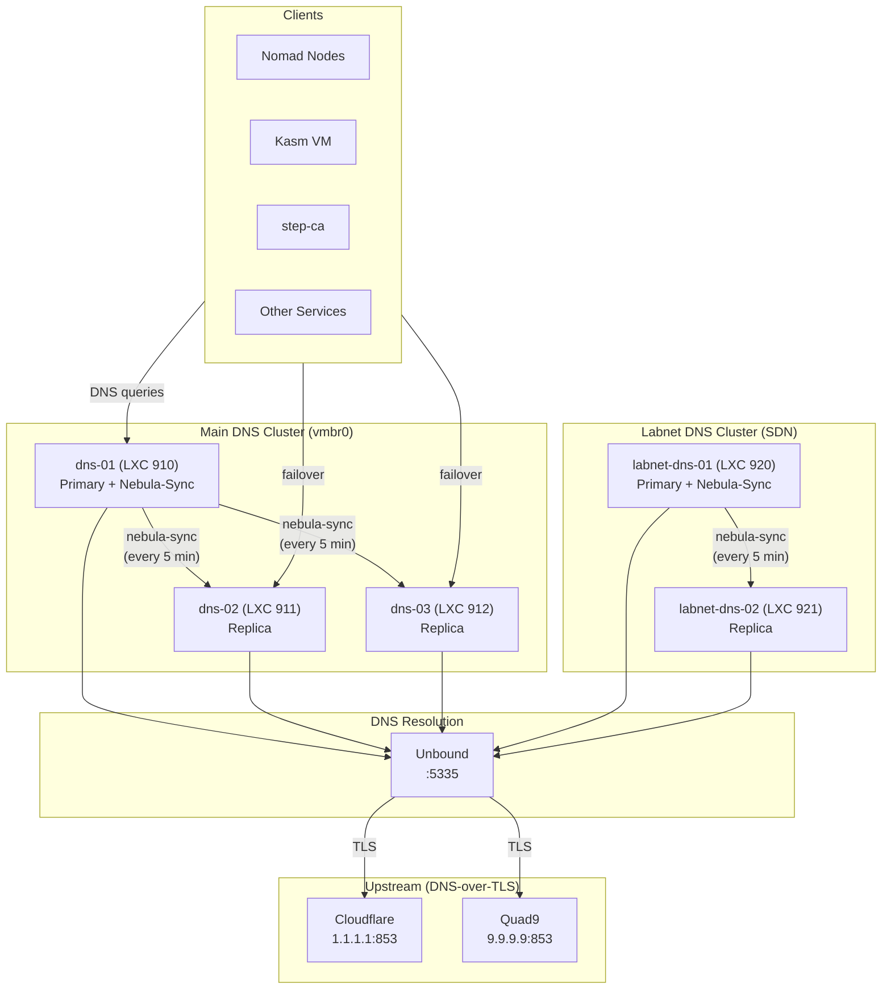
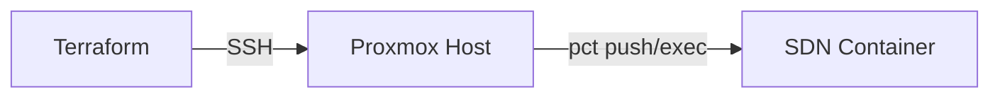

# Pi-hole DNS

Pi-hole v6 provides DNS resolution and ad-blocking for the entire Proxmox Lab infrastructure. It runs inside LXC containers with Unbound as a recursive resolver using DNS-over-TLS to upstream providers. Multiple nodes are synchronized using nebula-sync.

---

## Architecture



### DNS Resolution Chain

```
Client --> Pi-hole (ad-blocking, local DNS) --> Unbound (DNS-over-TLS) --> Cloudflare / Quad9
```

---

## Cluster Layout

### Main Cluster (External Network)

Deployed on the external network (`vmbr0`), one node per Proxmox cluster node. The number of DNS nodes matches your Proxmox cluster size.

| Node | VMID | Network | Role |
|------|------|---------|------|
| dns-01 | 910 | vmbr0 | Primary (nebula-sync source) |
| dns-02 | 911 | vmbr0 | Replica |
| dns-03 | 912 | vmbr0 | Replica |

### Labnet Cluster (SDN)

Deployed on the optional Proxmox SDN network (`labnet`), with a maximum of 2 nodes. This cluster provides DNS for services on the isolated internal network.

| Node | VMID | Network | Role |
|------|------|---------|------|
| labnet-dns-01 | 920 | labnet | Primary (nebula-sync source) |
| labnet-dns-02 | 921 | labnet | Replica |

!!! note "Optional"
    The labnet DNS cluster is only deployed if `dns_labnet_nodes` contains entries in `terraform.tfvars`. It is skipped when the list is empty.

---

## Container Specifications

| Setting | Value |
|---------|-------|
| OS template | Debian 12 (`debian-12-standard_12.12-1_amd64.tar.zst`) |
| CPU cores | 2 |
| Memory | 1024 MB |
| Swap | 1024 MB |
| Disk | 4 GB |
| Unprivileged | Yes |
| Nesting | Enabled |
| Start on boot | Yes |

---

## Pi-hole v6 Configuration

Pi-hole v6 uses the FTL (Faster Than Light) engine with TOML-based configuration. The module configures Pi-hole using `pihole-FTL --config` commands rather than editing files directly.

### Key Settings

| Setting | Command | Value |
|---------|---------|-------|
| DNS upstream | `pihole-FTL --config dns.upstreams` | `["127.0.0.1#5335"]` (Unbound) |
| Listening mode | `pihole-FTL --config dns.listeningMode` | `ALL` |
| Admin password | `pihole-FTL --config webserver.api.password` | From `admin_password` variable |
| Local DNS hosts | `pihole-FTL --config dns.hosts` | JSON array of `"IP hostname hostname.domain"` entries |
| DNS domain | `pihole-FTL --config dns.domain.name` | Value of `dns_zone` variable |

### Local DNS Records

The module automatically registers DNS records for all nodes in the cluster. Records are configured on the primary node and synced to replicas via nebula-sync.

Format: `["<ip> <hostname> <hostname>.<domain>", ...]`

Example:

```json
["10.1.50.3 dns-01 dns-01.mylab.lan", "10.1.50.4 dns-02 dns-02.mylab.lan"]
```

Additional service DNS records (for Nomad services like Vault, Traefik, Authentik) are added by `setup.sh` option **10** (Build DNS records).

---

## Unbound Configuration

Each Pi-hole container runs Unbound as a local recursive resolver on port 5335. Unbound encrypts all upstream queries using DNS-over-TLS (DoT).

**Config file:** `/etc/unbound/unbound.conf.d/pi-hole.conf`

### Upstream Servers

| Provider | Address | Port | TLS Hostname |
|----------|---------|------|--------------|
| Cloudflare | `1.1.1.1` | 853 | `cloudflare-dns.com` |
| Cloudflare | `1.0.0.1` | 853 | `cloudflare-dns.com` |
| Quad9 | `9.9.9.9` | 853 | `dns.quad9.net` |
| Quad9 | `149.112.112.112` | 853 | `dns.quad9.net` |

### Key Unbound Settings

| Setting | Value | Purpose |
|---------|-------|---------|
| `interface` | `127.0.0.1` | Listen only on localhost |
| `port` | `5335` | Non-standard port to avoid conflicts with Pi-hole |
| `tls-upstream` | `yes` | Enable DNS-over-TLS for upstream queries |
| `harden-glue` | `yes` | Trust glue only within server's authority |
| `harden-dnssec-stripped` | `yes` | Require DNSSEC data for trust-anchored zones |
| `edns-buffer-size` | `1232` | Per dnsflagday.net 2020 recommendation |
| `prefetch` | `yes` | Pre-fetch expiring cache entries |
| `num-threads` | `1` | Single thread (sufficient for home lab) |

### Private Address Ranges

Unbound is configured to protect the privacy of local IP ranges:

- `192.168.0.0/16`
- `169.254.0.0/16`
- `172.16.0.0/12`
- `10.0.0.0/8`
- `fd00::/8`
- `fe80::/10`

---

## Nebula-Sync (Gravity Sync)

[Nebula-sync](https://github.com/lovelaze/nebula-sync) synchronizes Pi-hole configuration from the primary node to all replicas. It runs as a systemd timer on the primary node.

### Configuration

| Setting | Value |
|---------|-------|
| Binary | `/usr/local/bin/nebula-sync` (v0.11.1) |
| Config | `/etc/nebula-sync/env` |
| Sync interval | Every 5 minutes |
| Full sync | Enabled |
| Run gravity | Enabled |
| HTTP server | Disabled |

### Systemd Units

**Service** (`/etc/systemd/system/nebula-sync.service`):

```ini
[Unit]
Description=Nebula-Sync Pi-hole synchronization
After=network.target pihole-FTL.service

[Service]
Type=oneshot
EnvironmentFile=/etc/nebula-sync/env
ExecStart=/usr/local/bin/nebula-sync run
```

**Timer** (`/etc/systemd/system/nebula-sync.timer`):

```ini
[Timer]
OnBootSec=2min
OnUnitActiveSec=5min
AccuracySec=1min
```

### Environment File

The `/etc/nebula-sync/env` file contains the connection details (permissions: `600`):

```
PRIMARY=http://127.0.0.1|<admin_password>
REPLICAS=http://<replica1_ip>|<admin_password>,http://<replica2_ip>|<admin_password>
FULL_SYNC=true
RUN_GRAVITY=true
HTTP_ENABLED=false
```

!!! note "Sync Direction"
    Nebula-sync runs on the **primary** node and pushes configuration **to** replicas. Changes should always be made on the primary node to avoid being overwritten.

---

## Provisioning Methods

The module supports two provisioning methods depending on network accessibility.

### Direct SSH (External Network)

For the main DNS cluster on `vmbr0`, Terraform connects directly to each container via SSH:

1. Copies the Unbound configuration file
2. Runs an inline provisioning script that installs Pi-hole and Unbound
3. Configures nebula-sync on the primary node
4. Sets local DNS records

### pct exec (SDN Network)

For the labnet cluster on the SDN network, containers are not directly reachable from the Terraform host. Instead, provisioning uses `pct exec` via the Proxmox host:

1. Copies files to the Proxmox host via SCP
2. Pushes files into the container using `pct push`
3. Executes install scripts inside the container using `pct exec`



---

## Installation Process

The following steps occur during provisioning (same for both SSH and pct exec methods):

1. **Set temporary DNS** -- Uses `1.1.1.1` (Cloudflare) during installation since internal DNS is not yet available
2. **Install packages** -- `curl`, `wget`, `dnsutils`, `jq`, `unbound`, `sqlite3`
3. **Configure Unbound** -- Writes config and starts the Unbound service
4. **Test Unbound** -- Verifies resolution via `dig @127.0.0.1 -p 5335 google.com`
5. **Install Pi-hole** -- Unattended install via `curl -sSL https://install.pi-hole.net | bash`
6. **Configure Pi-hole v6** -- Sets upstream DNS to Unbound, listening mode, and admin password
7. **Setup nebula-sync** -- (Primary node only, multi-node clusters only) Installs binary and systemd units
8. **Configure local DNS** -- Adds hostname records for all cluster nodes
9. **Switch to local DNS** -- Sets `resolv.conf` to `127.0.0.1`

---

## Accessing Pi-hole

### Web Admin Interface

Each Pi-hole node has a web admin interface:

```
http://<node-ip>/admin
```

Login with the `pihole_admin_password` configured in `terraform.tfvars`.

### Checking Sync Status

On the primary node:

```bash
# Check timer status
systemctl status nebula-sync.timer

# View last sync logs
journalctl -u nebula-sync.service --no-pager -n 20

# Trigger manual sync
systemctl start nebula-sync.service
```

---

## Troubleshooting

### DNS not resolving

1. Check if Pi-hole FTL is running:
   ```bash
   systemctl status pihole-FTL
   ```

2. Test Unbound directly:
   ```bash
   dig @127.0.0.1 -p 5335 google.com
   ```

3. Test Pi-hole:
   ```bash
   dig @<pihole-ip> google.com
   ```

### Nebula-sync not working

1. Check timer status:
   ```bash
   systemctl status nebula-sync.timer
   ```

2. Run sync manually and check output:
   ```bash
   systemctl start nebula-sync.service
   journalctl -u nebula-sync.service --no-pager
   ```

3. Verify replica connectivity:
   ```bash
   curl -s http://<replica-ip>/admin/api.php
   ```

### SDN containers unreachable

For labnet containers, you must access them through the Proxmox host:

```bash
# Check container status
pct status <vmid>

# Open a shell
pct enter <vmid>

# Check DNS inside container
pct exec <vmid> -- dig google.com
```

---

## Next Steps

- [Module Reference](../configuration/module-reference.md) -- Full module inputs and outputs
- [Step-CA](step-ca.md) -- Certificate Authority used by other services
- [Nomad Cluster](nomad-cluster.md) -- Depends on Pi-hole for DNS resolution
