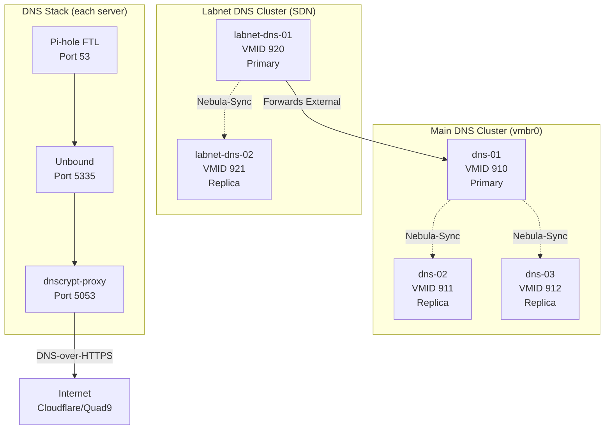
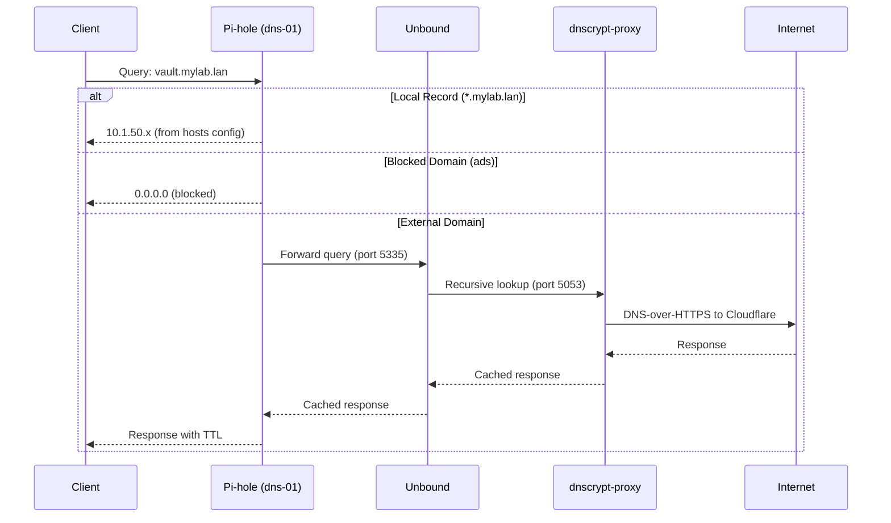
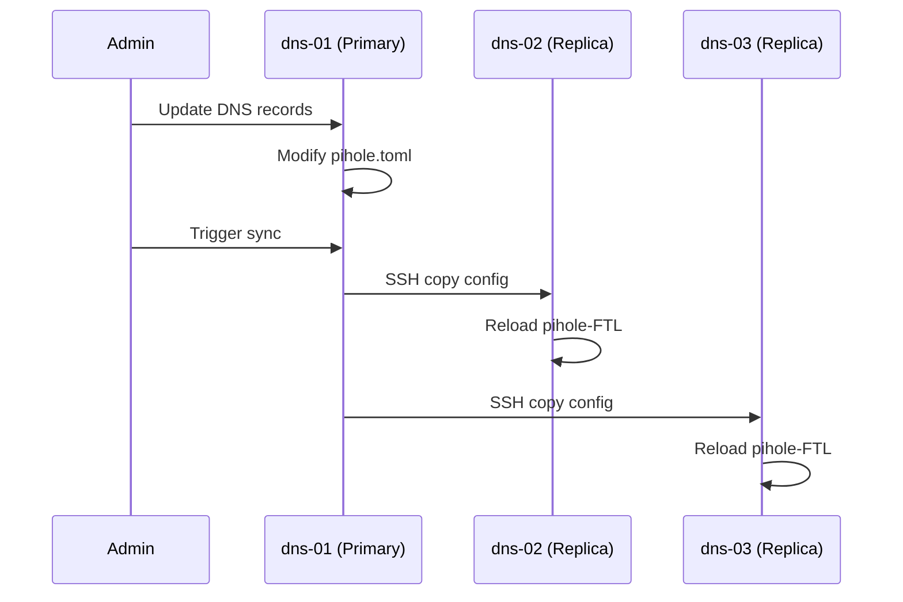

# Pi-hole DNS

Pi-hole provides network-level ad blocking and DNS services for Proxmox Lab. It forms the foundation of the DNS architecture with multiple clusters for external and internal networks.

## Overview

Proxmox Lab deploys Pi-hole v6 in a replicated configuration using Nebula-Sync for high availability.

### Key Features

- **Ad Blocking**: Network-wide ad and tracker blocking
- **Custom DNS Records**: Local domain resolution (e.g., `.mylab.lan`)
- **DNS-over-TLS**: Secure upstream DNS queries via Unbound and dnscrypt-proxy
- **High Availability**: Primary/replica architecture with automatic sync
- **Dual Networks**: Separate clusters for external (vmbr0) and internal (labnet) networks

### Architecture



## Deployment

### VMID Assignments

| Container | VMID | Network | IP Example |
|-----------|------|---------|------------|
| dns-01 | 910 | vmbr0 | 10.1.50.3 |
| dns-02 | 911 | vmbr0 | 10.1.50.x |
| dns-03 | 912 | vmbr0 | 10.1.50.x |
| labnet-dns-01 | 920 | labnet | 172.16.0.3 |
| labnet-dns-02 | 921 | labnet | 172.16.0.x |

### Terraform Module

Located at: `terraform/lxc-pihole/`

The module is called from `main.tf` for both external and labnet clusters:

```hcl
# Main DNS cluster (external network)
module "lxc-pihole" {
  source = "./lxc-pihole"

  proxmox_target_node      = var.proxmox_target_node
  network_interface_bridge = var.network_interface_bridge
  network_gateway_address  = var.network_gateway_address
  dns_postfix              = var.dns_postfix

  # Cluster configuration
  cluster_nodes = {
    "dns-01" = { vmid = 910, ip = "10.1.50.3/24", primary = true }
    "dns-02" = { vmid = 911, ip = "10.1.50.x/24", primary = false }
    "dns-03" = { vmid = 912, ip = "10.1.50.x/24", primary = false }
  }
}

# Labnet DNS cluster (SDN network)
module "lxc-pihole-labnet" {
  source = "./lxc-pihole"

  network_interface_bridge = "labnet"

  cluster_nodes = {
    "labnet-dns-01" = { vmid = 920, ip = "172.16.0.3/24", primary = true }
    "labnet-dns-02" = { vmid = 921, ip = "172.16.0.x/24", primary = false }
  }
}
```

### Container Specifications

| Resource | Value |
|----------|-------|
| OS | Debian 12 (from Proxmox CT templates) |
| CPU Cores | 2 |
| Memory | 1 GB |
| Storage | 4 GB |
| Privileged | No |
| Auto-start | Yes |

## DNS Resolution Flow

### Query Path



### DNS Stack Components

Each Pi-hole container runs three services:

#### 1. Pi-hole FTL (Port 53)

**Purpose**: DNS server with ad-blocking

- Listens on port 53 (TCP/UDP)
- Processes all client DNS queries
- Applies blocklists to filter ads/trackers
- Serves local DNS records from configuration
- Provides web interface on port 80
- Caches DNS responses

**Configuration**: `/etc/pihole/pihole.toml`

#### 2. Unbound (Port 5335)

**Purpose**: Recursive DNS resolver

- Listens on port 5335 (internal only)
- Performs recursive DNS lookups
- Validates DNSSEC signatures
- Caches responses for performance
- Forwards to dnscrypt-proxy

**Configuration**: `/etc/unbound/unbound.conf.d/pi-hole.conf`

#### 3. dnscrypt-proxy (Port 5053)

**Purpose**: DNS-over-HTTPS encryption

- Listens on port 5053 (internal only)
- Encrypts DNS queries using HTTPS
- Connects to Cloudflare (1.1.1.1) and Quad9 (9.9.9.9)
- Prevents ISP DNS snooping
- Load balances between upstream servers

**Configuration**: `/etc/dnscrypt-proxy/dnscrypt-proxy.toml`

## Pi-hole v6 Configuration

### TOML Configuration File

Pi-hole v6 uses a TOML configuration file instead of the old shell script format:

**Location**: `/etc/pihole/pihole.toml`

**Key sections**:

```toml
[dns]
# Upstream DNS (points to Unbound)
upstreams = ["127.0.0.1#5335"]

# Local domain
domain = "mylab.lan"

# Local DNS records
hosts = [
  "10.1.50.3 dns-01 dns-01.mylab.lan",
  "10.1.50.4 step-ca step-ca.mylab.lan",
  "10.1.50.114 vault vault.mylab.lan"
]

# CNAME records
cnameRecords = ["ca.mylab.lan,step-ca.mylab.lan"]

[webserver]
# Web interface configuration
api.port = 80
```

### Managing Configuration

**Via pihole-FTL CLI:**

```bash
# Add DNS records (appends to dns.hosts array)
pihole-FTL --config dns.hosts '["10.1.50.50 myhost myhost.mylab.lan"]'

# Add CNAME records
pihole-FTL --config dns.cnameRecords '["alias.mylab.lan,target.mylab.lan"]'

# View current records
pihole-FTL --config dns.hosts get

# Reload configuration
systemctl restart pihole-FTL
```

**Direct TOML editing:**

```bash
# Edit configuration
nano /etc/pihole/pihole.toml

# Restart to apply
systemctl restart pihole-FTL
```

## Nebula-Sync Replication

### Overview

Nebula-Sync is a custom synchronization service that replicates Pi-hole configuration from the primary to replica nodes.

### How It Works

1. **Primary node** (dns-01, labnet-dns-01) holds the source of truth
2. **Replica nodes** receive updates via SSH from primary
3. **Sync service** runs on primary, triggered manually or on schedule
4. **Configuration files** are copied: `pihole.toml`, blocklists, custom settings

### Sync Process



### Manual Sync

```bash
# SSH to primary DNS
ssh root@dns-01

# Trigger sync
systemctl start nebula-sync.service

# Check status
systemctl status nebula-sync.service

# View logs
journalctl -u nebula-sync.service -f
```

### Automatic Sync

Nebula-Sync can be configured to run on a schedule via systemd timer:

```bash
# Enable timer (if configured)
systemctl enable nebula-sync.timer
systemctl start nebula-sync.timer

# Check timer status
systemctl list-timers --all | grep nebula-sync
```

### Verifying Sync

```bash
# Check replica has updated records
ssh root@dns-02
pihole-FTL --config dns.hosts get | grep myhost

# Test DNS resolution from replica
dig @<dns-02-ip> myhost.mylab.lan
```

## Web Interface

### Accessing Pi-hole Admin

**URL**: `http://<dns-ip>/admin`

Example: `http://10.1.50.3/admin`

**Login**: Use the password configured in `terraform.tfvars` as `pihole_root_password`

### Web Interface Features

- **Dashboard**: Query statistics, top clients, top domains
- **Query Log**: Real-time DNS query log with filtering
- **Blocklist Management**: Add/remove blocklists, whitelist domains
- **Local DNS**: Manage custom DNS records (A, CNAME)
- **DHCP**: Configure DHCP server (for labnet DNS)
- **Settings**: Configure upstream DNS, rate limiting, privacy

### Managing DNS Records via Web

1. Navigate to **Local DNS > DNS Records**
2. Click **Add new domain**
3. Enter domain name and IP address
4. Click **Add**

!!! note "CLI Preferred for Automation"
    For programmatic updates, use `pihole-FTL --config` CLI commands rather than the web interface. The setup script uses CLI for bulk operations.

## DNS Management Operations

### Adding DNS Records

**Via setup script (recommended):**

```bash
./setup.sh
# Select option 10: Build DNS records
```

This automatically adds all infrastructure DNS records.

**Manual addition:**

```bash
ssh root@dns-01

# Add single record
pihole-FTL --config dns.hosts '["10.1.50.100 newvm newvm.mylab.lan"]'

# Sync to replicas
systemctl start nebula-sync.service
```

### Updating Proxmox Node DNS

After DNS deployment, update Proxmox nodes to use Pi-hole:

```bash
# Via setup script
./setup.sh
# Select option 10, answer Y to "Update Proxmox nodes to use this DNS server?"

# Or manually on each node
ssh root@proxmox-node
cat > /etc/resolv.conf << EOF
nameserver 10.1.50.3
nameserver 1.1.1.1
EOF
```

!!! info "Tailscale Integration"
    If Tailscale is installed on Proxmox nodes, the DNS update process automatically disables Tailscale DNS management to prevent conflicts. See [Tailscale Integration](../architecture/network-topology.md#tailscale-integration) for details.

### Removing DNS Records

```bash
ssh root@dns-01

# Get current records
pihole-FTL --config dns.hosts get > /tmp/hosts.json

# Edit the JSON to remove unwanted entries
nano /tmp/hosts.json

# Update Pi-hole with edited list
pihole-FTL --config dns.hosts "$(cat /tmp/hosts.json)"

# Sync to replicas
systemctl start nebula-sync.service
```

## Labnet DNS Configuration

### Special Considerations

Labnet DNS runs on the isolated SDN network, requiring special access methods.

### Accessing Labnet DNS

**Cannot SSH directly from external network**. Use `pct exec`:

```bash
# Execute commands inside labnet DNS container
pct exec 920 -- pihole-FTL --config dns.hosts get
pct exec 920 -- systemctl status pihole-FTL

# Interactive shell
pct enter 920
```

### DNS Forwarding

Labnet DNS forwards external queries to the main DNS cluster:

```toml
# In /etc/pihole/pihole.toml on labnet-dns-01
[dns]
upstreams = ["10.1.50.3"]  # Points to dns-01
```

This allows labnet VMs to resolve both:
- Local labnet records (e.g., lab VMs)
- External network services (e.g., vault.mylab.lan)
- Internet domains (via main DNS cluster)

### DHCP for Labnet

Labnet DNS also provides DHCP for the SDN network:

```toml
[dhcp]
active = true
start = "172.16.0.100"
end = "172.16.0.200"
router = "172.16.0.1"
leasetime = 86400  # 24 hours
```

## Tailscale Coexistence

### DNS Management Conflict

Tailscale's MagicDNS feature automatically manages DNS configuration on connected devices, which can conflict with Pi-hole DNS settings on Proxmox nodes.

### Automatic Resolution

When you run DNS updates (setup.sh option 10), the script automatically:

1. Detects Tailscale on each Proxmox cluster node
2. Runs `tailscale set --accept-dns=false` to disable DNS management
3. Allows Pi-hole to remain the primary DNS resolver

### What This Means

**Tailscale networking continues to work:**
- VPN tunnels remain active
- Can connect to nodes via Tailscale IPs (100.x.x.x)
- Peer-to-peer connections function normally

**MagicDNS names won't resolve on Proxmox nodes:**
- `node.tailnet.ts.net` won't resolve
- Use Tailscale IPs directly (100.x.x.x)
- Or add Tailscale hosts to Pi-hole DNS

### Adding Tailscale Hosts to Pi-hole

If you need to resolve Tailscale MagicDNS names:

```bash
ssh root@dns-01

# Add Tailscale hosts to Pi-hole
pihole-FTL --config dns.hosts '[
  "100.64.1.10 remote-host remote-host.tailnet.ts.net",
  "100.64.1.20 laptop laptop.tailnet.ts.net"
]'

# Sync to replicas
systemctl start nebula-sync.service
```

For more details, see:
- [Tailscale Integration](../architecture/network-topology.md#tailscale-integration)
- [DNS Management - Tailscale Integration](../operations/dns-management.md#tailscale-integration)
- [Troubleshooting - Tailscale Overwriting DNS](../troubleshooting/common-issues.md#tailscale-overwriting-dns-configuration)

## Monitoring and Maintenance

### Checking Service Status

```bash
# Container status
pct status 910

# Pi-hole service
ssh root@dns-01
systemctl status pihole-FTL

# DNS stack
systemctl status unbound
systemctl status dnscrypt-proxy
```

### Viewing Logs

```bash
# Pi-hole logs
journalctl -u pihole-FTL -f

# Query log (real-time)
pihole-FTL --tail

# Unbound logs
journalctl -u unbound -f
```

### Performance Monitoring

```bash
# DNS query statistics
pihole -c -e

# Cache statistics
pihole-FTL stats
```

### Updating Blocklists

```bash
# Update gravity (blocklists)
pihole -g

# Or via web interface: Tools > Update Gravity
```

## Troubleshooting

### DNS Not Resolving

1. **Check container is running:**
   ```bash
   pct status 910
   pct start 910
   ```

2. **Check Pi-hole service:**
   ```bash
   ssh root@dns-01
   systemctl status pihole-FTL
   systemctl restart pihole-FTL
   ```

3. **Test DNS directly:**
   ```bash
   dig @dns-01 vault.mylab.lan
   nslookup google.com dns-01
   ```

### Records Not Syncing

1. **Check Nebula-Sync:**
   ```bash
   ssh root@dns-01
   systemctl status nebula-sync.service
   journalctl -u nebula-sync.service -n 50
   ```

2. **Verify SSH connectivity to replicas:**
   ```bash
   ssh root@dns-02
   # Should connect without password
   ```

3. **Manual sync:**
   ```bash
   systemctl start nebula-sync.service
   ```

### External Domains Not Resolving

1. **Check Unbound:**
   ```bash
   systemctl status unbound
   systemctl restart unbound
   ```

2. **Check dnscrypt-proxy:**
   ```bash
   systemctl status dnscrypt-proxy
   systemctl restart dnscrypt-proxy
   ```

3. **Test upstream connectivity:**
   ```bash
   dig @127.0.0.1 -p 5335 google.com  # Test Unbound
   ```

### Labnet DNS Issues

```bash
# Can't SSH directly, use pct exec
pct exec 920 -- systemctl status pihole-FTL
pct exec 920 -- pihole-FTL --config dns.hosts get

# Check forwarding to main DNS
pct exec 920 -- dig @127.0.0.1 vault.mylab.lan
```

## Best Practices

1. **Always make changes on primary node** (dns-01 or labnet-dns-01)
2. **Trigger sync after manual changes** to propagate to replicas
3. **Use setup script for bulk updates** (option 10) rather than manual edits
4. **Test DNS resolution** after changes using dig/nslookup
5. **Monitor query logs** for unusual activity or misconfigurations
6. **Keep blocklists updated** monthly for optimal ad blocking
7. **Configure secondary DNS** on clients for redundancy
8. **Backup pihole.toml** before major configuration changes
9. **Use CLI for automation**, web interface for manual management
10. **Document custom records** not managed by automation

## Related Documentation

- [DNS Management Operations](../operations/dns-management.md) - Comprehensive DNS management guide
- [Network Topology](../architecture/network-topology.md) - DNS architecture and flow
- [Troubleshooting Common Issues](../troubleshooting/common-issues.md) - DNS troubleshooting
- [Tailscale Integration](../architecture/network-topology.md#tailscale-integration) - Tailscale coexistence details
