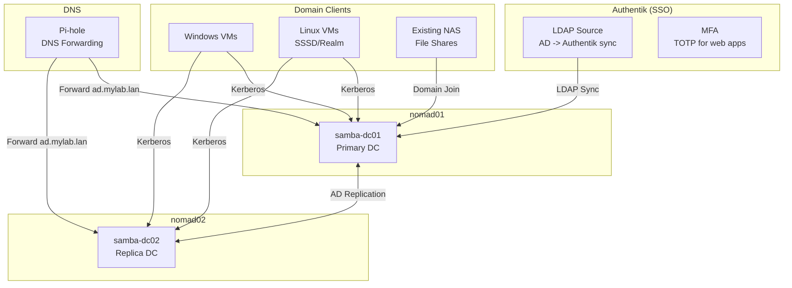

# Samba AD Domain Controllers

Samba AD Domain Controllers provide Active Directory services for the lab environment. The deployment supports both single-node and multi-node configurations:

- **Single node**: Deploys primary DC only (samba-dc01)
- **Multi-node**: Deploys primary DC (samba-dc01) and replica DC (samba-dc02) for high availability

Both configurations enable Windows/Linux domain joins and integrate with Authentik for web application SSO.

## Overview

| Property | Value |
|----------|-------|
| **Deployment Type** | Nomad Job |
| **Job File** | Dynamically generated from template |
| **Primary DC** | samba-dc01 (nomad01) |
| **Replica DC** | samba-dc02 (nomad02) - *multi-node only* |
| **AD Realm** | Configurable (default: DNS suffix uppercased, e.g., `JDCLABS.LAN`) |
| **NetBIOS Domain** | Configurable (default: first part of DNS suffix, e.g., `JDCLABS`) |
| **Ports** | 88 (Kerberos), 389/636 (LDAP), 445 (SMB), 5353/5354 (DNS) |
| **Storage** | GlusterFS at `/srv/gluster/nomad-data/samba-dc0[12]` |

## Architecture



## Deployment

### Prerequisites

- Nomad cluster deployed and healthy
- Vault deployed and unsealed
- Critical services deployed (DNS, CA)
- GlusterFS volume mounted

### Deploy via setup.sh

```bash
./setup.sh
# Select option 16: Deploy Samba AD Domain Controllers (on Nomad)
```

What happens:

1. Creates Vault policy and role for `samba-dc`
2. Generates AD admin password and stores in Vault
3. Creates storage directories on GlusterFS
4. Deploys primary DC (provisions new AD domain)
5. Waits for domain to be available
6. Deploys replica DC (joins existing domain)
7. Updates Pi-hole DNS with AD records and forwarding

### Manual Deployment

```bash
# From nomad01
nomad job run /path/to/samba-dc.nomad.hcl

# Check status
nomad job status samba-dc

# View logs
nomad alloc logs -job samba-dc -task samba-dc
```

## Configuration

### Job Configuration

The job deploys two groups, one for each DC:

```hcl
job "samba-dc" {
  datacenters = ["dc1"]
  type        = "service"

  group "dc01" {
    constraint {
      attribute = "${attr.unique.hostname}"
      value     = "nomad01"
    }

    vault {
      role        = "samba-dc"
      change_mode = "noop"  # Don't restart on secret change
    }

    network {
      mode = "host"
      port "dns"      { static = 5353 }
      port "kerberos" { static = 88 }
      port "ldap"     { static = 389 }
      port "ldaps"    { static = 636 }
      port "smb"      { static = 445 }
    }

    task "samba-dc" {
      driver = "docker"

      kill_timeout = "120s"  # Graceful shutdown

      config {
        image        = "nowsci/samba-domain:latest"
        network_mode = "host"
        privileged   = true
        volumes = [
          "/srv/gluster/nomad-data/samba-dc01/samba:/var/lib/samba",
          "/srv/gluster/nomad-data/samba-dc01/krb5:/etc/krb5",
        ]
      }
    }
  }

  group "dc02" {
    # Similar but constrained to nomad02, with JOIN=true
  }
}
```

### Environment Variables

Primary DC (dc01) - uses `nowsci/samba-domain` image:

```bash
DOMAIN=<YOUR_DOMAIN>           # e.g., JDCLABS.LAN
DOMAINPASS=<admin_password>    # From Vault
HOSTIP=<nomad01_ip>            # IP of nomad01
DNSFORWARDER=<dns_server_ip>   # Pi-hole IP
JOIN=false                     # Provision new domain
INSECURELDAP=true              # Allow plain LDAP
NOCOMPLEXITY=true              # Disable password complexity
```

Replica DC (dc02):

```bash
DOMAIN=<YOUR_DOMAIN>           # Same realm as DC01
DOMAINPASS=<admin_password>    # From Vault
HOSTIP=<nomad02_ip>            # IP of nomad02
DNSFORWARDER=<nomad01_ip>      # Point to DC01 for DNS
JOIN=true                      # Join existing domain
JOINSITE=Default-First-Site-Name
INSECURELDAP=true
NOCOMPLEXITY=true
```

## Secrets Management

AD secrets are stored in Vault at `secret/data/samba-ad`:

```json
{
  "admin_password": "auto-generated-password",
  "authentik_sync_password": "sync-account-password",
  "authentik_sync_dn": "cn=authentik-sync,cn=Users,dc=ad,dc=jdclabs,dc=lan"
}
```

### Retrieve Admin Password

```bash
# Using Vault CLI
vault kv get secret/samba-ad

# Using curl
curl -H "X-Vault-Token: $ROOT_TOKEN" \
  http://nomad01:8200/v1/secret/data/samba-ad | jq .
```

## DNS Configuration

### Pi-hole Integration

Pi-hole is configured to forward AD domain queries to the DCs:

```
/etc/dnsmasq.d/10-ad-forward.conf:
server=/ad.<your_domain>/10.1.50.114#5353
server=/ad.<your_domain>/10.1.50.115#5354
```

### DNS Records

| Record | Type | Value |
|--------|------|-------|
| samba-dc01.ad.<your_domain> | A | nomad01 IP |
| samba-dc02.ad.<your_domain> | A | nomad02 IP |
| _ldap._tcp.ad.<your_domain> | SRV | Samba DCs |
| _kerberos._tcp.ad.<your_domain> | SRV | Samba DCs |

## Domain Join

### Windows VM

1. Configure VM to use Pi-hole for DNS
2. Open System Properties → Computer Name → Change
3. Join domain: `ad.<your_domain>`
4. Enter AD Administrator credentials
5. Reboot

```powershell
# PowerShell
Add-Computer -DomainName "ad.<your_domain>" -Credential Administrator -Restart
```

### Linux VM (SSSD/Realm)

```bash
# Install required packages
sudo apt install sssd-ad realmd adcli samba-common-bin

# Discover domain
sudo realm discover ad.<your_domain>

# Join domain
sudo realm join ad.<your_domain> -U Administrator

# Verify
realm list
id administrator@ad.<your_domain>
```

### NAS Domain Join

Follow your NAS vendor's documentation. General steps:

1. Configure NAS to use Pi-hole for DNS
2. Enable Active Directory in NAS settings
3. Enter domain: `ad.<your_domain>`
4. Authenticate with AD Administrator
5. Configure share permissions using AD groups

## Authentik Integration

Configure Authentik to sync users from AD for web SSO:

```bash
./setup.sh
# Select option 17: Configure Authentik AD Sync
```

### LDAP Source Configuration

| Setting | Value |
|---------|-------|
| Server URI | `ldap://nomad01:389` |
| Bind DN | `cn=Administrator,cn=Users,dc=ad,dc=jdclabs,dc=lan` |
| Base DN | `dc=ad,dc=jdclabs,dc=lan` |
| User Filter | `(objectClass=user)` |
| Group Filter | `(objectClass=group)` |

### Sync Direction

**AD → Authentik** (one-way sync)

- AD is the authoritative source
- Users created in AD sync to Authentik
- Authentik adds MFA (TOTP) for web apps
- Changes in AD propagate to Authentik

### MFA Flow

1. User accesses web app
2. App redirects to Authentik
3. User enters AD credentials (synced)
4. Authentik prompts for TOTP
5. Token issued, user logged in

## Operations

### Verify AD Status

```bash
# Connect to DC container
docker exec -it $(docker ps -q -f name=samba-dc) bash

# Check domain level
samba-tool domain level show

# Check replication
samba-tool drs showrepl

# List users
samba-tool user list

# List groups
samba-tool group list
```

### Test Kerberos

```bash
# Get Kerberos ticket
kinit administrator@AD.<YOUR_DOMAIN>

# Verify ticket
klist

# Test LDAP
ldapsearch -H ldap://nomad01:389 \
  -b "dc=ad,dc=jdclabs,dc=lan" \
  "(objectClass=user)" sAMAccountName
```

### Create AD User

```bash
# From DC container
samba-tool user create john.doe \
  --given-name="John" \
  --surname="Doe" \
  --mail="john.doe@<your_domain>" \
  --random-password

# Set password
samba-tool user setpassword john.doe

# Add to group
samba-tool group addmembers "Scientists" john.doe
```

### Create AD Group

```bash
# Create group
samba-tool group add "Scientists" \
  --description="Lab Scientists"

# List members
samba-tool group listmembers "Scientists"
```

## Troubleshooting

### DC Won't Start

```bash
# Check Nomad allocation
nomad job status samba-dc
nomad alloc logs -job samba-dc -task samba-dc

# Common issues:
# - GlusterFS not mounted: Check /srv/gluster/nomad-data
# - Port conflict: Check for services using 88, 389, 445
# - Previous data: Clean /srv/gluster/nomad-data/samba-dc01
```

### Replication Issues

```bash
# Check replication status
samba-tool drs showrepl

# Force replication
samba-tool drs replicate samba-dc02 samba-dc01 dc=ad,dc=jdclabs,dc=lan

# Check for errors
journalctl -u samba-ad-dc
```

### DNS Resolution Fails

```bash
# Test from client
nslookup ad.<your_domain>
dig _ldap._tcp.ad.<your_domain> SRV

# Check Pi-hole forwarding
cat /etc/dnsmasq.d/10-ad-forward.conf

# Restart Pi-hole DNS
pihole restartdns
```

### Domain Join Fails

```bash
# Windows - Check DNS
nslookup ad.<your_domain>
nltest /dsgetdc:ad.<your_domain>

# Linux - Debug realm join
realm discover ad.<your_domain> -v
```

### LDAP Connection Issues

```bash
# Test LDAP connectivity
ldapsearch -x -H ldap://nomad01:389 \
  -D "cn=Administrator,cn=Users,dc=ad,dc=jdclabs,dc=lan" \
  -W -b "dc=ad,dc=jdclabs,dc=lan" "(objectClass=user)"

# Check TLS (LDAPS)
openssl s_client -connect nomad01:636
```

## Backup and Recovery

### Backup AD Database

```bash
# Backup on DC01
sudo tar -czf samba-backup-$(date +%Y%m%d).tar.gz \
  -C /srv/gluster/nomad-data/samba-dc01 samba/
```

### Backup Sysvol

```bash
# Backup Sysvol (Group Policies, etc.)
sudo tar -czf sysvol-backup-$(date +%Y%m%d).tar.gz \
  /srv/gluster/nomad-data/samba-dc01/samba/sysvol/
```

### Recovery

```bash
# Stop jobs
nomad job stop -purge samba-dc

# Restore data
sudo tar -xzf samba-backup.tar.gz -C /srv/gluster/nomad-data/samba-dc01/

# Redeploy
./setup.sh  # option 16
```

## Security Considerations

### Network Security

- DCs only accessible from internal network
- Kerberos traffic encrypted by default
- LDAPS available on port 636 (optional)
- SMB signing enabled

### Account Security

- AD admin password in Vault (not on filesystem)
- Sync account with minimal permissions
- Consider separate admin accounts per person
- Enable account lockout policies

### Best Practices

| Practice | Home Lab | Production |
|----------|----------|------------|
| Admin accounts | Single admin | Per-person accounts |
| Password policy | Basic | Complex requirements |
| Audit logging | Minimal | Comprehensive |
| Backup frequency | Weekly | Daily |
| TLS/LDAPS | Optional | Required |

## Next Steps

- [:octicons-arrow-right-24: Configure AD Sync](authentik.md#ldap-source) - Sync AD users to Authentik
- [:octicons-arrow-right-24: Set up MFA](authentik.md#mfa-configuration) - TOTP for web apps
- [:octicons-arrow-right-24: Vault Operations](../operations/vault-operations.md) - Managing AD secrets
