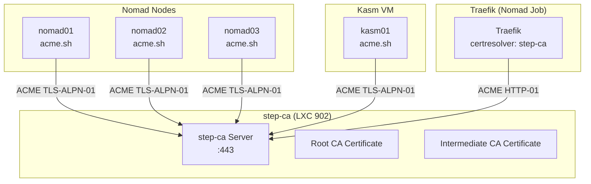

# Step-CA

Step-CA is the internal Certificate Authority (CA) for Proxmox Lab. It runs inside a single LXC container and provides automated TLS certificate issuance via the ACME protocol. All services in the lab obtain their certificates from this CA, enabling HTTPS across the infrastructure without relying on external certificate providers.

---

## Overview

| Property | Value |
|----------|-------|
| **VMID** | 902 |
| **Type** | LXC container |
| **OS** | Debian 12 |
| **CPU Cores** | 2 |
| **Memory** | 2 GB |
| **Swap** | 2 GB |
| **Disk** | 8 GB |
| **Storage** | `local-lvm` |
| **Network** | Static IP on `vmbr0` |
| **ACME Directory** | `https://ca.<dns_postfix>/acme/acme/directory` |

---

## Architecture



### Certificate Chain

```
Root CA (root_ca.crt)
  +-- Intermediate CA (intermediate_ca.crt)
        +-- Service certificates (issued via ACME)
```

All certificates issued by step-ca are signed by the intermediate CA, which is in turn signed by the root CA. Clients that trust the root CA will automatically trust all service certificates.

---

## Deployment

### Dependencies

The step-ca module depends on the main DNS cluster (`dns-main`). This ensures Pi-hole is available before step-ca is deployed, so the container can resolve DNS after switching from public DNS.

### What Terraform Does

1. **Creates LXC container** -- Unprivileged Debian 12 container on the specified Proxmox node
2. **Uploads CA files** -- Copies pre-generated CA certificates and keys from `terraform/lxc-step-ca/step-ca/` into the container at `/root/step-ca/`
3. **Installs step-ca** -- Runs the installation script via `remote-exec` provisioner:
    - Temporarily sets DNS to `1.1.1.1` (Cloudflare) for package downloads
    - Adds the SmallStep APT repository
    - Installs `step-cli` and `step-ca`
    - Copies CA files to `/etc/step-ca/`
    - Creates and enables the systemd service
    - Switches DNS to the internal Pi-hole

---

## Pre-Generated CA Files

Step-CA requires pre-generated CA certificates and keys before Terraform deployment. These are created by `setup.sh` (menu option **11**: Regenerate CA) using the `init-step-ca.sh` script.

### File Structure

```
terraform/lxc-step-ca/step-ca/
  +-- config/
  |     +-- ca.json               # CA server configuration
  +-- certs/
  |     +-- root_ca.crt           # Root CA certificate
  |     +-- intermediate_ca.crt   # Intermediate CA certificate
  +-- secrets/
        +-- intermediate_ca_key   # Intermediate CA private key (encrypted)
        +-- password_file         # Password for key decryption
```

### CA Initialization

The `init-step-ca.sh` script performs the following:

1. Generates a random 40-character password
2. Runs `step ca init` with these parameters:
    - **Deployment type:** standalone
    - **CA name:** proxmox-lab
    - **Listen address:** `:443`
    - **DNS name:** `ca.<dns_postfix>`
    - **Provisioner:** `admin@lab.com`
    - **ACME:** Enabled
3. Updates the ACME provisioner with extended certificate duration:
    - `defaultTLSCertDuration`: 2160h (90 days)
    - `maxTLSCertDuration`: 2160h (90 days)

!!! warning "Idempotent Initialization"
    The script checks if the CA is already initialized and verifies the password can decrypt the existing keys. If there is a password mismatch, it requires `FORCE_REGENERATE=1` to wipe and regenerate all CA files.

---

## Systemd Service

Step-CA runs as a systemd service that starts automatically on boot.

**Service file:** `/etc/systemd/system/step-ca.service`

```ini
[Unit]
Description=Step Certificate Authority
After=network.target

[Service]
ExecStart=/usr/bin/step-ca /etc/step-ca/config/ca.json --password-file /etc/step-ca/secrets/password_file
WorkingDirectory=/etc/step-ca
User=root
Restart=on-failure

[Install]
WantedBy=multi-user.target
```

### Service Management

```bash
# Check status
systemctl status step-ca

# Restart
systemctl restart step-ca

# View logs
journalctl -u step-ca -f
```

---

## ACME Protocol

Step-CA implements the ACME (Automatic Certificate Management Environment) protocol, the same protocol used by Let's Encrypt. Services request certificates by proving they control the domain name.

### ACME Directory

```
https://ca.<dns_postfix>/acme/acme/directory
```

For example, with `dns_postfix = "mylab.lan"`:

```
https://ca.mylab.lan/acme/acme/directory
```

### Challenge Types

| Challenge | Used By | How It Works |
|-----------|---------|--------------|
| TLS-ALPN-01 | acme.sh (Nomad nodes, Kasm) | Proves control by responding to TLS connection on port 443 |
| HTTP-01 | Traefik (certresolver) | Proves control by serving a token on port 80 |

---

## Integration with Services

### Nomad Nodes (acme.sh)

Each Nomad node uses acme.sh to obtain TLS certificates from step-ca. The cloud-init template configures acme.sh to use the internal ACME directory as its default CA.

```bash
# Set default CA
~/.acme.sh/acme.sh --set-default-ca --server https://ca.mylab.lan/acme/acme/directory

# Issue certificate
~/.acme.sh/acme.sh --issue --alpn -d nomad01.mylab.lan

# Install certificate
~/.acme.sh/acme.sh --install-cert -d nomad01.mylab.lan \
  --key-file       /etc/nomad.d/tls/nomad.key \
  --fullchain-file /etc/nomad.d/tls/nomad.crt
```

### Kasm (acme.sh)

Kasm uses the same acme.sh workflow with additional SANs:

- `kasm01.<dns_postfix>` (primary)
- `kasm.<dns_postfix>` (SAN for short URL access)

Certificates are installed to `/opt/kasm/current/certs/`.

### Traefik (Certificate Resolver)

Traefik uses its built-in ACME client to obtain certificates for all Nomad services. It is configured with a `certificatesresolvers.step-ca.acme` block that points to the internal step-ca.

Traefik trusts the root CA via two environment variables:

- `SSL_CERT_FILE=/data/certs/root_ca.crt`
- `LEGO_CA_CERTIFICATES=/data/certs/root_ca.crt`

The root CA certificate is mounted into the Traefik container from GlusterFS.

### Root CA Distribution

For browsers and other clients to trust certificates issued by step-ca, the root CA certificate must be distributed to:

1. **Proxmox nodes** -- `setup.sh` option **12** (Update root certificates) pushes the root CA to Proxmox hosts
2. **Nomad service containers** -- The root CA is stored on GlusterFS and mounted into containers that need it
3. **Client workstations** -- The root CA must be manually imported into browser/OS trust stores

---

## Container Configuration

### Network

| Setting | Value |
|---------|-------|
| Interface | `eth0` |
| Bridge | `vmbr0` |
| IP | Static (from `step-ca_eth0_ipv4_cidr`) |
| Gateway | From `network_gateway_address` |

### Features

| Setting | Value |
|---------|-------|
| Unprivileged | Yes |
| Nesting | Enabled |

### Tags

```
terraform,ca,lxc
```

---

## Module Variables

| Variable | Type | Required | Default | Description |
|----------|------|----------|---------|-------------|
| `eth0_vmbr` | `string` | Yes | -- | Network bridge (validated: `vmbr[0-9]+`) |
| `eth0_ipv4_cidr` | `string` | Yes | -- | Static IP with CIDR notation |
| `eth0_gateway` | `string` | Yes | -- | Gateway IPv4 address (validated) |
| `dns_primary_ipv4` | `string` | Yes | -- | Pi-hole IP (set in resolv.conf after install) |
| `proxmox_target_node` | `string` | Yes | -- | Proxmox node to deploy on |
| `root_password` | `string` | Yes | -- | Container root password |
| `ostemplate` | `string` | No | Debian 12 | OS template |
| `vmid` | `number` | No | `902` | Container VMID |

### Outputs

| Output | Type | Description |
|--------|------|-------------|
| `step-ca` | `object` | Container details (name, vmid, IP, target) -- sensitive |
| `step-ca-hosts` | `map(object)` | Hostname-to-IP mapping |

---

## Troubleshooting

### step-ca not responding

1. Check the service:
   ```bash
   systemctl status step-ca
   journalctl -u step-ca -f
   ```

2. Test the ACME endpoint:
   ```bash
   curl -k https://ca.mylab.lan/acme/acme/directory
   ```

3. Verify the CA files exist:
   ```bash
   ls -la /etc/step-ca/certs/
   ls -la /etc/step-ca/secrets/
   ls -la /etc/step-ca/config/
   ```

### Certificate issuance failing

1. Check that DNS resolves `ca.<dns_postfix>` to the step-ca container IP
2. Verify port 443 is accessible from the requesting host:
   ```bash
   curl -k https://ca.mylab.lan:443/health
   ```
3. Check step-ca logs for detailed error messages:
   ```bash
   journalctl -u step-ca --no-pager -n 50
   ```

### Password mismatch after regeneration

If you regenerated CA files but the old container still has previous keys:

1. Redeploy the step-ca container through Terraform
2. Or SSH in and manually replace the files in `/etc/step-ca/`
3. Restart the service: `systemctl restart step-ca`

After regenerating the CA, you must also:

- Update the root CA on all Proxmox nodes (`setup.sh` option **12**)
- Re-issue certificates on Nomad nodes and Kasm
- Clear Traefik's ACME cache (`/srv/gluster/nomad-data/traefik/acme.json`)

---

## Next Steps

- [Certificate Chain](../architecture/certificate-chain.md) -- Full certificate hierarchy diagram
- [Cloud-Init Templates](../configuration/cloudinit-templates.md) -- How acme.sh is configured on VMs
- [Module Reference](../configuration/module-reference.md) -- Full module inputs and outputs
- [Nomad Cluster](nomad-cluster.md) -- Uses step-ca for node certificates
