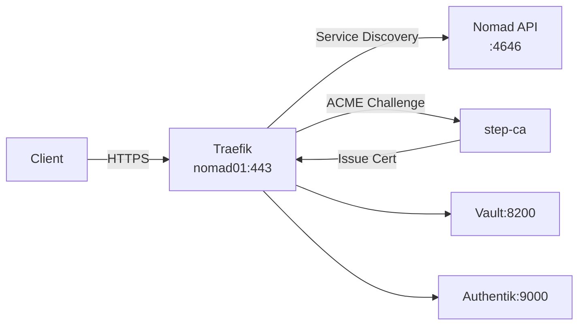

# Traefik Load Balancer

Traefik is deployed as a Nomad job to provide reverse proxy, load balancing, and automatic TLS certificate management via step-ca ACME.

## Overview

| Property | Value |
|----------|-------|
| **Deployment Type** | Nomad Job |
| **Job File** | `nomad/jobs/traefik.nomad.hcl` |
| **Constraint** | Pinned to nomad01 |
| **Ports** | 80 (HTTP), 443 (HTTPS), 8081 (API/Dashboard) |
| **Storage** | GlusterFS for certificates |
| **Access** | http://nomad01.mylab.lan or https://<service>.mylab.lan |

## Architecture

Traefik automatically discovers services from Nomad and routes traffic based on tags:



## Features

- **Nomad Provider**: Automatic service discovery via Nomad API
- **ACME Integration**: Automatic TLS via step-ca
- **Dual Routing**: Accepts both FQDN and short names
- **HTTP to HTTPS**: Automatic redirect
- **Dashboard**: Web UI at port 8081

## Deployment

### Prerequisites

- Nomad cluster running
- step-ca deployed and accessible
- DNS records configured

### Deploy via setup.sh

```bash
./setup.sh
# Select option 7: Deploy Traefik load balancer (on Nomad)
```

What happens:
1. Creates storage directory for Traefik
2. Fetches CA certificate from step-ca
3. Copies CA cert to GlusterFS for trust
4. Deploys Traefik job to Nomad
5. Updates DNS records

### Manual Deployment

```bash
# Ensure storage exists
ssh ubuntu@nomad01
sudo mkdir -p /srv/gluster/nomad-data/traefik /srv/gluster/nomad-data/certs

# Deploy
nomad job run nomad/jobs/traefik.nomad.hcl
```

## Configuration

### Nomad Provider

Traefik queries Nomad API for services:

```hcl
providers.nomad.address = "http://127.0.0.1:4646"
providers.nomad.refreshInterval = "15s"
```

Services register via tags in job specs:

```hcl
service {
  name = "vault"
  tags = [
    "traefik.enable=true",
    "traefik.http.routers.vault.rule=Host(`vault.mylab.lan`) || Host(`vault`)",
    "traefik.http.routers.vault.tls=true",
    "traefik.http.routers.vault.tls.certresolver=step-ca",
  ]
}
```

### ACME Configuration

```hcl
certificatesResolvers.step-ca.acme.httpChallenge = true
certificatesResolvers.step-ca.acme.httpChallenge.entryPoint = "web"
certificatesResolvers.step-ca.acme.caServer = "https://ca.mylab.lan/acme/acme/directory"
certificatesResolvers.step-ca.acme.storage = "/data/traefik/acme.json"
```

Traefik automatically:
1. Detects new service with TLS requirement
2. Requests certificate from step-ca via ACME
3. Validates ownership via HTTP challenge
4. Stores certificate in `acme.json`
5. Renews before expiration

### CA Trust

Root CA certificate is mounted for trust:

```hcl
env {
  SSL_CERT_FILE       = "/data/certs/root_ca.crt"
  LEGO_CA_CERTIFICATES = "/data/certs/root_ca.crt"
}

volumes = [
  "/srv/gluster/nomad-data/certs:/data/certs:ro"
]
```

### Entrypoints

```hcl
entryPoints.web.address = ":80"
entryPoints.web.http.redirections.entryPoint.to = "websecure"
entryPoints.web.http.redirections.entryPoint.scheme = "https"

entryPoints.websecure.address = ":443"
entryPoints.traefik.address = ":8081"  # Dashboard/API
```

## Operations

### Accessing Dashboard

URL: `http://nomad01:8081`

Shows:
- HTTP routers and their rules
- Services and backends
- Middleware configuration
- TLS certificates

### Viewing Routes

```bash
# List all HTTP routers
curl http://nomad01:8081/api/http/routers | jq .

# List services
curl http://nomad01:8081/api/http/services | jq .
```

### Checking Logs

```bash
nomad alloc logs -f -job traefik
```

### Restarting Service

```bash
nomad job stop -purge traefik
nomad job run nomad/jobs/traefik.nomad.hcl
```

## Service Registration

To add a new service to Traefik, add tags to its Nomad service block:

```hcl
service {
  name     = "myapp"
  port     = "http"
  provider = "nomad"

  tags = [
    "traefik.enable=true",
    # HTTP router (for ACME challenges and redirects)
    "traefik.http.routers.myapp-http.rule=Host(`myapp.mylab.lan`) || Host(`myapp`)",
    "traefik.http.routers.myapp-http.entrypoints=web",
    # HTTPS router
    "traefik.http.routers.myapp.rule=Host(`myapp.mylab.lan`) || Host(`myapp`)",
    "traefik.http.routers.myapp.entrypoints=websecure",
    "traefik.http.routers.myapp.tls=true",
    "traefik.http.routers.myapp.tls.certresolver=step-ca",
    # LoadBalancer
    "traefik.http.services.myapp.loadbalancer.server.port=8080",
  ]
}
```

Traefik will automatically:
1. Detect the new service
2. Create routes
3. Request TLS certificate
4. Start routing traffic

## Troubleshooting

### 404 Errors

```bash
# Check if route exists
curl http://nomad01:8081/api/http/routers | jq '.[] | select(.name | contains("vault"))'

# Verify service is registered
nomad service list

# Check Traefik logs
nomad alloc logs -job traefik | grep -i vault
```

### ACME Challenges Failing

```bash
# Check step-ca is accessible
curl -k https://ca.mylab.lan/health

# Verify DNS resolves to correct IP
nslookup vault.mylab.lan

# Clear stale ACME data
ssh ubuntu@nomad01
sudo rm -f /srv/gluster/nomad-data/traefik/acme.json
nomad job stop -purge traefik
nomad job run nomad/jobs/traefik.nomad.hcl
```

### Service Not Discovered

```bash
# Verify Nomad API is accessible
curl http://127.0.0.1:4646/v1/services

# Check service registration
nomad job status vault

# Ensure 'provider = "nomad"' is set in service block
```

### Certificate Errors

```bash
# Check CA certificate exists
ssh ubuntu@nomad01
ls -la /srv/gluster/nomad-data/certs/root_ca.crt

# Re-fetch CA cert
curl -k https://ca.mylab.lan/roots.pem -o /tmp/root_ca.crt
sudo cp /tmp/root_ca.crt /srv/gluster/nomad-data/certs/root_ca.crt
```

## Security

### Dashboard Access

Dashboard runs on port 8081 without authentication. Restrict access:

- Only bind to localhost (done via `traefik` entrypoint)
- Use SSH tunnel: `ssh -L 8081:localhost:8081 ubuntu@nomad01`
- Add middleware for basic auth (optional)

### TLS Configuration

- TLS 1.2+ only
- Strong cipher suites
- HSTS enabled (optional)

## Performance

### Resource Usage

```hcl
resources {
  cpu    = 200   # MHz
  memory = 256   # MB
}
```

Typical usage: ~100 MHz CPU, ~150 MB RAM

### Connection Limits

Default limits sufficient for home lab:
- Max idle connections: 100
- Max connections per host: 10

## Next Steps

- [Traefik Documentation](https://doc.traefik.io/traefik/)
- [:octicons-arrow-right-24: Vault Module](vault.md)
- [:octicons-arrow-right-24: Authentik Module](authentik.md)
- [:octicons-arrow-right-24: step-ca Module](step-ca.md)
