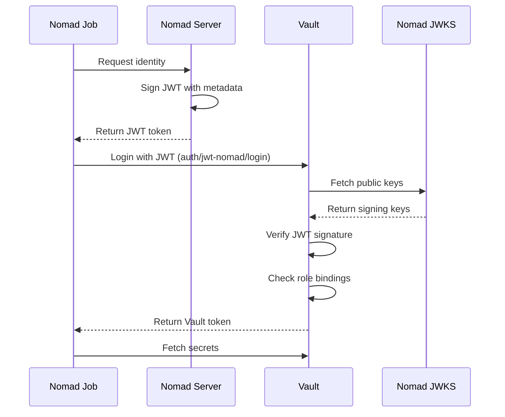

# Vault Secrets Manager

HashiCorp Vault is deployed as a Nomad job to provide centralized secrets management. It uses Workload Identity Federation (WIF) for token-less authentication with Nomad jobs.

## Overview

| Property | Value |
|----------|-------|
| **Deployment Type** | Nomad Job |
| **Job File** | `nomad/jobs/vault.nomad.hcl` |
| **Constraint** | Pinned to nomad01 |
| **Ports** | 8200 (HTTP API), 8201 (cluster) |
| **Storage** | File backend on GlusterFS |
| **Access** | http://nomad01:8200 or https://vault.mylab.lan |

## Architecture

```mermaid
graph TB
    subgraph nomad["nomad01"]
        VAULT[Vault Container<br/>hashicorp/vault:1.15]
    end

    subgraph storage["GlusterFS"]
        VAULT_DATA[/srv/gluster/nomad-data/vault]
    end

    subgraph ingress["Ingress"]
        TRAEFIK[Traefik<br/>HTTPS:443]
    end

    subgraph consumers["Secret Consumers"]
        AUTHENTIK[Authentik<br/>via WIF]
        FUTURE[Future Services]
    end

    VAULT --> VAULT_DATA
    TRAEFIK --> VAULT
    AUTHENTIK -->|JWT Auth| VAULT
    FUTURE -->|JWT Auth| VAULT
```

## Deployment

### Prerequisites

- Nomad cluster deployed and healthy
- Traefik deployed (recommended for ingress)
- GlusterFS volume mounted at `/srv/gluster/nomad-data`

### Deploy via setup.sh

```bash
./setup.sh
# Select option 8: Deploy Vault secrets manager (on Nomad)
```

What happens:
1. Creates storage directory: `/srv/gluster/nomad-data/vault`
2. Deploys Vault job to Nomad
3. Waits for Vault to start
4. Initializes Vault with 1 key share (home lab simplicity)
5. Unseals Vault
6. Enables KV v2 secrets engine at `secret/`
7. Configures JWT auth for Nomad WIF
8. Creates Vault policies and roles
9. Saves credentials to `crypto/vault-credentials.json`

### Manual Deployment

```bash
# From nomad01
nomad job run /path/to/vault.nomad.hcl

# Check status
nomad job status vault

# View logs
nomad alloc logs -job vault
```

## Initialization

Vault is automatically initialized during first deployment:

- **Key Shares**: 1 (simplified for home lab)
- **Key Threshold**: 1
- **Root Token**: Auto-generated
- **Unseal Key**: Auto-generated

Credentials are saved to:

```json
{
  "unseal_key": "base64-encoded-key",
  "root_token": "hvs.xxxxxxxxxxxx",
  "vault_address": "http://nomad01:8200",
  "initialized_at": "2026-02-25T12:00:00Z"
}
```

!!! warning "Security Note"
    In production, use 5 key shares with 3-threshold and store keys separately. For a home lab, 1 key is acceptable.

## Configuration

### Job Configuration

```hcl
job "vault" {
  datacenters = ["dc1"]
  type        = "service"

  constraint {
    attribute = "${attr.unique.hostname}"
    value     = "nomad01"
  }

  group "vault" {
    network {
      mode = "host"
      port "api"     { static = 8200 }
      port "cluster" { static = 8201 }
    }

    task "vault" {
      driver = "docker"

      config {
        image        = "hashicorp/vault:1.15"
        privileged   = true
        volumes = [
          "/srv/gluster/nomad-data/vault:/data/vault"
        ]
      }

      env {
        SKIP_CHOWN = "true"
        VAULT_ADDR = "http://127.0.0.1:8200"
      }
    }
  }
}
```

### Vault Server Config

```hcl
# Generated via template stanza
ui = true
disable_mlock = true

storage "file" {
  path = "/data/vault"
}

listener "tcp" {
  address     = "0.0.0.0:8200"
  tls_disable = true
}
```

### Traefik Integration

Vault is accessible via Traefik with automatic TLS:

```hcl
tags = [
  "traefik.enable=true",
  "traefik.http.routers.vault.rule=Host(`vault.mylab.lan`) || Host(`vault`)",
  "traefik.http.routers.vault.tls=true",
  "traefik.http.routers.vault.tls.certresolver=step-ca",
]
```

Access URLs:
- Direct: `http://nomad01:8200`
- Via Traefik (HTTP): `http://vault.mylab.lan`
- Via Traefik (HTTPS): `https://vault.mylab.lan`

## Workload Identity Federation (WIF)

Vault uses JWT-based authentication to trust Nomad workloads without storing long-lived tokens.

### How It Works



### JWT Auth Configuration

Configured automatically during deployment:

```bash
# Enable JWT auth at path 'jwt-nomad'
vault auth enable -path=jwt-nomad jwt

# Configure to trust Nomad's JWKS
vault write auth/jwt-nomad/config \
  jwks_url="http://nomad01:4646/.well-known/jwks.json" \
  default_role="nomad-workloads"
```

### Nomad Server Configuration

```hcl
# In Nomad server config
vault {
  enabled = true
  address = "http://127.0.0.1:8200"

  default_identity {
    aud  = ["vault.io"]
    ttl  = "1h"
  }
}
```

## Policies and Roles

### Authentik Policy

File: `nomad/vault-policies/authentik.hcl`

```hcl
# Allow reading Authentik secrets
path "secret/data/authentik" {
  capabilities = ["read"]
}

path "secret/metadata/authentik" {
  capabilities = ["read", "list"]
}
```

### Authentik Role

```json
{
  "role_type": "jwt",
  "bound_audiences": ["vault.io"],
  "user_claim": "/nomad_job_id",
  "bound_claims": {
    "nomad_job_id": "authentik"
  },
  "token_policies": ["authentik"],
  "token_ttl": "1h"
}
```

This role:
- Accepts JWTs with audience `vault.io`
- Binds to job ID `authentik`
- Grants `authentik` policy permissions
- Tokens expire after 1 hour

### Creating New Policies

```bash
# Write policy file
vault policy write my-service - <<EOF
path "secret/data/my-service/*" {
  capabilities = ["read"]
}
EOF

# Create role
vault write auth/jwt-nomad/role/my-service \
  role_type="jwt" \
  bound_audiences="vault.io" \
  user_claim="/nomad_job_id" \
  bound_claims='{"nomad_job_id":"my-service"}' \
  token_policies="my-service" \
  token_ttl="1h"
```

## Secrets Management

### Storing Secrets

```bash
# Using Vault CLI
vault kv put secret/my-service \
  username="admin" \
  password="secret123"

# Using curl
curl -X POST http://nomad01:8200/v1/secret/data/my-service \
  -H "X-Vault-Token: $ROOT_TOKEN" \
  -d '{"data": {"username": "admin", "password": "secret123"}}'
```

### Reading Secrets (as Admin)

```bash
# Using Vault CLI
vault kv get secret/authentik

# Using curl
curl -H "X-Vault-Token: $ROOT_TOKEN" \
  http://nomad01:8200/v1/secret/data/authentik | jq .
```

### Using Secrets in Jobs

```hcl
job "my-service" {
  vault {
    role = "my-service"
  }

  task "app" {
    template {
      data = <<EOH
{{ with secret "secret/data/my-service" }}
USERNAME={{ .Data.data.username }}
PASSWORD={{ .Data.data.password }}
{{ end }}
EOH
      destination = "secrets/app.env"
      env         = true
    }
  }
}
```

## Unsealing Vault

Vault automatically seals itself on restart for security.

### Check Seal Status

```bash
# Using curl
curl http://nomad01:8200/v1/sys/health | jq .

# Response when sealed:
{
  "initialized": true,
  "sealed": true,
  "standby": false
}
```

### Unseal via setup.sh

```bash
./setup.sh
# Select option 10: Unseal Vault
```

### Manual Unseal

```bash
# Get unseal key from credentials file
UNSEAL_KEY=$(jq -r .unseal_key crypto/vault-credentials.json)

# Unseal Vault
curl -X PUT http://nomad01:8200/v1/sys/unseal \
  -H "Content-Type: application/json" \
  -d "{\"key\": \"$UNSEAL_KEY\"}"
```

## Operations

### Accessing Vault

Web UI: `https://vault.mylab.lan`

Login with root token from `crypto/vault-credentials.json`.

### Health Check

```bash
# Check health (accepts sealed state as healthy)
curl http://nomad01:8200/v1/sys/health?sealedcode=200

# Expected response:
{
  "initialized": true,
  "sealed": false,
  "standby": false,
  "performance_standby": false,
  "replication_performance_mode": "disabled",
  "replication_dr_mode": "disabled",
  "server_time_utc": 1708876800,
  "version": "1.15.0",
  "cluster_name": "vault-cluster-nomad",
  "cluster_id": "..."
}
```

### Listing Secrets

```bash
# List all secret paths
vault kv list secret/

# Output:
Keys
----
authentik
```

### Managing Policies

```bash
# List policies
vault policy list

# Read policy
vault policy read authentik

# Delete policy
vault policy delete my-service
```

### Managing Roles

```bash
# List roles
vault list auth/jwt-nomad/role

# Read role
vault read auth/jwt-nomad/role/authentik

# Delete role
vault delete auth/jwt-nomad/role/my-service
```

## Backup and Recovery

### Backup Data

```bash
# Backup Vault storage
sudo tar -czf vault-backup-$(date +%Y%m%d).tar.gz \
  -C /srv/gluster/nomad-data vault/

# Backup credentials
cp crypto/vault-credentials.json vault-credentials-backup.json
```

### Backup Policies

```bash
# Export all policies
for policy in $(vault policy list); do
  vault policy read "$policy" > "vault-policy-${policy}.hcl"
done
```

### Recovery

```bash
# Restore storage
sudo tar -xzf vault-backup.tar.gz -C /srv/gluster/nomad-data/

# Restart Vault job
nomad job stop -purge vault
nomad job run nomad/jobs/vault.nomad.hcl

# Unseal with saved key
./setup.sh  # option 10
```

## Troubleshooting

### Vault Won't Start

```bash
# Check Nomad allocation
nomad alloc status $(nomad job status -short vault | grep running | awk '{print $1}')

# View logs
nomad alloc logs -job vault

# Common issues:
# - Permission denied on /data/vault: Check GlusterFS mount
# - Port already in use: Stop old allocations with `nomad job stop -purge vault`
```

### Vault is Sealed

This is normal after restart. Simply unseal it:

```bash
./setup.sh  # option 10
```

### Cannot Authenticate

```bash
# Verify JWT auth is enabled
vault auth list

# Check role exists
vault read auth/jwt-nomad/role/authentik

# Verify Nomad JWKS is accessible
curl http://nomad01:4646/.well-known/jwks.json
```

### Secrets Not Accessible

```bash
# Check policy
vault policy read authentik

# Check role bindings
vault read auth/jwt-nomad/role/authentik

# Verify secret exists
vault kv get secret/authentik
```

## Security Considerations

### Home Lab vs. Production

| Feature | Home Lab | Production |
|---------|----------|------------|
| Key Shares | 1 | 5+ |
| Key Threshold | 1 | 3+ |
| TLS | Disabled (internal) | Required |
| Auto-unseal | Manual | Cloud KMS |
| Token TTL | 1 hour | 15 minutes |
| Audit Logging | Disabled | Required |

### Network Security

- Vault runs on internal network only
- No public internet access
- Traefik provides TLS termination
- Root token access via trusted workstation only

### Credentials Storage

- Unseal key: `crypto/vault-credentials.json` (gitignored)
- Root token: Same file
- No tokens stored on Nomad nodes (WIF instead)

## Next Steps

- [:octicons-arrow-right-24: Deploy Authentik](authentik.md) - SSO using Vault secrets
- [:octicons-arrow-right-24: Vault Operations](../operations/vault-operations.md) - Daily operations
- [:octicons-arrow-right-24: Nomad Operations](../operations/nomad-operations.md) - Managing jobs
