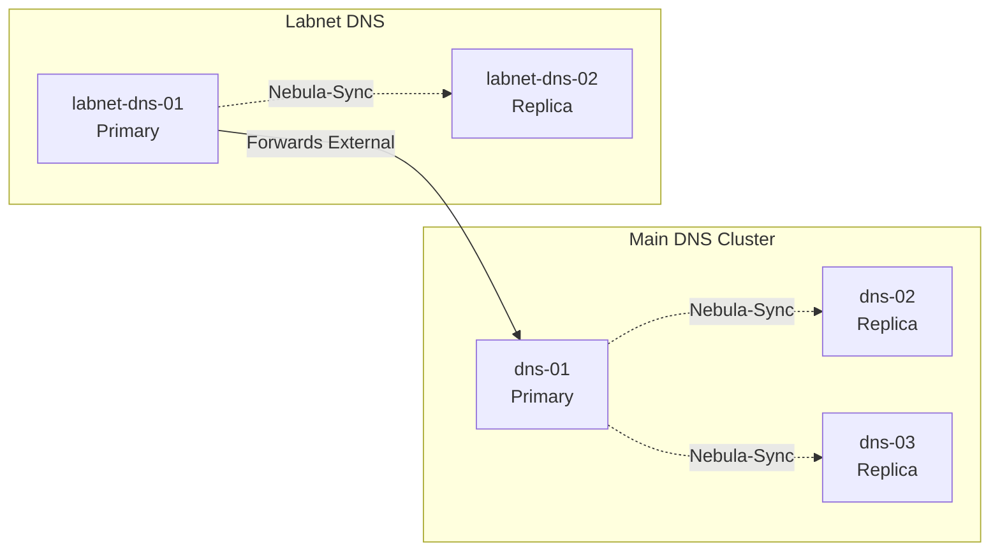
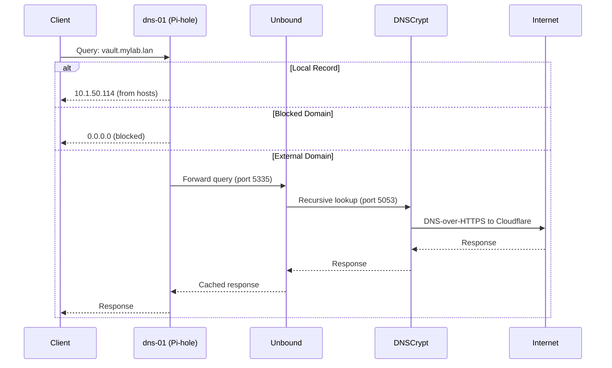

# DNS Management

This guide covers managing DNS records in Proxmox Lab, including Pi-hole configuration, DNS updates, and Tailscale integration.

## Overview

Proxmox Lab uses a multi-tier DNS architecture:

- **Main DNS cluster**: Pi-hole instances on external network (dns-01, dns-02, dns-03)
- **Labnet DNS cluster**: Pi-hole instances on SDN network (labnet-dns-01, labnet-dns-02)
- **Nebula-Sync**: Synchronizes DNS records between primary and replica Pi-hole instances



## Updating DNS Records

### Automatic Updates via Setup Script

The easiest way to update DNS records is through the setup menu:

```bash
./setup.sh
# Select option 10: Build DNS records
```

This automatically:

1. Reads deployed hosts from `hosts.json` and cluster info from `cluster-info.json`
2. Generates DNS records for all Proxmox nodes and services
3. Updates the primary DNS server (dns-01)
4. Triggers Nebula-Sync to propagate changes to replicas
5. Optionally updates Proxmox nodes to use the DNS server
6. Disables Tailscale DNS management if Tailscale is detected (see [Tailscale Integration](#tailscale-integration))

### What Gets Added

The update process adds these DNS records:

#### Proxmox Nodes
```
10.1.50.2  pve01  pve01.mylab.lan
10.1.50.10 pve02  pve02.mylab.lan
```

#### Proxmox Alias (Round-Robin)
```
10.1.50.2  proxmox  proxmox.mylab.lan
10.1.50.10 proxmox  proxmox.mylab.lan
```

#### Infrastructure Services
```
10.1.50.3  dns-01   dns-01.mylab.lan
10.1.50.3  dns      dns.mylab.lan        # Alias to dns-01
10.1.50.4  step-ca  step-ca.mylab.lan
```

#### Nomad Services
All services are pinned to nomad01 and fronted by Traefik:
```
10.1.50.114  vault    vault.mylab.lan
10.1.50.114  auth     auth.mylab.lan
10.1.50.114  traefik  traefik.mylab.lan
```

#### Samba AD Domain Controllers
If Active Directory is configured:
```
10.1.50.114  samba-dc01  samba-dc01.ad.mylab.lan
10.1.50.115  samba-dc02  samba-dc02.ad.mylab.lan
```

#### CNAME Records
```
ca.mylab.lan -> step-ca.mylab.lan
```

## Manual DNS Management

### Viewing Current Records

SSH to the primary DNS server:

```bash
ssh root@<dns-01-ip>

# View all local DNS records
pihole-FTL --config dns.hosts get
```

### Adding Records Manually

```bash
# Single A record
pihole-FTL --config dns.hosts '["10.1.50.50 myhost myhost.mylab.lan"]'

# Multiple records
pihole-FTL --config dns.hosts '[
  "10.1.50.50 host1 host1.mylab.lan",
  "10.1.50.51 host2 host2.mylab.lan"
]'
```

!!! note "Pi-hole v6 Configuration"
    Pi-hole v6 uses a TOML configuration file at `/etc/pihole/pihole.toml`. The `pihole-FTL --config` command updates this file and automatically reloads the configuration.

### Adding CNAME Records

```bash
# Add CNAME pointing to another hostname
pihole-FTL --config dns.cnameRecords '["alias.mylab.lan,target.mylab.lan"]'
```

### Triggering Sync to Replicas

After manual changes, sync to replica servers:

```bash
# On dns-01
systemctl start nebula-sync.service
systemctl status nebula-sync.service
```

## Nebula-Sync Configuration

Nebula-Sync handles synchronization between the primary DNS and replicas.

### Checking Sync Status

```bash
# On dns-01 (primary)
systemctl status nebula-sync.service

# View sync logs
journalctl -u nebula-sync.service -f
```

### Manual Sync Trigger

```bash
# On dns-01
systemctl start nebula-sync.service
```

### Verifying Replica Records

After sync, verify records reached replicas:

```bash
# Query replica DNS
dig @<dns-02-ip> myhost.mylab.lan

# Or SSH to replica
ssh root@<dns-02-ip>
pihole-FTL --config dns.hosts get | grep myhost
```

## Tailscale Integration

### Automatic Configuration

When Tailscale is installed on Proxmox cluster nodes, Proxmox Lab automatically configures DNS coexistence during DNS updates.

The `disableTailscaleDNS()` function:

1. Detects Tailscale on each cluster node
2. Runs `tailscale set --accept-dns=false`
3. Prevents Tailscale from managing `/etc/resolv.conf`
4. Allows Pi-hole to be the primary DNS resolver

### Why This Matters

**Without this configuration:**
- Tailscale MagicDNS would overwrite `/etc/resolv.conf` with `100.100.100.100`
- Proxmox nodes wouldn't resolve local `.mylab.lan` domains
- Services wouldn't be able to discover each other properly

**With this configuration:**
- Pi-hole remains the primary DNS server
- Local services resolve correctly
- Tailscale networking still works for remote access
- Only MagicDNS name resolution is disabled on Proxmox nodes

### When It Runs

The Tailscale DNS configuration runs automatically when you:

- Update DNS records via setup.sh (option 10)
- Choose to update Proxmox node DNS settings
- The script prompts: "Update Proxmox nodes to use this DNS server? [Y/n]"

### Manual Tailscale DNS Configuration

If needed, you can manually disable Tailscale DNS on a node:

```bash
# SSH to the Proxmox node
ssh root@proxmox-node

# Check Tailscale status
tailscale status

# Disable DNS management
tailscale set --accept-dns=false

# Verify resolv.conf uses your DNS
cat /etc/resolv.conf
# Should show your dns-01 IP, not 100.100.100.100
```

### Re-enabling Tailscale DNS

If you want to revert and use Tailscale's MagicDNS:

```bash
tailscale set --accept-dns=true
```

!!! warning "Impact of Re-enabling"
    Re-enabling Tailscale DNS will break resolution of local `.mylab.lan` domains on that node. Only do this if you understand the implications.

### Resolving Tailscale Hosts

After disabling Tailscale DNS management, MagicDNS names like `node.tailnet.ts.net` won't resolve on Proxmox nodes. Use these alternatives:

#### Option 1: Use Tailscale IPs

```bash
# Instead of: ssh node.tailnet.ts.net
ssh 100.x.x.x
```

#### Option 2: Add Pi-hole DNS Records

Add your Tailscale hosts to Pi-hole:

```bash
# On dns-01
pihole-FTL --config dns.hosts '[
  "100.64.1.10 myhost myhost.tailnet.ts.net"
]'

# Sync to replicas
systemctl start nebula-sync.service
```

#### Option 3: Use /etc/hosts

For individual nodes needing specific Tailscale hosts:

```bash
# On the Proxmox node
echo "100.64.1.10 myhost.tailnet.ts.net" >> /etc/hosts
```

## Pi-hole Web Interface

### Accessing the Interface

```bash
# Open in browser (replace with your dns-01 IP)
http://10.1.50.3/admin
```

Login with the password you configured during setup (`pihole_root_password` in terraform.tfvars).

### Managing via Web UI

The Pi-hole web interface allows you to:

- View DNS query logs
- Add/remove blocklists
- Configure DHCP settings (for labnet DNS)
- View statistics and graphs
- Whitelist/blacklist domains
- Manage local DNS records (via "Local DNS" menu)

!!! note "Web UI Limitations"
    For programmatic DNS updates, use the `pihole-FTL` CLI commands rather than the web interface. The CLI is used by automation scripts and supports bulk operations.

## Proxmox Node DNS Configuration

### Updating Proxmox to Use Lab DNS

During DNS record updates, you're prompted to update Proxmox node DNS:

```
Update Proxmox nodes to use this DNS server? [Y/n]
```

This updates `/etc/resolv.conf` on each node:

```
nameserver 10.1.50.3    # dns-01 (primary)
nameserver 1.1.1.1       # Cloudflare (fallback)
```

### Manual Node DNS Update

To manually update a Proxmox node:

```bash
# SSH to the node
ssh root@proxmox-node

# Backup current config
cp /etc/resolv.conf /etc/resolv.conf.bak

# Update DNS servers
cat > /etc/resolv.conf << EOF
nameserver 10.1.50.3
nameserver 1.1.1.1
EOF

# Test resolution
dig step-ca.mylab.lan
```

### Using Multiple DNS Servers

For redundancy, configure multiple DNS servers:

```bash
cat > /etc/resolv.conf << EOF
nameserver 10.1.50.3    # dns-01
nameserver 10.1.50.4    # dns-02 (if available)
nameserver 1.1.1.1       # Cloudflare fallback
EOF
```

## DNS for Virtual Machines

### Cloud-Init DNS Configuration

VMs deployed via Terraform automatically receive DNS configuration through cloud-init:

```hcl
# In cloud-init template
nameserver=${var.dns_server}
```

This is set to the primary DNS server (dns-01) during deployment.

### Verifying VM DNS

After VM deployment:

```bash
# SSH to the VM
ssh ubuntu@vm-hostname

# Check DNS configuration
cat /etc/resolv.conf

# Test DNS resolution
dig vault.mylab.lan
nslookup step-ca.mylab.lan
```

## DNS Resolution Chain

Understanding the full DNS resolution path:



### DNS Stack Components

Each DNS server runs:

| Component | Port | Purpose |
|-----------|------|---------|
| Pi-hole FTL | 53 | DNS server + ad blocking |
| Unbound | 5335 | Recursive DNS resolver |
| dnscrypt-proxy | 5053 | DNS-over-HTTPS encryption |

## Troubleshooting

### DNS Not Resolving

**Check DNS server is running:**
```bash
# For LXC containers
pct status 910  # dns-01

# SSH and check service
ssh root@dns-01
systemctl status pihole-FTL
```

**Test DNS directly:**
```bash
# From your workstation
nslookup vault.mylab.lan <dns-01-ip>
dig @<dns-01-ip> step-ca.mylab.lan
```

**Check DNS records:**
```bash
# On dns-01
pihole-FTL --config dns.hosts get | grep vault
```

### Records Not Syncing to Replicas

**Check Nebula-Sync status:**
```bash
# On dns-01
systemctl status nebula-sync.service
journalctl -u nebula-sync.service -n 50
```

**Manually trigger sync:**
```bash
systemctl start nebula-sync.service
```

**Verify connectivity to replicas:**
```bash
# From dns-01
ping <dns-02-ip>
ssh root@<dns-02-ip> 'systemctl status pihole-FTL'
```

### Tailscale Overwriting DNS

**Symptoms:**
- `/etc/resolv.conf` shows `nameserver 100.100.100.100`
- Local domains don't resolve on Proxmox nodes
- Resets after reboot

**Solution:**
```bash
# Run DNS update to disable Tailscale DNS management
./setup.sh
# Select option 10: Build DNS records
# Answer Y when prompted to update Proxmox DNS

# Or manually on each node:
ssh root@proxmox-node
tailscale set --accept-dns=false
```

**Verify fix:**
```bash
cat /etc/resolv.conf
# Should show your dns-01 IP, not 100.100.100.100

tailscale status
# Should show: Accept DNS: false
```

### Nomad Services Not Resolving

**Check service DNS points to nomad01:**
```bash
dig vault.mylab.lan
# Should return nomad01's IP
```

**Verify Traefik is running:**
```bash
docker compose run --rm nomad job status traefik
curl http://nomad01:8081/api/http/routers
```

**Re-add service DNS records:**
```bash
./setup.sh
# Option 10: Build DNS records
```

### Labnet DNS Issues

**For labnet (SDN) DNS, access via pct exec:**
```bash
# Can't SSH directly to labnet DNS from external network
# Use pct exec instead
pct exec 920 -- pihole-FTL --config dns.hosts get
```

**Check DNS forwarding to external:**
```bash
# On labnet-dns-01
pct exec 920 -- dig @127.0.0.1 google.com
```

## Best Practices

1. **Always use the setup script** for DNS updates - it handles all edge cases
2. **Test DNS resolution** after changes using `dig` or `nslookup`
3. **Monitor Nebula-Sync** to ensure replicas stay in sync
4. **Keep dns-01 as source of truth** - make changes there first
5. **Document custom records** that aren't managed by automation
6. **Use CNAME records** for service aliases rather than multiple A records
7. **Set up secondary DNS** on clients for redundancy
8. **Disable Tailscale DNS** on Proxmox nodes to prevent conflicts

## Related Documentation

- [Network Topology](../architecture/network-topology.md) - Network design and DNS architecture
- [Tailscale Integration](../architecture/network-topology.md#tailscale-integration) - Detailed Tailscale coexistence information
- [Accessing Services](accessing-services.md) - How to access deployed services
- [Common Issues](../troubleshooting/common-issues.md) - Troubleshooting DNS problems
