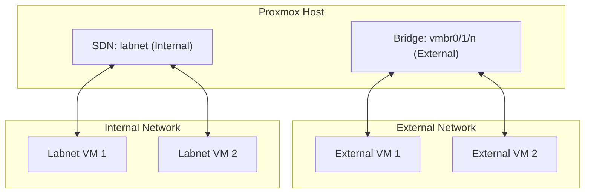

# Pre-Installation

## Proxmox Setup

Prior to running this project, it is recommended that all storage and network configurations have been completed. Internet access must also be configured prior to installation. Make sure that you note the following items

- Target **Storage device** (e.g. local, local-lvm, zfs-store) to store templates, containers, and virtual machines
- Target **Network bridge** device (e.g. vmbr0, vmbr1) for all Internet communications

## External Network Configuration

Note the `IPv4 network` your target network bridge uses. This includes:

- IP address of Proxmox network bridge
- Subnet mask in CIDR notaion (e.g. /24)
- Gateway address

This will be required for setting up services like DNS and the certificate authority.

## Internal Network Configuration - Labnet

This project will setup a `Software Defined Network (SDN)` for internal use. It's purpose is to segment all lab traffic into an internal network. A Pihole instance (pihole-internal) will host DNS and DHCP services for this network. The network information is as follows

|            |               |
| ---------- | ------------- |
| Network    | 172.16.0.0/24 |
| Gateway    | 172.16.0.1    |
| Pihole DNS | 172.16.0.3    |

## Pihole DNS External

`Pihole` is a DNS service that also provides ad-blocking and filtering services. Along with this service, the recursive DNS service `Unbound`, and DNS over HTTP service `dnscrypt-proxy` has been installed.

`Pihole-external` is a DNS service for your external (not labnet) network. During installation, your Proxmox system will be reconfigured to use this DNS service. This is required for negotiating certificates from the internal certificate authority. You can also use configure your external network hosts to use this DNS server instead of your ISP provided one.

> This service can be accessed via its web portal using the IP address and password configured during this installation.

## Pihole DNS Internal

`Pihole-internal` is a DNS service for the labnet network. This service also provides DHCP services for hosts that are connected to labnet. To access this service, you must have a virtual machine on the labnet. Connect to this system and with a web browser, connect to https://172.16.0.3/admin.

## Certificate Authority - Step-CA

Certificate authorities are required for creating TLS certificates for secured communication. These are used by web servers and applications to facilitate an encrypted communication channel between the client and the server.

`Step-CA` is a service that creates the certificate authority, including the root and intermediate certificates. This service also facilitates the ability to fulfill certificate requests and revocations via the ACME protocol.

For this project, Step-CA is configured to run on the external network.
