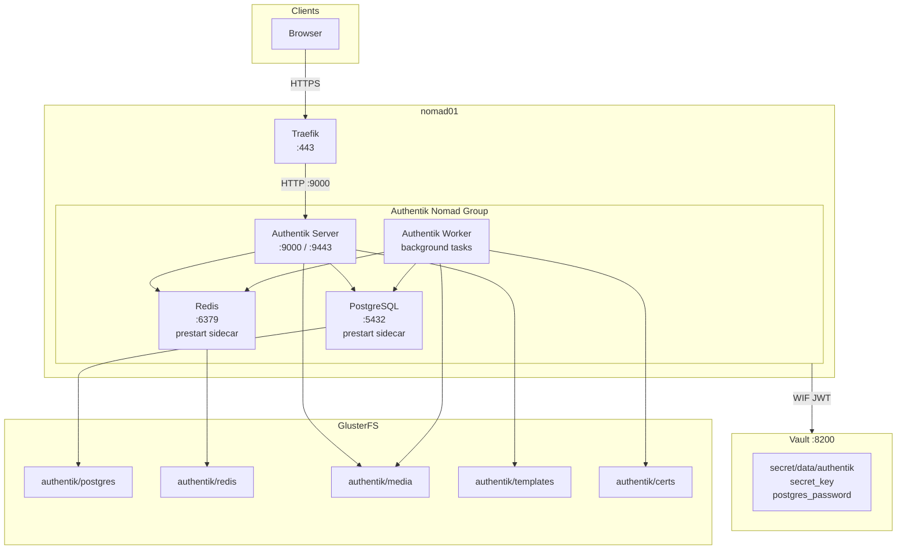
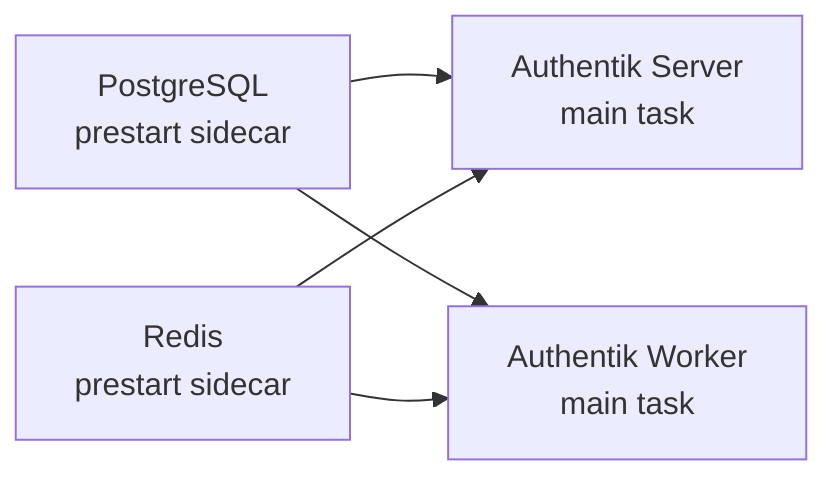

# Authentik

Authentik is a self-hosted identity provider that provides single sign-on (SSO) for lab services. It supports OAuth2, OpenID Connect (OIDC), SAML, and LDAP protocols. Authentik runs as a multi-task Nomad job with PostgreSQL, Redis, and two Authentik processes (server and worker), all pinned to nomad01.

## Overview

| Property | Value |
|----------|-------|
| **Nomad Job** | `authentik` |
| **Type** | `service` (count 1) |
| **Node** | Pinned to `nomad01` |
| **Vault Role** | `authentik` (WIF, restart on secret change) |
| **Ports** | 9000 (HTTP), 9443 (HTTPS), 5432 (PostgreSQL), 6379 (Redis) |
| **Network Mode** | Host |
| **Storage** | Docker bind mounts on GlusterFS |
| **Menu Option** | 9 (Deploy Authentik) |

### Task Resource Allocation

| Task | Image | CPU | Memory |
|------|-------|-----|--------|
| PostgreSQL | `postgres:16-alpine` | 200 MHz | 512 MB |
| Redis | `redis:7-alpine` | 100 MHz | 128 MB |
| Server | `ghcr.io/goauthentik/server:2025.12` | 500 MHz | 1024 MB |
| Worker | `ghcr.io/goauthentik/server:2025.12` | 300 MHz | 512 MB |

## Deployment

Deploy Authentik using the setup menu:

```bash
./setup.sh
# Select option 9: Deploy Authentik
```

Or deploy directly with the Nomad CLI:

```bash
docker compose run --rm nomad job run /nomad/jobs/authentik.nomad.hcl
```

### Prerequisites

Before deploying Authentik, all of the following must be in place:

1. **Nomad cluster** -- All three Nomad nodes operational
2. **Traefik** -- Reverse proxy running (menu option 7)
3. **Vault** -- Secrets manager running and initialized (menu option 8)
4. **Vault secrets** -- Authentik secrets stored at `secret/data/authentik`:
    - `secret_key` -- Authentik's internal signing key
    - `postgres_password` -- PostgreSQL database password
5. **Pi-hole DNS** -- `auth.<dns_postfix>` resolving to nomad01
6. **GlusterFS** -- Shared volume mounted at `/srv/gluster/nomad-data`

## Architecture



## Multi-Task Architecture

Authentik runs as four tasks within a single Nomad group. This ensures all components are co-located on the same node and share the same network namespace.

### Task Lifecycle



PostgreSQL and Redis are configured as **prestart sidecars** (`lifecycle { hook = "prestart"; sidecar = true }`). This means:

- They start before the main tasks (Server and Worker)
- They continue running for the lifetime of the group
- If they fail, the entire group is restarted

### PostgreSQL

PostgreSQL provides the primary data store for Authentik.

| Property | Value |
|----------|-------|
| Image | `postgres:16-alpine` |
| Port | 5432 |
| User | `root` (container user) |
| Database | `authentik` |
| DB User | `authentik` |
| Storage | `/srv/gluster/nomad-data/authentik/postgres` |

The database password is injected from Vault via a template:

```hcl
template {
  data = <<EOH
POSTGRES_USER=authentik
POSTGRES_DB=authentik
{{ with secret "secret/data/authentik" }}
POSTGRES_PASSWORD={{ .Data.data.postgres_password }}
{{ end }}
PGDATA=/var/lib/postgresql/data
EOH
  destination = "secrets/postgres.env"
  env         = true
}
```

### Redis

Redis serves as the cache and message broker for Authentik's background task system.

| Property | Value |
|----------|-------|
| Image | `redis:7-alpine` |
| Port | 6379 |
| Persistence | RDB snapshot every 60 seconds if at least 1 key changed |
| Storage | `/srv/gluster/nomad-data/authentik/redis` |

### Authentik Server

The server task handles the web UI, API endpoints, and authentication flows.

| Property | Value |
|----------|-------|
| Image | `ghcr.io/goauthentik/server:2025.12` |
| Args | `["server"]` |
| HTTP Port | 9000 |
| HTTPS Port | 9443 |
| Storage | `authentik/media`, `authentik/templates` |

### Authentik Worker

The worker task handles background processing such as email sending, LDAP sync, and scheduled tasks.

| Property | Value |
|----------|-------|
| Image | `ghcr.io/goauthentik/server:2025.12` |
| Args | `["worker"]` |
| Storage | `authentik/media`, `authentik/certs` |

The worker has no service registration or health check since it does not serve HTTP traffic.

## Vault Secret Injection

Authentik uses Nomad's Vault integration with Workload Identity Federation to fetch secrets at runtime. The group-level vault stanza configures this:

```hcl
vault {
  role        = "authentik"
  change_mode = "restart"
}
```

- **`role = "authentik"`** -- Nomad presents a JWT to Vault's `jwt-nomad` auth backend with this role, which maps to the `authentik` Vault policy.
- **`change_mode = "restart"`** -- If the secrets at `secret/data/authentik` change, all tasks in the group are restarted to pick up the new values.

### Secrets Retrieved

Both the Server and Worker tasks use identical template blocks to inject secrets as environment variables:

| Environment Variable | Vault Path | Key |
|---------------------|------------|-----|
| `AUTHENTIK_SECRET_KEY` | `secret/data/authentik` | `secret_key` |
| `AUTHENTIK_POSTGRESQL__PASSWORD` | `secret/data/authentik` | `postgres_password` |

The template block:

```hcl
template {
  data = <<EOH
{{ with secret "secret/data/authentik" }}
AUTHENTIK_SECRET_KEY={{ .Data.data.secret_key }}
AUTHENTIK_POSTGRESQL__PASSWORD={{ .Data.data.postgres_password }}
{{ end }}
AUTHENTIK_POSTGRESQL__HOST=127.0.0.1
AUTHENTIK_POSTGRESQL__PORT=5432
AUTHENTIK_POSTGRESQL__USER=authentik
AUTHENTIK_POSTGRESQL__NAME=authentik
AUTHENTIK_REDIS__HOST=127.0.0.1
AUTHENTIK_REDIS__PORT=6379
AUTHENTIK_ERROR_REPORTING__ENABLED=false
EOH
  destination = "secrets/authentik.env"
  env         = true
}
```

Since all tasks run in host networking mode on the same node, PostgreSQL and Redis are reached at `127.0.0.1`.

## Traefik Integration

Authentik registers with Traefik for HTTP and HTTPS routing:

```hcl
tags = [
  "traefik.enable=true",
  "traefik.http.routers.authentik-http.rule=Host(`auth.<domain>`) || Host(`auth`)",
  "traefik.http.routers.authentik-http.entrypoints=web",
  "traefik.http.routers.authentik.rule=Host(`auth.<domain>`) || Host(`auth`)",
  "traefik.http.routers.authentik.entrypoints=websecure",
  "traefik.http.routers.authentik.tls=true",
  "traefik.http.routers.authentik.tls.certresolver=step-ca",
  "traefik.http.services.authentik.loadbalancer.server.port=9000",
]
```

Access Authentik at:

- `https://auth.<dns_postfix>` (HTTPS via Traefik)
- `http://nomad01:9000` (direct, no TLS)

## Health Check

The Authentik Server task registers a health check with Nomad:

```hcl
check {
  type     = "http"
  path     = "/-/health/live/"
  port     = "http"
  interval = "30s"
  timeout  = "5s"
}
```

The `/-/health/live/` endpoint returns 200 when the Authentik server is accepting requests.

## Initial Setup

After the first deployment, Authentik requires an initial setup to create the default admin account.

### Steps

1. Open `https://auth.<dns_postfix>/if/flow/initial-setup/` in a browser.
2. Create the initial admin account (default username is `akadmin`).
3. Set a strong password for the admin account.
4. Log in to the Authentik admin interface.

!!! warning "First-Time Only"
    The initial setup flow is only available when no admin account exists. If you need to reset the admin account, you must access the PostgreSQL database directly.

### Accessing the Admin Interface

After initial setup, the admin interface is available at:

```
https://auth.<dns_postfix>/if/admin/
```

## SSO Capabilities

Authentik supports multiple authentication protocols for integrating with lab services:

| Protocol | Use Case |
|----------|----------|
| **OAuth2 / OIDC** | Modern web applications, API authentication |
| **SAML** | Enterprise applications, legacy systems |
| **LDAP** | Applications requiring directory-style authentication |
| **Proxy** | Forward authentication for services behind Traefik |

### Common Integrations

Authentik can provide SSO for:

- Proxmox VE (OIDC)
- Nomad UI (OIDC)
- Vault UI (OIDC)
- Grafana (OAuth2)
- Any Traefik-proxied service (Forward Auth)

## Storage Paths

All Authentik data is stored on GlusterFS:

| Path | Contents |
|------|----------|
| `/srv/gluster/nomad-data/authentik/postgres` | PostgreSQL database files |
| `/srv/gluster/nomad-data/authentik/redis` | Redis RDB snapshots |
| `/srv/gluster/nomad-data/authentik/media` | Uploaded media (icons, backgrounds) |
| `/srv/gluster/nomad-data/authentik/templates` | Custom email/page templates |
| `/srv/gluster/nomad-data/authentik/certs` | Certificates used by the worker |

## Verifying the Deployment

After deploying Authentik, verify all components are running:

```bash
# Check job status (all 4 tasks should be running)
docker compose run --rm nomad job status authentik

# Check allocation health
docker compose run --rm nomad alloc status -job authentik

# Check the health endpoint
curl -s http://nomad01:9000/-/health/live/

# Verify the service is registered in Nomad
docker compose run --rm nomad service list

# Check Traefik has discovered Authentik
curl -s http://nomad01:8081/api/http/routers | jq '.[] | select(.name | contains("authentik"))'

# View allocation logs for a specific task
docker compose run --rm nomad alloc logs -job authentik server
docker compose run --rm nomad alloc logs -job authentik postgres
```

## Troubleshooting

??? question "Authentik Server not starting"
    The server task fails to start or restarts repeatedly.

    1. Check the server task logs:
        ```bash
        docker compose run --rm nomad alloc logs -job authentik server
        ```
    2. Verify PostgreSQL is running:
        ```bash
        docker compose run --rm nomad alloc logs -job authentik postgres
        ```
    3. Verify Redis is running:
        ```bash
        docker compose run --rm nomad alloc logs -job authentik redis
        ```
    4. Check that Vault secrets are accessible:
        ```bash
        export VAULT_ADDR="http://nomad01:8200"
        vault kv get secret/authentik
        ```

??? question "Vault secrets not being injected"
    Authentik tasks fail because secrets are missing.

    1. Verify the Vault role exists:
        ```bash
        export VAULT_ADDR="http://nomad01:8200"
        vault read auth/jwt-nomad/role/authentik
        ```
    2. Verify the secrets exist in Vault:
        ```bash
        vault kv get secret/authentik
        ```
    3. Check that Vault is unsealed:
        ```bash
        curl -s http://nomad01:8200/v1/sys/seal-status | jq .sealed
        ```
    4. Inspect the Nomad job events for Vault errors:
        ```bash
        docker compose run --rm nomad job status authentik
        ```

??? question "Database connection errors"
    Authentik cannot connect to PostgreSQL.

    1. Verify PostgreSQL is running and healthy:
        ```bash
        docker compose run --rm nomad alloc logs -job authentik postgres
        ```
    2. Test the database connection from nomad01:
        ```bash
        ssh nomad01 'docker exec $(docker ps -qf name=postgres) pg_isready'
        ```
    3. Check that the PostgreSQL data directory has correct permissions:
        ```bash
        ssh nomad01 'ls -la /srv/gluster/nomad-data/authentik/postgres'
        ```

??? question "Initial setup page not loading"
    The `/if/flow/initial-setup/` page returns an error or redirect loop.

    1. Verify Authentik is healthy:
        ```bash
        curl -s http://nomad01:9000/-/health/live/
        ```
    2. Check that you are using the correct URL (trailing slash matters):
        ```
        https://auth.<dns_postfix>/if/flow/initial-setup/
        ```
    3. If an admin account already exists, use the regular login page:
        ```
        https://auth.<dns_postfix>/if/flow/default-authentication-flow/
        ```

## Next Steps

- [:octicons-arrow-right-24: Samba AD](samba-ad.md) -- Active Directory with Authentik LDAP sync
- [:octicons-arrow-right-24: Vault](vault.md) -- Secrets management powering Authentik
- [:octicons-arrow-right-24: Traefik](traefik.md) -- Reverse proxy routing traffic to Authentik
