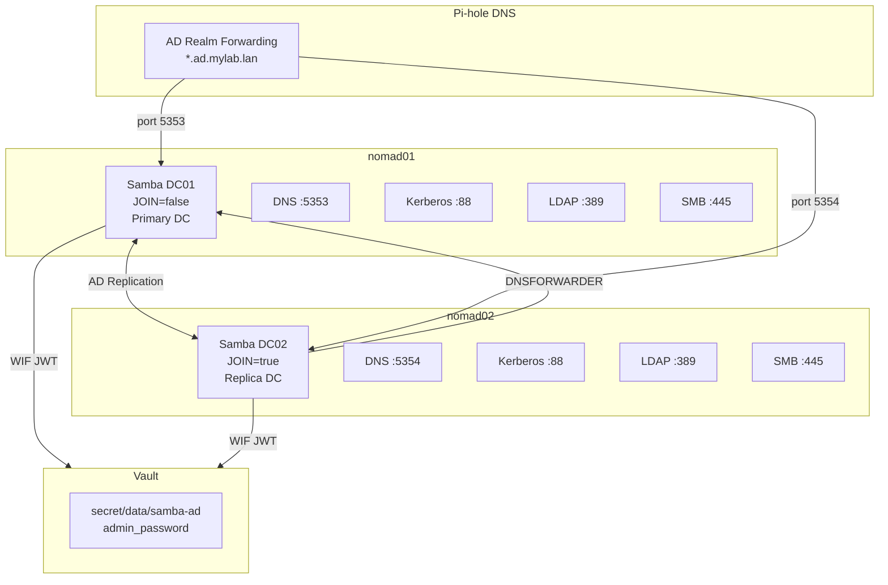

# Samba AD

Samba AD provides Active Directory Domain Services for the lab environment. It deploys two domain controllers -- DC01 as the primary (provisioning a new domain) and DC02 as a replica (joining the existing domain) -- across separate Nomad nodes for redundancy.

## Overview

| Property | Value |
|----------|-------|
| **Nomad Job** | `samba-dc` |
| **Image** | `nowsci/samba-domain:latest` |
| **Type** | `service` (2 groups) |
| **DC01 Node** | Pinned to `nomad01` |
| **DC02 Node** | Pinned to `nomad02` |
| **Vault Role** | `samba-dc` (WIF, change_mode: noop) |
| **Privileged** | Yes |
| **Kill Timeout** | 120 seconds |
| **Resources** | 500 MHz CPU, 1024 MB memory per DC |
| **Menu Option** | 16 (Deploy Samba AD) |

## Deployment

Deploy Samba AD using the setup menu:

```bash
./setup.sh
# Select option 16: Deploy Samba AD
```

The deployment script:

1. Prompts for the AD realm (derived from `dns_postfix`, e.g., `AD.MYLAB.LAN`)
2. Stores the admin password in Vault at `secret/data/samba-ad`
3. Configures Pi-hole DNS forwarding for the AD realm
4. Submits the Nomad job with variable substitution
5. Deploys DC01 first, then DC02 (if nomad02 exists)

### Prerequisites

Before deploying Samba AD, the following must be in place:

1. **Nomad cluster** -- At least nomad01 operational (nomad02 for DC02)
2. **Vault** -- Running and initialized with the `samba-dc` role configured (menu option 8)
3. **Vault secrets** -- Admin password stored at `secret/data/samba-ad`:
    - `admin_password` -- Domain administrator password
4. **Pi-hole DNS** -- Running and configured for AD realm forwarding
5. **Local storage** -- `/opt/samba-dc01/` on nomad01 and `/opt/samba-dc02/` on nomad02

## Architecture



## Domain Controller Groups

The Nomad job defines two separate groups -- `dc01` and `dc02` -- each pinned to a different Nomad node. This separation ensures the domain controllers run on different physical hosts for redundancy.

### DC01 -- Primary Domain Controller

DC01 provisions a new Active Directory domain. It runs with `JOIN=false`, meaning it creates the domain from scratch on first start.

| Property | Value |
|----------|-------|
| Node | `nomad01` |
| Role | Primary (provisions domain) |
| `JOIN` | `false` |
| DNS Port | 5353 |
| Storage | `/opt/samba-dc01/samba` and `/opt/samba-dc01/krb5` |

#### Ports (DC01)

| Port | Protocol | Service |
|------|----------|---------|
| 5353 | TCP/UDP | DNS (non-standard to avoid Pi-hole conflict on 53) |
| 88 | TCP/UDP | Kerberos |
| 389 | TCP | LDAP |
| 636 | TCP | LDAP over TLS |
| 445 | TCP | SMB |
| 3268 | TCP | Global Catalog |
| 3269 | TCP | Global Catalog over TLS |

### DC02 -- Replica Domain Controller

DC02 joins the existing domain as a replica. It runs with `JOIN=true` and uses DC01 as its DNS forwarder.

| Property | Value |
|----------|-------|
| Node | `nomad02` |
| Role | Replica (joins domain) |
| `JOIN` | `true` |
| `JOINSITE` | `Default-First-Site-Name` |
| `DNSFORWARDER` | nomad01 IP |
| DNS Port | 5354 |
| Storage | `/opt/samba-dc02/samba` and `/opt/samba-dc02/krb5` |

#### Ports (DC02)

DC02 uses the same ports as DC01 except for DNS:

| Port | Protocol | Service |
|------|----------|---------|
| 5354 | TCP/UDP | DNS (different from DC01 to allow Pi-hole forwarding to both) |
| 88 | TCP/UDP | Kerberos |
| 389 | TCP | LDAP |
| 636 | TCP | LDAP over TLS |
| 445 | TCP | SMB |
| 3268 | TCP | Global Catalog |
| 3269 | TCP | Global Catalog over TLS |

### Single-Node Support

If the Nomad cluster has only one or two nodes and `nomad02` does not exist, the deployment script automatically skips DC02. Only DC01 is deployed, providing a fully functional single-DC domain without replication.

## Local Storage Requirement

!!! warning "POSIX ACL Requirement"
    Samba AD requires POSIX ACL support on its data directory. GlusterFS FUSE mounts do **not** provide this, so Samba DCs use **local storage** instead of GlusterFS.

Each DC stores its data on the local filesystem of its Nomad node:

| DC | Samba Data | Kerberos Config |
|----|-----------|-----------------|
| DC01 | `/opt/samba-dc01/samba:/var/lib/samba` | `/opt/samba-dc01/krb5:/etc/krb5` |
| DC02 | `/opt/samba-dc02/samba:/var/lib/samba` | `/opt/samba-dc02/krb5:/etc/krb5` |

Because storage is local (not replicated via GlusterFS), each DC maintains its own copy of the AD database. Active Directory's built-in replication protocol keeps them synchronized.

## Vault Secrets Integration

Samba AD uses Vault WIF to retrieve the domain administrator password at startup:

```hcl
vault {
  role        = "samba-dc"
  change_mode = "noop"
}
```

- **`role = "samba-dc"`** -- Maps to the `samba-dc` Vault policy which grants read access to `secret/data/samba-ad`.
- **`change_mode = "noop"`** -- Secrets changes do **not** restart the container. Active Directory is stateful and restarting a DC can cause replication issues. Password changes must be handled manually.

### Secrets Template

```hcl
template {
  data = <<EOH
{{ with secret "secret/data/samba-ad" }}
DOMAINPASS={{ .Data.data.admin_password }}
{{ end }}
DOMAIN=<ad_realm>
HOSTIP=<node_ip>
DNSFORWARDER=<forwarder_ip>
JOIN=false
INSECURELDAP=true
NOCOMPLEXITY=true
EOH
  destination = "secrets/samba.env"
  env         = true
}
```

| Variable | DC01 Value | DC02 Value |
|----------|-----------|-----------|
| `DOMAINPASS` | From Vault | From Vault |
| `DOMAIN` | AD realm (e.g., `AD.MYLAB.LAN`) | Same |
| `HOSTIP` | nomad01 IP | nomad02 IP |
| `DNSFORWARDER` | Pi-hole IP | nomad01 IP |
| `JOIN` | `false` | `true` |
| `JOINSITE` | (not set) | `Default-First-Site-Name` |
| `INSECURELDAP` | `true` | `true` |
| `NOCOMPLEXITY` | `true` | `true` |

## DNS Forwarding

Pi-hole is configured to forward queries for the AD realm to the Samba DCs. This allows clients using Pi-hole as their DNS server to resolve AD hostnames without additional configuration.

### Forwarding Rules

| Query Pattern | Forwarded To | Port |
|---------------|-------------|------|
| `*.ad.<dns_postfix>` | nomad01 (DC01) | 5353 |
| `*.ad.<dns_postfix>` | nomad02 (DC02) | 5354 |

The setup script configures this automatically in Pi-hole's dnsmasq configuration.

### DNS Records

The deployment also creates DNS records in Pi-hole:

| Record | Points To |
|--------|-----------|
| `samba-dc01.ad.<dns_postfix>` | nomad01 IP |
| `samba-dc02.ad.<dns_postfix>` | nomad02 IP |

### Why Non-Standard DNS Ports?

Samba AD runs its own DNS server internally, but Pi-hole already occupies port 53 on the network. To resolve this:

- DC01 uses port **5353** for DNS
- DC02 uses port **5354** for DNS
- Pi-hole forwards AD realm queries to these non-standard ports
- Clients never need to know about the port mapping -- they query Pi-hole on port 53 as usual

## Health Checks

Each DC registers two services with Nomad, each with a TCP health check:

| Service | Port | Check Type | Interval |
|---------|------|------------|----------|
| `samba-dc01` / `samba-dc02` | LDAP (389) | TCP | 30s |
| `samba-dc01-kerberos` / `samba-dc02-kerberos` | Kerberos (88) | TCP | 30s |

Both checks use a 5-second timeout. If LDAP or Kerberos becomes unreachable, Nomad marks the service as unhealthy.

## Domain Configuration

The AD realm and NetBIOS domain name are derived from the lab's `dns_postfix`:

| Setting | Example (dns_postfix = `mylab.lan`) |
|---------|--------------------------------------|
| AD Realm | `AD.MYLAB.LAN` |
| NetBIOS Domain | `AD` |
| Domain DN | `DC=ad,DC=mylab,DC=lan` |
| Admin User | `Administrator` |

!!! note "NetBIOS Name Limit"
    The NetBIOS domain name has a 15-character maximum. The deployment script uses the first component of the AD realm (e.g., `AD`), which stays well within this limit.

## Service Tags

Each DC is tagged with metadata for service discovery:

```hcl
# DC01
tags = [
  "dc=primary",
  "realm=AD.MYLAB.LAN",
]

# DC02
tags = [
  "dc=replica",
  "realm=AD.MYLAB.LAN",
]
```

## Verifying the Deployment

After deploying Samba AD, verify both DCs are running:

```bash
# Check job status (both dc01 and dc02 groups)
docker compose run --rm nomad job status samba-dc

# Verify services are registered
docker compose run --rm nomad service list

# Test LDAP connectivity to DC01
ldapsearch -x -H ldap://nomad01:389 -b "dc=ad,dc=mylab,dc=lan" -s base

# Test Kerberos on DC01
ssh nomad01 'docker exec $(docker ps -qf name=samba-dc) samba-tool domain info 127.0.0.1'

# Check AD replication status (run from DC01)
ssh nomad01 'docker exec $(docker ps -qf name=samba-dc) samba-tool drs showrepl'

# List domain users
ssh nomad01 'docker exec $(docker ps -qf name=samba-dc) samba-tool user list'

# Check allocation logs
docker compose run --rm nomad alloc logs -job samba-dc
```

## Troubleshooting

??? question "DC won't start"
    The domain controller fails to start or crashes on launch.

    1. Check container logs:
        ```bash
        docker compose run --rm nomad alloc logs -job samba-dc
        ```
    2. Verify the storage directories exist and have correct permissions:
        ```bash
        ssh nomad01 'ls -la /opt/samba-dc01/'
        ssh nomad02 'ls -la /opt/samba-dc02/'
        ```
    3. Check that ports are not already in use:
        ```bash
        ssh nomad01 'sudo ss -tlnp | grep -E ":88|:389|:445"'
        ```
    4. Verify Vault secrets are accessible:
        ```bash
        export VAULT_ADDR="http://nomad01:8200"
        vault kv get secret/samba-ad
        ```
    5. For a fresh start, stop the job and clean the data directory:
        ```bash
        docker compose run --rm nomad job stop -purge samba-dc
        ssh nomad01 'sudo rm -rf /opt/samba-dc01/*'
        ```

??? question "AD replication failing between DC01 and DC02"
    The domain controllers are not synchronizing.

    1. Check replication status from inside DC01:
        ```bash
        ssh nomad01 'docker exec $(docker ps -qf name=samba-dc) samba-tool drs showrepl'
        ```
    2. Verify DC02 can reach DC01 over the network:
        ```bash
        ssh nomad02 'nc -zv nomad01 389'
        ssh nomad02 'nc -zv nomad01 88'
        ```
    3. Check that DNS is resolving correctly:
        ```bash
        ssh nomad02 'nslookup samba-dc01.ad.mylab.lan'
        ```
    4. Inspect DC02 logs for join/replication errors:
        ```bash
        docker compose run --rm nomad alloc logs -job samba-dc
        ```

??? question "Domain join from a client machine fails"
    A workstation or server cannot join the AD domain.

    1. Verify DNS forwards the AD realm to the Samba DCs. Test from the client:
        ```bash
        nslookup ad.mylab.lan
        nslookup _ldap._tcp.ad.mylab.lan
        ```
    2. Check Pi-hole's AD forwarding configuration:
        ```bash
        ssh dns-01 'cat /etc/dnsmasq.d/10-ad-forward.conf'
        ```
    3. Test LDAP connectivity from the client:
        ```bash
        ldapsearch -x -H ldap://nomad01:389 -b "dc=ad,dc=mylab,dc=lan" -s base
        ```
    4. Verify the domain admin credentials:
        ```bash
        export VAULT_ADDR="http://nomad01:8200"
        vault kv get -field=admin_password secret/samba-ad
        ```

??? question "LDAP connection fails"
    LDAP queries return errors or timeouts.

    1. Test basic TCP connectivity:
        ```bash
        nc -zv nomad01 389
        ```
    2. Test LDAP bind:
        ```bash
        ldapsearch -x -H ldap://nomad01:389 \
          -D "Administrator@ad.mylab.lan" \
          -w "<admin_password>" \
          -b "dc=ad,dc=mylab,dc=lan" \
          "(objectClass=user)"
        ```
    3. Check that `INSECURELDAP=true` is set (allows unencrypted LDAP binds).
    4. If using LDAPs (port 636), verify the DC has a valid TLS certificate.

??? question "Kerberos authentication errors"
    Clients receive Kerberos errors when authenticating.

    1. Verify the Kerberos service is running:
        ```bash
        ssh nomad01 'nc -zv 127.0.0.1 88'
        ```
    2. Check time synchronization -- Kerberos requires clocks to be within 5 minutes:
        ```bash
        ssh nomad01 'date'
        ssh nomad02 'date'
        ```
    3. Verify the realm is correct in the client's `krb5.conf`:
        ```ini
        [libdefaults]
            default_realm = AD.MYLAB.LAN

        [realms]
            AD.MYLAB.LAN = {
                kdc = nomad01
                admin_server = nomad01
            }
        ```

## Next Steps

- [:octicons-arrow-right-24: Authentik](authentik.md) -- Configure AD-to-Authentik user sync
- [:octicons-arrow-right-24: Vault](vault.md) -- Secrets management powering Samba AD
- [:octicons-arrow-right-24: Traefik](traefik.md) -- Reverse proxy for other lab services
