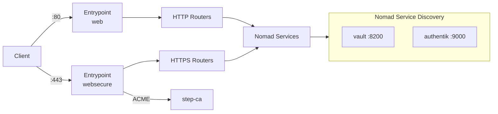
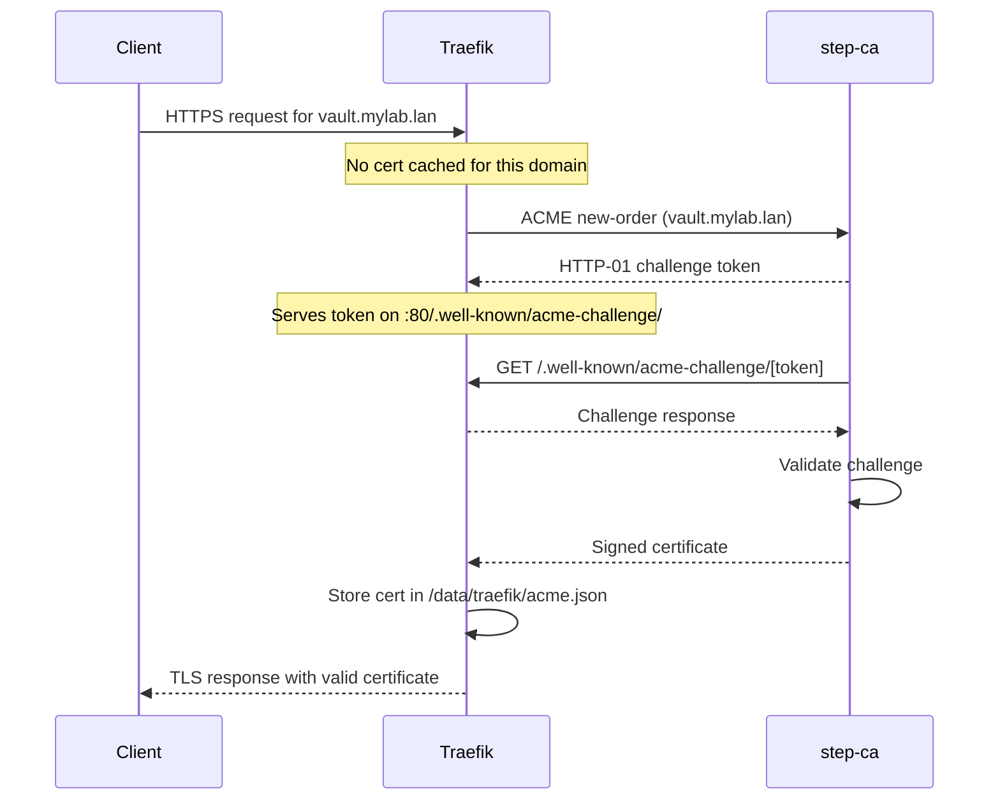

# Traefik

Traefik is the reverse proxy and load balancer for all Nomad-managed services. It automatically discovers services via the Nomad provider and obtains TLS certificates from the internal step-ca Certificate Authority using the ACME protocol.

## Overview

| Property | Value |
|----------|-------|
| **Nomad Job** | `traefik` |
| **Image** | `traefik:v3.6` |
| **Type** | `service` (count 1) |
| **Node** | Pinned to `nomad01` |
| **Ports** | 80 (HTTP), 443 (HTTPS), 8081 (Dashboard) |
| **Network Mode** | Host |
| **Storage** | GlusterFS host volume `gluster-data` mounted at `/data` |
| **Resources** | 200 MHz CPU, 256 MB memory |
| **Menu Option** | 7 (Deploy Traefik) |

## Deployment

Deploy Traefik using the setup menu:

```bash
./setup.sh
# Select option 7: Deploy Traefik
```

Or deploy directly with the Nomad CLI:

```bash
docker compose run --rm nomad job run /nomad/jobs/traefik.nomad.hcl
```

### Prerequisites

Before deploying Traefik, the following must be in place:

1. **Nomad cluster** -- All three Nomad nodes operational
2. **Pi-hole DNS** -- DNS records for services must resolve to nomad01
3. **Step-CA** -- Certificate Authority running and reachable at `ca.<dns_postfix>`
4. **GlusterFS** -- Shared volume mounted at `/srv/gluster/nomad-data` on all Nomad nodes

## Architecture



Traefik runs in host networking mode on nomad01, binding directly to ports 80, 443, and 8081. All service DNS records (e.g., `vault.<domain>`, `auth.<domain>`) point to nomad01's IP address, so Traefik receives all inbound HTTP/HTTPS traffic and routes it to the appropriate backend.

## Entrypoints

Traefik defines three entrypoints:

| Entrypoint | Port | Purpose |
|------------|------|---------|
| `web` | 80 | HTTP traffic and ACME HTTP-01 challenges |
| `websecure` | 443 | HTTPS traffic with TLS termination |
| `traefik` | 8081 | Dashboard and API (insecure mode) |

## Service Discovery

Traefik uses the **Nomad provider** to automatically discover services registered in the Nomad cluster:

```
--providers.nomad=true
--providers.nomad.endpoint.address=http://127.0.0.1:4646
--providers.nomad.exposedByDefault=false
--providers.nomad.namespaces=default
--providers.nomad.allowEmptyServices=true
```

Key behaviors:

- **`exposedByDefault=false`** -- Services must explicitly opt in with `traefik.enable=true` in their Nomad service tags.
- **`allowEmptyServices=true`** -- Prevents Traefik from removing routes when a service temporarily has zero healthy instances.
- Traefik connects to the local Nomad agent at `http://127.0.0.1:4646` since it runs on nomad01 in host networking mode.

### Enabling a Service for Traefik

Nomad services opt in to Traefik routing by setting tags on their `service` stanza. For example, Vault registers itself as:

```hcl
service {
  name     = "vault"
  port     = "api"
  provider = "nomad"

  tags = [
    "traefik.enable=true",
    "traefik.http.routers.vault-http.rule=Host(`vault.mylab.lan`) || Host(`vault`)",
    "traefik.http.routers.vault-http.entrypoints=web",
    "traefik.http.routers.vault.rule=Host(`vault.mylab.lan`) || Host(`vault`)",
    "traefik.http.routers.vault.entrypoints=websecure",
    "traefik.http.routers.vault.tls=true",
    "traefik.http.routers.vault.tls.certresolver=step-ca",
    "traefik.http.services.vault.loadbalancer.server.port=8200",
  ]
}
```

Each service defines two routers:

- An **HTTP router** (entrypoint `web`) for plain HTTP access and ACME challenges.
- An **HTTPS router** (entrypoint `websecure`) with TLS enabled via the `step-ca` certificate resolver.

### Router Rules

All routers accept both the FQDN and the short hostname:

```
Host(`service.<dns_postfix>`) || Host(`service`)
```

This means `https://vault.mylab.lan` and `https://vault` both reach the same backend.

## ACME Certificate Management

Traefik automatically obtains TLS certificates from the internal step-ca using ACME:

```
--certificatesresolvers.step-ca.acme.email=admin@<dns_postfix>
--certificatesresolvers.step-ca.acme.storage=/data/traefik/acme.json
--certificatesresolvers.step-ca.acme.caserver=https://ca.<dns_postfix>/acme/acme/directory
--certificatesresolvers.step-ca.acme.httpchallenge=true
--certificatesresolvers.step-ca.acme.httpchallenge.entrypoint=web
```

### How It Works



### CA Trust

Since step-ca uses a private root CA, Traefik must trust it to complete ACME requests. Two environment variables configure this:

| Variable | Value | Purpose |
|----------|-------|---------|
| `SSL_CERT_FILE` | `/data/certs/root_ca.crt` | System-level CA trust for Go's TLS |
| `LEGO_CA_CERTIFICATES` | `/data/certs/root_ca.crt` | LEGO ACME library CA trust |

The root CA certificate is stored on the GlusterFS volume at `/srv/gluster/nomad-data/certs/root_ca.crt`, which is mounted into the container at `/data/certs/root_ca.crt`.

### Certificate Storage

ACME certificates are persisted at `/data/traefik/acme.json` on the GlusterFS volume. This file is preserved across container restarts so certificates do not need to be re-issued.

## Health Check

Traefik registers itself as a Nomad service with an HTTP health check:

```hcl
service {
  name     = "traefik"
  port     = "dashboard"
  provider = "nomad"

  check {
    type     = "http"
    path     = "/ping"
    port     = "dashboard"
    interval = "10s"
    timeout  = "2s"
  }
}
```

The `/ping` endpoint is enabled via `--ping=true` and bound to the `traefik` entrypoint on port 8081.

## Dashboard

The Traefik dashboard provides a web interface to inspect routers, services, and middleware. It is enabled in insecure mode (no authentication) for lab use:

```
--api=true
--api.dashboard=true
--api.insecure=true
```

Access the dashboard at:

```
http://nomad01:8081/dashboard/
```

!!! warning "Trailing Slash Required"
    The dashboard URL must include the trailing slash: `/dashboard/`. Without it, Traefik returns a 404.

### Useful API Endpoints

| Endpoint | Purpose |
|----------|---------|
| `http://nomad01:8081/api/http/routers` | List all HTTP routers |
| `http://nomad01:8081/api/http/services` | List all HTTP services |
| `http://nomad01:8081/api/entrypoints` | List entrypoints |
| `http://nomad01:8081/ping` | Health check |

Query routers to verify service discovery:

```bash
curl -s http://nomad01:8081/api/http/routers | jq .
```

## Verifying the Deployment

After deploying Traefik, verify it is running correctly:

```bash
# Check job status
docker compose run --rm nomad job status traefik

# Check allocation logs
docker compose run --rm nomad alloc logs -job traefik

# Verify the service is registered
docker compose run --rm nomad service list

# Test the ping endpoint
curl http://nomad01:8081/ping

# Check discovered routers
curl -s http://nomad01:8081/api/http/routers | jq '.[].rule'
```

## Troubleshooting

??? question "404 Not Found for a service"
    Traefik is running but cannot route the request to a backend.

    1. Check that the service is registered in Nomad:
        ```bash
        docker compose run --rm nomad service list
        ```
    2. Verify the router exists in Traefik:
        ```bash
        curl -s http://nomad01:8081/api/http/routers | jq .
        ```
    3. Confirm DNS resolves the service hostname to nomad01's IP:
        ```bash
        nslookup vault.mylab.lan
        ```
    4. Check that the service's Nomad tags include `traefik.enable=true`.

??? question "ACME certificate challenges failing"
    Traefik cannot obtain a TLS certificate from step-ca.

    1. Verify step-ca is running and reachable:
        ```bash
        curl -k https://ca.mylab.lan/health
        ```
    2. Check that DNS resolves the service domain to nomad01 (step-ca must be able to reach Traefik on port 80 for HTTP-01 challenges).
    3. Inspect the ACME storage file for errors:
        ```bash
        ssh nomad01 'cat /srv/gluster/nomad-data/traefik/acme.json | jq .'
        ```
    4. Clear stale ACME data and restart the job:
        ```bash
        ssh nomad01 'rm /srv/gluster/nomad-data/traefik/acme.json'
        docker compose run --rm nomad job stop -purge traefik
        docker compose run --rm nomad job run /nomad/jobs/traefik.nomad.hcl
        ```

??? question "Service not discovered by Traefik"
    The service is running in Nomad but does not appear in Traefik's router list.

    1. Verify the service is healthy in Nomad:
        ```bash
        docker compose run --rm nomad job status <job-name>
        ```
    2. Check that the service uses `provider = "nomad"` (not Consul).
    3. Confirm the service tags include `traefik.enable=true`.
    4. Inspect Traefik logs for discovery errors:
        ```bash
        docker compose run --rm nomad alloc logs -job traefik
        ```

??? question "Port 80 or 443 already in use"
    Another process is binding to Traefik's ports on nomad01.

    1. Identify what is using the port:
        ```bash
        ssh nomad01 'sudo ss -tlnp | grep -E ":80|:443"'
        ```
    2. Stop/purge any stale Traefik allocations:
        ```bash
        docker compose run --rm nomad job stop -purge traefik
        ```

## Next Steps

- [:octicons-arrow-right-24: Vault](vault.md) -- Secrets management (routed through Traefik)
- [:octicons-arrow-right-24: Authentik](authentik.md) -- Identity provider (routed through Traefik)
- [:octicons-arrow-right-24: Certificate Chain](../architecture/certificate-chain.md) -- How TLS certificates are issued
