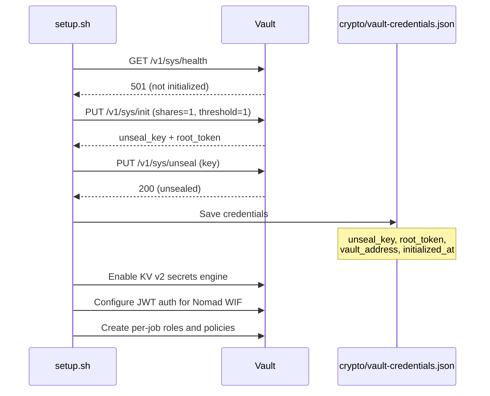
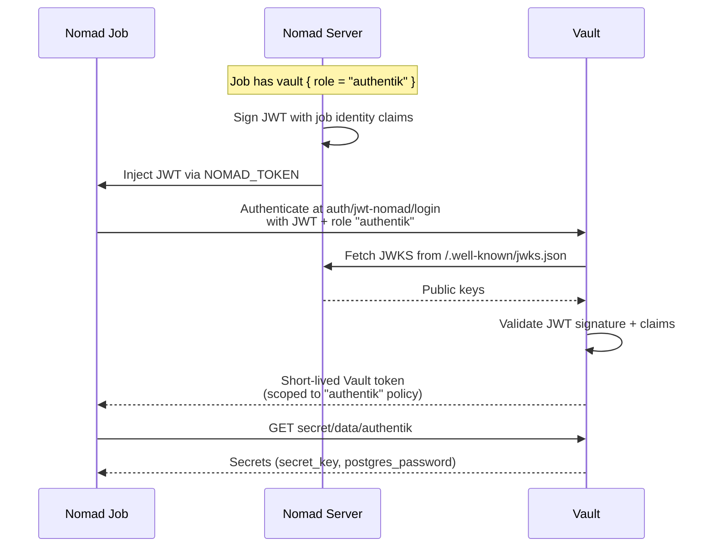

# Vault

HashiCorp Vault provides centralized secrets management for all Nomad services. It stores sensitive data such as database passwords and API keys, and integrates with Nomad via Workload Identity Federation (WIF) so that running jobs can securely retrieve secrets without long-lived tokens.

## Overview

| Property | Value |
|----------|-------|
| **Nomad Job** | `vault` |
| **Image** | `hashicorp/vault:1.15` |
| **Type** | `service` (count 1) |
| **Node** | Pinned to `nomad01` |
| **Ports** | 8200 (API/UI), 8201 (Cluster) |
| **Network Mode** | Host |
| **Storage** | Docker bind mount `/srv/gluster/nomad-data/vault:/data/vault` |
| **Privileged** | Yes (required for GlusterFS writes) |
| **Resources** | 200 MHz CPU, 256 MB memory |
| **Menu Option** | 8 (Deploy Vault) |

## Deployment

Deploy Vault using the setup menu:

```bash
./setup.sh
# Select option 8: Deploy Vault
```

Or deploy directly with the Nomad CLI:

```bash
docker compose run --rm nomad job run /nomad/jobs/vault.nomad.hcl
```

### Prerequisites

Before deploying Vault, the following must be in place:

1. **Nomad cluster** -- All three Nomad nodes operational
2. **Traefik** -- Reverse proxy running for HTTPS access at `vault.<dns_postfix>`
3. **Pi-hole DNS** -- `vault.<dns_postfix>` resolving to nomad01
4. **GlusterFS** -- Shared volume mounted at `/srv/gluster/nomad-data` on all Nomad nodes

## Architecture

```mermaid
graph TB
    subgraph clients["Clients"]
        BROWSER[Browser / CLI]
    end

    subgraph nomad01["nomad01"]
        TRAEFIK[Traefik<br/>:80 / :443]
        VAULT[Vault<br/>:8200]
        NOMAD[Nomad Agent<br/>:4646]
    end

    subgraph storage["GlusterFS"]
        VDATA["/srv/gluster/nomad-data/vault"]
    end

    BROWSER -->|HTTPS| TRAEFIK
    TRAEFIK -->|HTTP :8200| VAULT
    VAULT --> VDATA
    NOMAD -->|JWT (WIF)| VAULT

    subgraph jobs["Nomad Jobs"]
        AUTH_JOB[Authentik]
        SAMBA_JOB[Samba AD]
    end

    NOMAD -->|Sign JWT| jobs
    jobs -->|Present JWT| VAULT
    VAULT -->|Return secrets| jobs
```

### Key Design Decisions

- **Privileged mode** -- The Docker container runs as privileged (`privileged = true`) because GlusterFS FUSE mounts require elevated permissions for file writes.
- **Direct bind mount** -- Vault uses a Docker bind mount (`/srv/gluster/nomad-data/vault:/data/vault`) instead of a Nomad host volume. This ensures Vault has direct access to the GlusterFS path.
- **TLS disabled** -- Vault listens on plain HTTP (`tls_disable = true`) because Traefik handles TLS termination. Vault is only accessible within the host or through Traefik.
- **`disable_mlock`** -- Set to `true` because the Nomad Docker driver does not allow the `IPC_LOCK` capability. In a home lab environment this is an acceptable trade-off.

## Configuration

Vault's configuration is rendered as a Nomad template at `/local/vault.hcl` inside the container:

```hcl
ui = true
disable_mlock = true

storage "file" {
  path = "/data/vault"
}

listener "tcp" {
  address     = "0.0.0.0:8200"
  tls_disable = true
}

api_addr     = "http://<nomad01_ip>:8200"
cluster_addr = "http://<nomad01_ip>:8201"
```

| Setting | Value | Purpose |
|---------|-------|---------|
| `ui` | `true` | Enables the Vault web UI |
| `disable_mlock` | `true` | Required for Nomad Docker driver |
| `storage.file.path` | `/data/vault` | Persistent storage on GlusterFS |
| `listener.tls_disable` | `true` | Traefik terminates TLS |
| `api_addr` | `http://<ip>:8200` | Advertised API address |
| `cluster_addr` | `http://<ip>:8201` | Cluster communication address |

## Initialization

On first deployment, Vault starts in an **uninitialized** state. The setup script automatically initializes it with a single key share and single threshold -- appropriate for a home lab where operational simplicity is preferred over the security of Shamir's Secret Sharing with multiple key holders.

### Initialization Parameters

| Parameter | Value | Rationale |
|-----------|-------|-----------|
| Key shares | 1 | Single unseal key for simplicity |
| Key threshold | 1 | One key required to unseal |

### Initialization Flow



### Credential Storage

After initialization, credentials are saved to `crypto/vault-credentials.json` (gitignored):

```json
{
  "unseal_key": "<base64-encoded-key>",
  "root_token": "hvs.xxxxxxxxxxxxxxxxxxxx",
  "vault_address": "http://10.1.50.114:8200",
  "initialized_at": "2026-02-22T12:00:00Z"
}
```

!!! danger "Security Warning"
    This file contains the root token and unseal key. Protect it accordingly:

    - It is gitignored and must never be committed
    - Back it up to a secure location
    - Losing the unseal key means Vault data cannot be recovered after a restart

## Unseal Process

Vault seals itself on every restart. Before it can serve requests, it must be unsealed with the key from `crypto/vault-credentials.json`.

The setup script handles unsealing automatically during deployment. For manual unsealing:

```bash
# Using the Vault CLI
export VAULT_ADDR="http://nomad01:8200"
vault operator unseal <unseal_key>

# Or using the HTTP API
curl -X PUT http://nomad01:8200/v1/sys/unseal \
  -d '{"key": "<unseal_key>"}'
```

!!! note "Auto-Unseal"
    For production environments, Vault supports auto-unseal using cloud KMS or Transit secrets engines. This lab uses manual unseal for simplicity.

## Health Check

Vault's health check is configured to accept all operational states as healthy, since an uninitialized or sealed Vault is expected during first deployment:

```hcl
check {
  type     = "http"
  path     = "/v1/sys/health?standbyok=true&uninitcode=200&sealedcode=200"
  port     = "api"
  interval = "10s"
  timeout  = "3s"
}
```

| Parameter | Effect |
|-----------|--------|
| `standbyok=true` | Standby nodes report healthy |
| `uninitcode=200` | Uninitialized Vault returns 200 instead of 501 |
| `sealedcode=200` | Sealed Vault returns 200 instead of 503 |

## Traefik Integration

Vault registers with Nomad using Traefik-compatible service tags:

```hcl
tags = [
  "traefik.enable=true",
  "traefik.http.routers.vault-http.rule=Host(`vault.<domain>`) || Host(`vault`)",
  "traefik.http.routers.vault-http.entrypoints=web",
  "traefik.http.routers.vault.rule=Host(`vault.<domain>`) || Host(`vault`)",
  "traefik.http.routers.vault.entrypoints=websecure",
  "traefik.http.routers.vault.tls=true",
  "traefik.http.routers.vault.tls.certresolver=step-ca",
  "traefik.http.services.vault.loadbalancer.server.port=8200",
]
```

This creates two routers:

- **`vault-http`** -- HTTP access on port 80 (also handles ACME challenges)
- **`vault`** -- HTTPS access on port 443 with a TLS certificate from step-ca

Access Vault at:

- `https://vault.<dns_postfix>` (HTTPS via Traefik)
- `http://nomad01:8200` (direct, no TLS)

## KV v2 Secrets Engine

Vault uses the **KV version 2** secrets engine at the path `secret/`. KV v2 provides versioned secrets with metadata, soft-delete, and rollback capabilities.

The setup script enables KV v2 automatically during initialization:

```bash
vault secrets enable -path=secret kv-v2
```

### Storing Secrets

```bash
# Store Authentik secrets
vault kv put secret/authentik \
  secret_key="<random-string>" \
  postgres_password="<random-string>"

# Store Samba AD secrets
vault kv put secret/samba-ad \
  admin_password="<domain-admin-password>"
```

### Reading Secrets

```bash
vault kv get secret/authentik
vault kv get -field=secret_key secret/authentik
```

## Workload Identity Federation (WIF)

WIF allows Nomad jobs to authenticate to Vault using short-lived JWT tokens instead of long-lived Vault tokens. This eliminates the need to store any Vault credentials on Nomad nodes.

### How WIF Works



### JWT Auth Configuration

Vault is configured with a JWT auth backend at path `jwt-nomad`:

| Setting | Value | Purpose |
|---------|-------|---------|
| Auth path | `jwt-nomad` | JWT auth mount point |
| JWKS URL | `http://<nomad01_ip>:4646/.well-known/jwks.json` | Nomad's public key endpoint |
| Audience | `vault.io` | Expected JWT audience claim |

### Nomad Default Identity

Nomad servers are configured with a `default_identity` block that tells Nomad how to sign JWTs for jobs that request Vault access:

```hcl
vault {
  enabled = true
  default_identity {
    aud = ["vault.io"]
    ttl = "1h"
  }
}
```

### Per-Job Roles

Each service that needs Vault access has a dedicated role that maps JWT claims to a Vault policy:

| Role | Job | Policy | Secret Path |
|------|-----|--------|-------------|
| `authentik` | `authentik` | `authentik` | `secret/data/authentik` |
| `samba-dc` | `samba-dc` | `samba-dc` | `secret/data/samba-ad` |

In the Nomad job file, services declare their Vault role:

```hcl
vault {
  role        = "authentik"
  change_mode = "restart"  # Restart task if secrets change
}
```

## Vault Policies

Policies define what each role can access. All policies are stored in `nomad/vault-policies/`.

### authentik.hcl

Allows the Authentik job to read its secrets:

```hcl
# Allow reading Authentik secrets
path "secret/data/authentik" {
  capabilities = ["read"]
}

# Allow listing and reading metadata (for debugging)
path "secret/metadata/authentik" {
  capabilities = ["read", "list"]
}
```

### samba-dc.hcl

Allows the Samba AD job to read its secrets:

```hcl
# Allow reading Samba AD secrets (admin password, sync credentials)
path "secret/data/samba-ad" {
  capabilities = ["read"]
}

# Allow listing and reading metadata (for debugging)
path "secret/metadata/samba-ad" {
  capabilities = ["read", "list"]
}
```

### nomad-server.hcl

Allows Nomad servers to create and manage tokens for jobs:

```hcl
# Allow creating tokens against the "nomad-cluster" role
path "auth/token/create/nomad-cluster" {
  capabilities = ["update"]
}

# Allow looking up the "nomad-cluster" role
path "auth/token/roles/nomad-cluster" {
  capabilities = ["read"]
}

# Allow looking up own token capabilities
path "auth/token/lookup-self" {
  capabilities = ["read"]
}

# Allow looking up incoming tokens for validation
path "auth/token/lookup" {
  capabilities = ["update"]
}

# Allow revoking tokens via accessor when jobs end
path "auth/token/revoke-accessor" {
  capabilities = ["update"]
}

# Allow renewing own token
path "auth/token/renew-self" {
  capabilities = ["update"]
}
```

## Verifying the Deployment

After deploying Vault, verify it is running correctly:

```bash
# Check job status
docker compose run --rm nomad job status vault

# Check Vault health (returns initialized/sealed status)
curl -s http://nomad01:8200/v1/sys/health | jq .

# Check seal status
curl -s http://nomad01:8200/v1/sys/seal-status | jq .

# Verify Vault is registered as a Nomad service
docker compose run --rm nomad service list

# Check allocation logs
docker compose run --rm nomad alloc logs -job vault
```

## Troubleshooting

??? question "Permission denied on storage"
    Vault cannot write to its storage path on GlusterFS.

    1. Verify the container is running in privileged mode:
        ```bash
        docker compose run --rm nomad job inspect vault | jq '.Job.TaskGroups[].Tasks[].Config.privileged'
        ```
    2. Clean up stale data and redeploy:
        ```bash
        ssh nomad01 'sudo rm -rf /srv/gluster/nomad-data/vault/*'
        docker compose run --rm nomad job stop -purge vault
        docker compose run --rm nomad job run /nomad/jobs/vault.nomad.hcl
        ```

??? question "Port 8200 already in use"
    A previous Vault allocation may still be running.

    1. Check for stale allocations:
        ```bash
        docker compose run --rm nomad job status vault
        ```
    2. Stop and purge the job, then redeploy:
        ```bash
        docker compose run --rm nomad job stop -purge vault
        docker compose run --rm nomad job run /nomad/jobs/vault.nomad.hcl
        ```

??? question "Vault not responding"
    Vault may be sealed, uninitialized, or scheduled on an unexpected node.

    1. Check which node Vault is running on:
        ```bash
        docker compose run --rm nomad job status vault
        ```
    2. Check seal status:
        ```bash
        curl -s http://nomad01:8200/v1/sys/seal-status | jq .
        ```
    3. If sealed, unseal it:
        ```bash
        curl -X PUT http://nomad01:8200/v1/sys/unseal \
          -d '{"key": "<unseal_key_from_credentials_file>"}'
        ```
    4. If uninitialized, run the setup menu option 8 to initialize.

??? question "WIF authentication failing for a job"
    A Nomad job cannot authenticate to Vault using its JWT.

    1. Verify the JWT auth backend is enabled:
        ```bash
        export VAULT_ADDR="http://nomad01:8200"
        vault auth list
        ```
    2. Check the role exists:
        ```bash
        vault read auth/jwt-nomad/role/<role-name>
        ```
    3. Verify Nomad's JWKS endpoint is reachable from Vault:
        ```bash
        curl -s http://nomad01:4646/.well-known/jwks.json | jq .
        ```
    4. Check the Nomad job's `vault` stanza specifies the correct role name.

## Next Steps

- [:octicons-arrow-right-24: Authentik](authentik.md) -- Identity provider that retrieves secrets from Vault
- [:octicons-arrow-right-24: Samba AD](samba-ad.md) -- Active Directory that retrieves secrets from Vault
- [:octicons-arrow-right-24: Traefik](traefik.md) -- Reverse proxy that routes traffic to Vault
